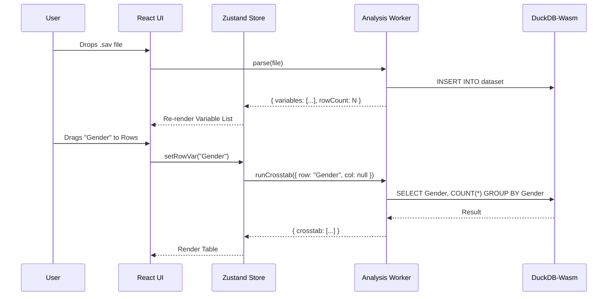

# System Architecture

## 1. Overview

Velocity is a **local-first, browser-based** survey data analysis tool. All computation happens client-side using WebAssembly. No data is ever uploaded to a server.

```
┌─────────────────────────────────────────────────────────────────┐
│                         BROWSER TAB                             │
├─────────────────────────────────────────────────────────────────┤
│  ┌─────────────┐    ┌─────────────┐    ┌─────────────────────┐  │
│  │   React UI  │◄──►│ State Store │◄──►│   Analysis Engine   │  │
│  │  (Main Thrd)│    │  (Zustand)  │    │    (Web Worker)     │  │
│  └─────────────┘    └─────────────┘    └──────────┬──────────┘  │
│                                                    │             │
│                                        ┌───────────▼──────────┐ │
│                                        │     DuckDB-Wasm      │ │
│                                        │  (Columnar Storage)  │ │
│                                        └───────────▲──────────┘ │
│                                                    │             │
│  ┌─────────────────────────────────────────────────┴───────────┐│
│  │                    Ingestion Layer                          ││
│  │  ┌─────────────┐  ┌─────────────┐  ┌─────────────────────┐  ││
│  │  │ ReadStat-Wasm│  │ CSV Parser  │  │   Arrow IPC        │  ││
│  │  │   (.sav)    │  │             │  │                     │  ││
│  │  └─────────────┘  └─────────────┘  └─────────────────────┘  ││
│  └─────────────────────────────────────────────────────────────┘│
│                                                                  │
│  ┌───────────────────────────────────────────────────────────┐  │
│  │               Advanced Stats Plugins (Lazy Load)          │  │
│  │  ┌─────────────┐              ┌─────────────┐             │  │
│  │  │   WebR      │              │  Pyodide    │             │  │
│  │  │ (Phase 3)   │              │  (Phase 4)  │             │  │
│  │  └─────────────┘              └─────────────┘             │  │
│  └───────────────────────────────────────────────────────────┘  │
└─────────────────────────────────────────────────────────────────┘
```

## 2. Core Components

### 2.1 The Ingestion Layer
*   **Purpose:** Parse proprietary file formats into a universal columnar format.
*   **Tech:** `readstat-wasm` (C compiled to Wasm) for `.sav` files.
*   **Output:** Apache Arrow IPC buffers + JSON metadata sidecar.

### 2.2 The Storage Layer (DuckDB-Wasm)
*   **Purpose:** High-speed analytical queries (GROUP BY, PIVOT).
*   **Interaction:** The UI never queries DuckDB directly. All queries go through the `AnalysisEngine` worker.
*   **Persistence:** Data is stored in `IndexedDB` (via OPFS) for session recovery.

### 2.3 The State Store (Zustand)
*   **Purpose:** Manage UI state (selected variables, active filters, undo history).
*   **Pattern:** Optimistic updates. UI updates instantly; worker confirms.

### 2.4 The Analysis Engine (Web Worker)
*   **Purpose:** Execute DuckDB queries off the main thread to prevent UI freezing.
*   **API:** Message-passing (postMessage/onmessage).

### 2.5 Advanced Stats Plugins (Phase 3+)
*   **WebR:** For `lme4`, `survey` package.
*   **Pyodide:** For NLP (spaCy, scikit-learn).
*   **Loading:** These are **not** bundled. They are fetched on-demand when the user activates "Analyst Mode."

## 3. Data Flow



## 4. Key Constraints

| Constraint | Limit | Mitigation |
| :--- | :--- | :--- |
| Browser Memory | ~4GB | Stream large files via OPFS; warn user if file > 500MB. |
| Main Thread Blocking | Any >16ms task | All DuckDB queries run in Web Worker. |
| Bundle Size | <1MB initial | Lazy-load WebR/Pyodide plugins. |
