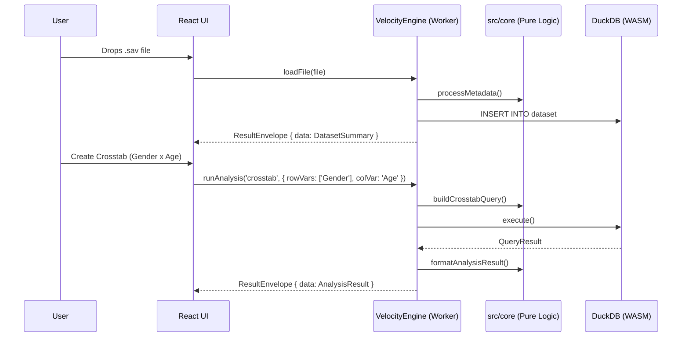

# System Architecture

## 1. Overview

Velocity is a **local-first** survey data analysis platform. While it began as a browser-first application, its architecture has evolved into an **API-first engine** capable of supporting human users (via the React UI) and autonomous AI agents (via the MCP Server and CLI) simultaneously.

All computation happens locally using WebAssembly or native Node extensions. No data is ever uploaded to a server.

```
┌─────────────────────────────────────────────────────────────────┐
│                        CONSUMER LAYER                           │
├─────────────────────────────────────────────────────────────────┤
│  ┌─────────────┐    ┌─────────────┐    ┌─────────────────────┐  │
│  │ BROWSER (UI)│    │ CLI (Term)  │    │ MCP SERVER (Agents) │  │
│  │   React     │    │   Node.js   │    │      Tool Use       │  │
│  └──────┬──────┘    └──────┬──────┘    └──────────┬──────────┘  │
│         │                  │                      │             │
│         │        ┌─────────▼─────────────┐        │             │
│         └───────►│    VelocityEngine     │◄───────┘             │
│                  │ (Stateful Orchestrator)│                     │
│                  └─────────┬─────────────┘                      │
│                            │                                    │
│  ┌─────────────────────────▼─────────────────────────────────┐  │
│  │                     DatabaseAdapter                       │  │
│  │      DuckDBWasmAdapter     |     DuckDBNodeAdapter        │  │
│  └───────────────────────────────────────────────────────────┘  │
│                                                                 │
│  ┌───────────────────────────────────────────────────────────┐  │
│  │               Headless Core (Pure Functions)              │  │
│  │   Ingestion (ReadStat) | Analysis Runners | Export (PPTX) │  │
│  └───────────────────┬───────────────────────────────────────┘  │
│                      │                                          │
│  ┌───────────────────▼───────────────────────────────────────┐  │
│  │               Advanced Stats Plugins (Lazy Load)          │  │
│  │  ┌─────────────┐              ┌─────────────┐             │  │
│  │  │   WebR      │              │  Pyodide    │             │  │
│  │  │ (Phase 3)   │              │  (Phase 4)  │             │  │
│  │  └─────────────┘              └─────────────┘             │  │
│  └───────────────────────────────────────────────────────────┘  │
└─────────────────────────────────────────────────────────────────┘
```

## 2. Core Components

### 2.1 VelocityEngine (The Orchestrator)
*   **Purpose:** The single, stateful orchestration layer that unifies all capability access. It owns the database adapter, current session state (metadata, variables), and analysis lifecycle.
*   **Consumers:** The React app (via `src/services/analysisWorker.ts`), the CLI, and the MCP Server.
*   **Reference:** See `docs/arch_07_agent_architecture.md` for strict Agent engine boundaries.

### 2.2 The Ingestion Layer
*   **Purpose:** Parse proprietary file formats into a universal columnar format.
*   **Tech:** `readstat-wasm` (C compiled to Wasm) for `.sav` files.
*   **Output:** Apache Arrow IPC buffers + JSON metadata sidecar.

### 2.3 The Storage Layer (DuckDB / DatabaseAdapter)
*   **Purpose:** High-speed analytical queries (GROUP BY, PIVOT).
*   **Interface:** `DatabaseAdapter` abstracts DuckDB execution, enabling both browser (`DuckDBWasmAdapter`) and Node (`DuckDBNodeAdapter`) environments to query identically.
*   **Retrieval:** The UI *never* queries DuckDB directly. All queries pass through the `VelocityEngine`.

### 2.4 The State Store (Zustand - Browser Only)
*   **Purpose:** Manage UI view state (active tabs, modal visibility, current component states).
*   **Future Convergence:** With the shift to `VelocityEngine`, the Zustand store is migrating away from holding domain/analysis state towards purely holding UI presentation state.

### 2.5 Advanced Stats Plugins (Phase 3+)
*   **WebR:** For `lme4`, `survey` package.
*   **Pyodide:** For NLP (spaCy, scikit-learn).
*   **Loading:** These are **not** bundled. They are fetched on-demand when the user executes operations requiring advanced mathematical modeling.

### 2.6 The UX Architecture (Soft Modal)
*   **Concept:** "Hub-and-Spoke".
    *   **Hub:** The **Analysis Canvas** (Low density, Drag-and-Drop, Reading mode, Slide creation).
    *   **Spoke:** The **Variable Manager** (High density, Miller Columns, Writing/Cleaning/Semantic tagging).
*   **Interaction:** 
    *   The Manager overlays the Canvas (Z-index layer) rather than replacing the router view, providing zero-latency switching.

## 3. Data Flow (Browser Example)



## 4. Key Constraints

| Constraint | Limit | Mitigation |
| :--- | :--- | :--- |
| Browser Memory | ~4GB | Stream large files via OPFS; warn user if file > 500MB. |
| Main Thread Blocking | Any >16ms task | All DuckDB queries run in Web Worker. |
| Bundle Size | <1MB initial | Lazy-load WebR/Pyodide plugins. |

## 5. Module Ownership & Import Direction

This section defines who is allowed to import whom. It exists to keep ownership
legible: dependencies flow **down** the stack (UI → headless), never up. Treat
the rules below as the intended target — known violations are tracked in §5.3.

### 5.1 Layers

Listed top (most dependent) to bottom (most depended-upon). A module may import
from its own layer or any layer **below** it, never above.

| # | Layer | Directories | Role |
| :- | :--- | :--- | :--- |
| 1 | **App shell** | `src/app` | Composition root: routing, session lifecycle, orchestration hooks. The only layer allowed to wire features together. |
| 2 | **Features** | `src/features/*` | Self-contained feature modules (workspace, dashboard, variableManager, harmonization). Each owns its components, hooks, and lib. |
| 3 | **Shared UI** | `src/components`, `src/context`, `src/theme`, shared `src/hooks` | Presentational, theming, and cross-feature UI primitives. No feature-specific logic. |
| 4 | **UI state** | `src/store` | Zustand slices holding UI/presentation state (see §2.4). |
| 5 | **Headless platform** | `src/engine`, `src/services`, `src/core`, `src/adapters` | Engine facade, workers/proxy, pure analysis/export logic, DB adapters. Runs in browser worker, CLI, and MCP server — **must not depend on any UI layer.** |
| 6 | **Shared kernel** | `src/types`, `src/constants`, `src/lib`, `src/utils` | Framework-agnostic type contracts and helpers depended on by everything. |

### 5.2 Cardinal rule & forbidden edges

- **Headless never imports UI.** Nothing in layers 5–6 (`core`, `engine`,
  `services`, `adapters`, `types`, `lib`, `utils`) may import from layers 1–4
  (`app`, `features`, `components`, `context`, `theme`, `store`). This is the
  same boundary enforced by `npm run check:worker-boundary` and is the one
  constraint that must hold without exception.
- **Store does not reach up.** `src/store` (layer 4) must not import from
  `src/features` or `src/components`. Shared contracts it needs belong in the
  kernel (layer 6), not in a feature.
- **App composes; features stay independent.** `src/features/*` modules should
  not import from `src/app`, and should avoid importing *another* feature
  directly — share via layers 3/6 instead.
- **Depend on neutral type modules, not component modules.** Cross-layer type
  imports (e.g. a modal's payload shape) should live in a neutral types module,
  not be pulled from a component file, so consumers don't depend on UI modules
  just for a type.

### 5.3 Known exceptions (to be resolved)

These violations exist today and are explicitly scoped to later stabilization
PRs. New code must not add to them.

- `src/types/worker.ts` and `src/types/engineWorker.ts` import
  `CrosstabQueryOptions` from `src/core/sql/queryBuilder` (kernel → platform
  back-edge). Type-only and entirely within the headless side, so low-risk, but
  a candidate for relocating the option type into the kernel.
