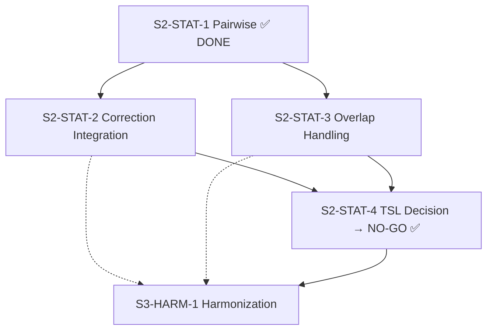

# Design Briefs: S2-STAT-1 through S2-STAT-4

**Author:** Architect (Claude Opus)
**Date:** 2026-02-23
**Status:** Proposal
**Scope:** Phase 2 Statistical Engine closure — the critical path blocking all Phase 3+ work.

---

## 0. Executive Summary & Reality Check

Before designing, the codebase was audited against the tracker. The tracker is materially stale:

| ID | Tracker Status | Actual State | Real Gap |
|:---|:---|:---|:---|
| S2-STAT-1 | Not started | **Fully implemented** | Tracker reconciliation only |
| S2-STAT-2 | Not started | **Functions exist, not wired** | Integration into crosstab pipeline |
| S2-STAT-3 | Not started | **Not implemented** | Full design + implementation needed |
| S2-STAT-4 | Not started | **Non-goal in arch doc** | Decision brief only (evaluation) |

The real remaining work is **S2-STAT-2 integration** and **S2-STAT-3 implementation**. S2-STAT-4 is a decision gate, not a code task.

---

## Brief 1: S2-STAT-1 — Pairwise Column Comparisons

### Status: DONE (Tracker Reconciliation Required)

### Evidence

The following are already implemented and tested:

| Component | Location | Test Coverage |
|:---|:---|:---|
| `calculatePairwiseComparisons()` | `src/services/statistics.ts:345-430` | 5 unit tests |
| Pairwise integration in crosstab pipeline | `src/core/analysis/crosstabRunner.ts:466-517` | Implicit via runner |
| `sigLetters` and `columnLetter` on `AggregatedRow` | `src/types/index.ts:216-219` | Type-safe |
| Letter rendering in DataTable UI | `src/features/dashboard/components/DataTable.tsx` | Visual |
| Column letter rendering in headers | `src/features/dashboard/components/DataTable.tsx` | Visual |

**Algorithm:** O(N²) Welch's T-Test between all column pairs per row category. Assigns letters A, B, C... to columns. Each cell shows which columns it is significantly higher than (e.g., "BC" means higher than B and C at α=0.05).

### Action Required

1. Update `tracker_00_implementation_status.md`: move S2-STAT-1 to **Done**.
2. Add evidence commit references (the pairwise implementation landed in the same batch as `plan_stats_engine_implementation.md` — circa 2026-02-04 based on that doc's timestamps).

### Remaining Quality Gaps (Non-Blocking)

- Pairwise always uses hardcoded `alpha = 0.05`. Should respect `analysisSettings.significanceLevel`. (Deferred to S2-STAT-2 integration.)
- No golden test coverage against SPSS reference outputs for pairwise specifically.
- Letter assignment is positional (column order in result set), not stable across filter changes. Acceptable for now.

---

## Brief 2: S2-STAT-2 — Multiple Comparison Corrections (FDR + Bonferroni)

### Status: Functions Exist, Pipeline Integration Missing

### What Exists

| Component | Location | State |
|:---|:---|:---|
| `bonferroniCorrection()` | `statistics.ts:446-454` | Complete, tested |
| `bonferroniAdjustedPValues()` | `statistics.ts:465-470` | Complete, tested |
| `benjaminiHochbergFDR()` | `statistics.ts:488-517` | Complete, tested |
| `benjaminiHochbergAdjustedPValues()` | `statistics.ts:528-557` | Complete, tested |
| `applyMultipleTestingCorrection()` | `statistics.ts:569-583` | Complete, tested |
| `AnalysisSettings.correctionType` | `analysisSlice.ts:28` | State exists, defaults to `'none'` |
| `AnalysisSettingsPanel` UI | `AnalysisSettingsPanel.tsx` | Buttons for None/Bonferroni/FDR |

### What's Missing

**The `crosstabRunner.ts` never reads `analysisSettings` and never applies corrections.** The pairwise comparisons at line 506 always call:

```typescript
calculatePairwiseComparisons(columnStatsArray, isMeans, 0.05) // hardcoded
```

The correction functions exist as isolated utilities with no call site in the pipeline.

### Approach

The integration requires threading `analysisSettings` through the crosstab pipeline and applying corrections **after** all raw p-values are collected.

#### Step 1: Extend `CrosstabQueryOptions` to accept settings

```typescript
// In queryBuilder.ts or crosstabRunner.ts
interface SignificanceOptions {
  comparisonMethod: 'cell_vs_rest' | 'pairwise';
  correctionType: 'none' | 'bonferroni' | 'fdr';
  significanceLevel: number; // 0.95 | 0.90 | 0.80 → maps to alpha
}
```

Thread this through `runCrosstab()` → significance testing block.

#### Step 2: Collect raw p-values, then correct

The current pipeline applies significance markers inline per-cell. The corrected approach:

1. **Pass 1 (existing):** Compute all raw t-scores and p-values as today. Store on each row as `stats.pValue`.
2. **Pass 2 (new):** After all cells are processed, collect the array of p-values across all tests in the table.
3. **Pass 3 (new):** Apply `applyMultipleTestingCorrection(pValues, correctionType, alpha)` to get adjusted significance.
4. **Pass 4 (new):** Re-assign `row.sig` markers based on corrected results.

For pairwise comparisons specifically:
1. Collect all pairwise p-values across all row groups.
2. Apply correction to the full family of tests.
3. Re-filter `sigLetters` to only include pairs that survive correction.

#### Step 3: Pass settings from store through worker

The worker message for crosstab queries needs to include `analysisSettings`:

```typescript
// In analysisWorker.ts message handler for 'crosstab'
const settings = msg.analysisSettings; // passed from UI
const result = await runCrosstab(adapter, { ...options, significanceOptions: settings }, context);
```

#### Step 4: Store adjusted p-values for tooltip display

Extend `AggregatedRow.stats`:

```typescript
stats?: {
  tScore: number;
  pValue: number;       // raw
  adjustedPValue?: number; // after correction (new)
  effN: number;
  correctionMethod?: 'none' | 'bonferroni' | 'fdr'; // for tooltip (new)
};
```

### Files to Modify

| File | Change |
|:---|:---|
| `src/core/analysis/crosstabRunner.ts` | Accept significance options; two-pass correction |
| `src/types/index.ts` | Add `adjustedPValue`, `correctionMethod` to stats |
| `src/services/analysisWorker.ts` | Thread `analysisSettings` through worker messages |
| `src/store/slices/analysisSlice.ts` | Ensure settings trigger re-query |
| `src/App.tsx` | Pass `analysisSettings` in worker message |
| `src/components/common/StatisticsTooltip.tsx` | Display adjusted p-value and correction method |
| `src/components/common/SignificanceLegend.tsx` | Update legend text for active correction |

### Invariants

- **Zero breaking changes:** Raw (uncorrected) behavior is the default (`correctionType: 'none'`). All existing tests pass unchanged.
- **No main-thread compute:** Corrections are applied inside the worker, in the crosstab runner.
- **Additive types only:** New optional fields on `AggregatedRow.stats`.

### Test Strategy

| Test | Description | Gate |
|:---|:---|:---|
| Unit: Bonferroni integration | 5-column table, verify letters removed after correction | U |
| Unit: FDR integration | Same table, verify FDR retains more letters than Bonferroni | U |
| Unit: Settings passthrough | Mock worker, verify settings reach crosstabRunner | U |
| Unit: `significanceLevel` respected | Change alpha, verify threshold changes | U |
| Golden: SPSS parity | Compare corrected outputs to SPSS reference if available | G |

### Risk

**Low.** All mathematical functions exist and are tested. This is a plumbing task — threading state and applying already-tested functions at the right point.

### Estimated Complexity

Small-to-medium. ~150 lines of new integration code across 5-7 files. No new algorithms.

---

## Brief 3: S2-STAT-3 — Dependent-Sample Overlap Handling (Multi-Response)

### Status: Not Implemented — Full Design Required

### The Problem

In a multiple-response question ("Which brands do you know? Select all that apply"), a single respondent can select multiple options. When this variable is used as the **column banner** of a crosstab, the same respondent appears in multiple columns simultaneously.

**Example:** Respondent #42 selected Coke, Pepsi, and Fanta.

| | Coke (A) | Pepsi (B) | Fanta (C) | Sprite (D) |
|:---|:---|:---|:---|:---|
| Male | ← #42 here | ← #42 here | ← #42 here | |

The current pairwise test between Coke and Pepsi treats them as **independent samples**, but they share respondent #42. This violates the independence assumption of the Welch's T-Test and inflates Type I error rates — the tests will report too many "significant" differences.

### When This Matters

This problem **only** applies when:
1. The **column variable** is a multi-response set (`VariableSet.structure === 'multiple'`).
2. Pairwise comparisons are active (always computed in the current pipeline).

It does **not** apply when:
- The column variable is a standard single-response variable (respondents appear in exactly one column).
- Cell-vs-Rest comparisons are used (the rest naturally excludes the cell, though overlap between rest columns still exists — this is a second-order effect).

### Survey Industry Standard Approach

The standard correction for dependent proportions in market research is the **McNemar-style paired test** or equivalently a **correlated-proportions z-test**:

For two columns A and B with overlapping respondents:

$$z = \frac{p_A - p_B}{\sqrt{\frac{p_A(1-p_A)}{n} + \frac{p_B(1-p_B)}{n} - \frac{2 \cdot p_{AB} - p_A \cdot p_B}{n}}}$$

Where:
- $p_A$ = proportion selecting A
- $p_B$ = proportion selecting B
- $p_{AB}$ = proportion selecting **both** A and B (the overlap)
- $n$ = total base (unweighted or ESS)

The key additional data requirement is $p_{AB}$ — the joint selection rate for every pair of columns.

### Approach

#### Phase 1: Detect overlap context

When the column variable is a multi-response set, the crosstab runner needs to know this and switch to the dependent-sample test.

Detection is straightforward: the `VariableSet` with `structure === 'multiple'` is already known at query time. The `isMultipleResponse` flag is already computed in `App.tsx:221` and passed through to chart recommender and export.

```typescript
// Already exists:
const isMultipleResponse = firstRowVarSet?.structure === 'multiple';
```

This flag needs to reach the crosstab runner's significance testing block.

#### Phase 2: Compute pairwise overlap counts via SQL

For a multi-response set with variables `Q5_1` (Coke), `Q5_2` (Pepsi), `Q5_3` (Fanta), we need:

```sql
-- Count respondents who selected BOTH column i AND column j
SELECT
  COUNT(*) FILTER (WHERE "Q5_1" = 1 AND "Q5_2" = 1) as overlap_1_2,
  COUNT(*) FILTER (WHERE "Q5_1" = 1 AND "Q5_3" = 1) as overlap_1_3,
  COUNT(*) FILTER (WHERE "Q5_2" = 1 AND "Q5_3" = 1) as overlap_2_3,
  -- Total base
  COUNT(*) as n_total
FROM main
WHERE ... (filters)
```

For weighted data:

```sql
SELECT
  SUM(weight) FILTER (WHERE "Q5_1" = 1 AND "Q5_2" = 1) as overlap_w_1_2,
  SUM(weight * weight) FILTER (WHERE "Q5_1" = 1 AND "Q5_2" = 1) as overlap_sw2_1_2,
  ...
FROM main
```

This is O(K²) additional SQL aggregates for K multi-response columns. For typical multi-response sets (5-15 items), this produces 10-105 overlap counts — well within DuckDB's capability in a single query.

**New function needed in `queryBuilder.ts`:**

```typescript
function buildOverlapQuery(
  multiResponseVarIds: string[],  // The column names in the MR set
  countedValue: number,            // e.g., 1 for "selected"
  filters?: Filter[],
  weightVar?: string
): string
```

#### Phase 3: New statistical primitive

Add to `statistics.ts`:

```typescript
/**
 * Correlated Proportions Test (for dependent/overlapping samples)
 *
 * Tests whether two proportions from overlapping samples differ significantly.
 * Used when both samples come from the same respondents (multi-response).
 */
export function calculateDependentProportionsTest(
  pA: number,      // Proportion selecting A
  pB: number,      // Proportion selecting B
  pAB: number,     // Proportion selecting BOTH A and B
  n: number,       // Effective sample size (total base)
): { tScore: number; pValue: number }
```

The variance of the difference accounts for the covariance between proportions:

```
Var(pA - pB) = Var(pA) + Var(pB) - 2*Cov(pA, pB)

Cov(pA, pB) = (pAB - pA*pB) / n

SE = sqrt( [pA(1-pA) + pB(1-pB) - 2*(pAB - pA*pB)] / n )
```

#### Phase 4: Integration in crosstabRunner

Modify the pairwise comparison block (`crosstabRunner.ts:466-517`):

```typescript
// If column variable is multi-response, use dependent test
if (isMultiResponse && overlapData) {
  // Use calculateDependentProportionsTest instead of calculatePairwiseComparisons
  // for each pair of columns
} else {
  // Existing independent pairwise test
}
```

#### Phase 5: Thread overlap data

The overlap query needs to run once per crosstab execution (alongside the totals query at line 322). The overlap counts are then available to the pairwise comparison block.

### Data Flow

```
runCrosstab()
  │
  ├── buildCrosstabQuery()      → main results (existing)
  ├── buildCrosstabQuery(null)  → row totals (existing)
  ├── buildOverlapQuery()       → pairwise overlap counts (NEW)
  │
  ├── Cell-vs-Rest sig testing  → row.sig markers (existing)
  │
  └── Pairwise comparisons
      ├── IF isMultiResponse:   → calculateDependentProportionsTest (NEW)
      └── ELSE:                 → calculatePairwiseComparisons (existing)
```

### Files to Modify

| File | Change |
|:---|:---|
| `src/services/queryBuilder.ts` | New `buildOverlapQuery()` function |
| `src/services/statistics.ts` | New `calculateDependentProportionsTest()` |
| `src/core/analysis/crosstabRunner.ts` | Run overlap query; switch test type for MR columns |
| `src/types/index.ts` | Add `isOverlapCorrected?: boolean` to stats |
| `src/services/analysisWorker.ts` | Pass `isMultipleResponse` flag and MR variable IDs |
| `src/components/common/StatisticsTooltip.tsx` | Show "Dependent samples (overlap-corrected)" |
| `src/components/common/SignificanceLegend.tsx` | Add note when overlap correction is active |

### Invariants

- **Existing single-response behavior unchanged.** The overlap path only activates when the column banner is a multi-response set.
- **No main-thread compute.** Overlap query and dependent test both run in the worker.
- **Dual-state integrity preserved.** Overlap counts are computed on raw codes, not labels.
- **Additive contract changes.** New optional fields only.

### Test Strategy

| Test | Description | Gate |
|:---|:---|:---|
| Unit: `calculateDependentProportionsTest` | Known reference values (manual calculation) | U |
| Unit: `buildOverlapQuery` SQL | Verify generated SQL for 3-item and 5-item MR sets | U |
| Unit: Zero overlap | When no respondent selects both → degrades to independent test | U |
| Unit: Full overlap | When all respondents select both → z=0 (no difference) | U |
| Integration: MR column detection | Verify overlap path activates only for `structure === 'multiple'` | I |
| Integration: End-to-end MR crosstab | Load fixture with known MR data, verify corrected letters | I |
| Golden: Compare uncorrected vs corrected | Show that overlap correction removes false positives | G |

### Risk

**Medium.** This is the only genuinely new algorithm in the S2-STAT series. Risks:

1. **SQL complexity for large MR sets.** A 20-item MR set produces 190 overlap pairs. Mitigation: DuckDB handles this trivially in a single FILTER-based aggregation.
2. **Weighted overlap ESS.** Need to compute ESS for the overlap subgroup specifically. Mitigation: track `SUM(w)` and `SUM(w²)` per overlap pair alongside the counts.
3. **Row-segmented overlaps.** The overlap counts need to be computed per row category when row variables are present, not just globally. This multiplies the query size by the number of row categories. Mitigation: Use a GROUP BY on row variables in the overlap query.

### Estimated Complexity

Medium. ~300 lines new code. One new SQL builder function, one new statistical primitive, integration plumbing. The statistical theory is well-established (McNemar/correlated proportions); the implementation challenge is the SQL overlap aggregation.

---

## Brief 4: S2-STAT-4 — TSL Variance Estimation Evaluation (Go/No-Go)

### Status: Decision Required — Not a Code Task

### Context

Taylor Series Linearization (TSL) is a variance estimation method for complex survey designs with stratification and primary sampling units (PSUs). It provides "correct" standard errors for multi-stage probability samples (e.g., government household surveys, large national panels with geographic clustering).

### Current Architecture Position

`arch_04_statistical_engine.md` explicitly states:

> **Not Planned (Non-Goals):**
> - Taylor Series Linearization (TSL): Over-engineering for boutique agency needs.
> - Complex Strata/PSU Support: Velocity targets "flat" panel data, not government stratified samples.

The earlier `plan_stats_engine_implementation.md` also lists TSL as a non-goal.

### Evaluation Criteria

The go/no-go decision should answer:

| Question | Current Answer | Implication |
|:---|:---|:---|
| Does Velocity's target persona work with stratified samples? | No — target is commercial MR (panel data) | TSL not needed |
| Do Velocity's competitors offer TSL? | Displayr: No. SPSS: Yes (Complex Samples module, separate license). Q: No. | Not a competitive gap |
| Would TSL change existing test results? | Only for data with strata/PSU variables, which Velocity doesn't ingest | No impact on current outputs |
| What's the implementation cost? | High — requires reading strata/PSU metadata from SAV files, new variance formulas, new SQL aggregation patterns | Disproportionate to benefit |
| Is there a middle ground? | Design effects (DEFF) can approximate TSL benefit. Kish's ESS already provides a first-order correction. | Already partially addressed |

### Recommendation: NO-GO

TSL should remain a non-goal for Phase 2. Rationale:

1. **Target persona mismatch.** Commercial MR agencies use flat panel data with post-stratification weights. Kish's ESS handles this correctly.
2. **No competitive pressure.** Neither Displayr nor Q (the primary competitors) offer TSL.
3. **High cost, low impact.** TSL implementation would touch ingestion (strata/PSU metadata), SQL generation, and every statistical primitive. For zero benefit to 95%+ of target users.
4. **Phase 3 escape hatch.** If a future persona requires TSL, the WebR bridge (S3-R-1) provides it via R's `survey` package without building it from scratch in JS/SQL.

### Action Required

1. Record this decision in the tracker as **Done** with status "Go/No-Go: NO-GO (deferred to Phase 3+ via WebR)."
2. Update `arch_04_statistical_engine.md` to note the formal evaluation and decision date.
3. Unblock Phase 3 — the dependency graph shows S3-HARM-1 depends on S2-STAT-4. With this decision resolved, S3-HARM-1's dependency is satisfied.

### Optional Addendum: Design Effects Reporting

As a minor trust signal, Velocity could display the **Design Effect** (DEFF = N / ESS) alongside ESS in the StatisticsTooltip. This gives researchers a familiar metric that acknowledges weighting impact without implementing TSL. This is ~10 lines of code and could be done opportunistically.

---

## Revised Dependency Graph

After reconciliation, the actual dependency graph is:



**Critical path:** S2-STAT-2 and S2-STAT-3 can proceed in parallel. Both must complete before Phase 3 is unblocked. S2-STAT-4 is resolved immediately (decision, not code).

### Execution Order

1. **Immediate:** Reconcile tracker (S2-STAT-1 → Done, S2-STAT-4 → Done with NO-GO decision).
2. **Parallel Track A:** S2-STAT-2 — Wire corrections into crosstab pipeline (~small-medium).
3. **Parallel Track B:** S2-STAT-3 — Implement overlap handling (~medium).
4. **Gate:** Both S2-STAT-2 and S2-STAT-3 pass all gates → Phase 2 statistical closure achieved.

---

## Appendix: Contract Changes Summary

| ID | Contract Change? | Nature |
|:---|:---|:---|
| S2-STAT-1 | Already landed | `sigLetters`, `columnLetter` on `AggregatedRow` |
| S2-STAT-2 | Yes (additive) | `adjustedPValue`, `correctionMethod` on `stats`; `significanceOptions` on runner config |
| S2-STAT-3 | Yes (additive) | `isOverlapCorrected` on `stats`; `buildOverlapQuery` in queryBuilder |
| S2-STAT-4 | No | Decision only |
