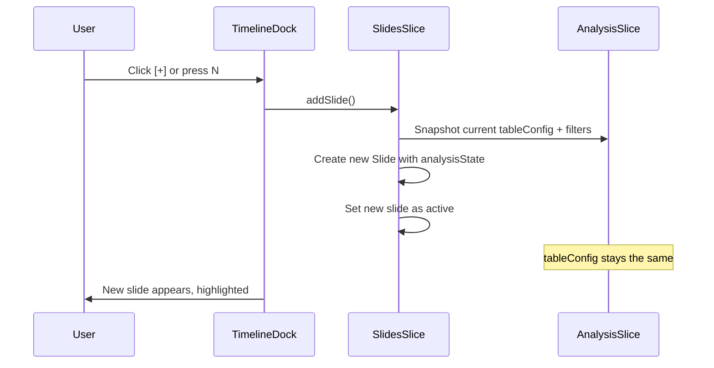
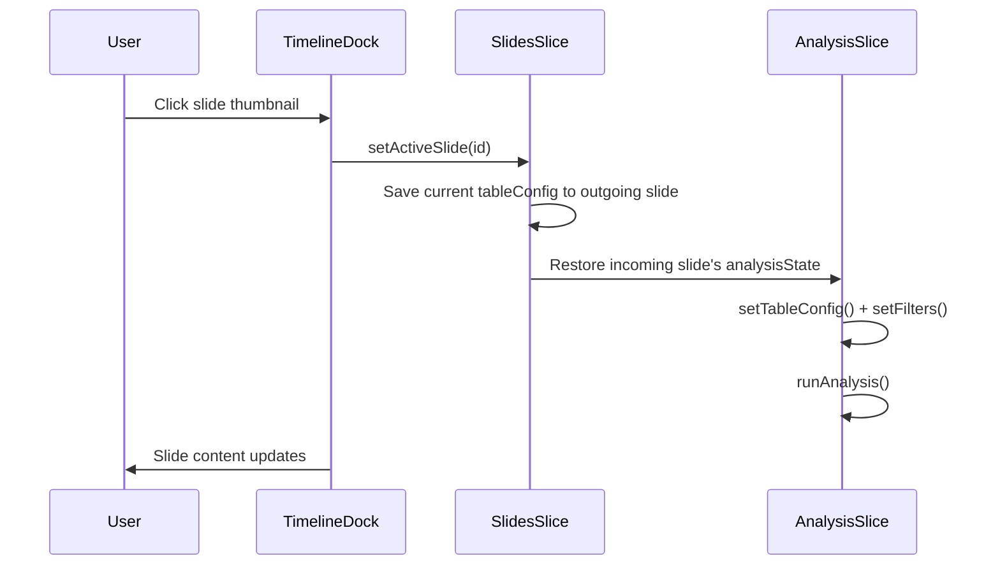
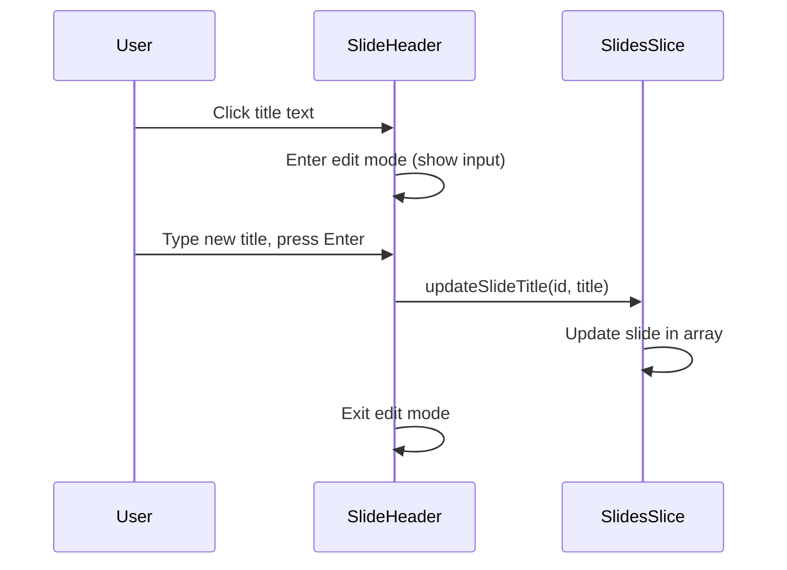

# Analysis Deck: Design & Architecture

> **Status:** Implemented baseline; export and deck presentation quality remain part of the stabilization backlog.
> **Current Authority:** See `tracker_00_implementation_status.md` and `roadmap_00_strategic_guide.md`.

---

## Executive Summary

The Analysis Deck transforms Velocity from a single-analysis tool into a **presentation-ready research platform**. Each "slide" captures a complete analysis view—variables, filters, visualization choice—and can be chained into a narrative deck for client delivery.


---

## 1. Core Concept

### What is a Slide?

A **Slide** is a saved analysis view containing:

| Property | Description | Example |
|----------|-------------|---------|
| **Row Variables** | Variables on rows axis | `["age_group", "gender"]` |
| **Column Variable** | Variable on columns axis | `"income_band"` |
| **Filters** | Active data filters | `[{ variableId: "region", value: "North" }]` |
| **Visualization** | Table or specific chart type | `"horizontal-bar"` |
| **Title** | Editable headline | `"Age Distribution by Income"` |
| **Subtitle** | Editable subheadline | `"Filtered to North region"` |

### Why This Matters

1. **Narrative Flow** — Build stories, not isolated tables
2. **Reproducibility** — Each slide captures exact state
3. **Presentation Mode** — Share with stakeholders (future)
4. **Comparison** — Side-by-side slides with different filters

---

## 2. Architecture

### 2.1 Data Model

```typescript
// types/slides.ts

export interface SlideAnalysisState {
    /** Row variable IDs */
    rowVars: string[];
    /** Column variable ID (nullable) */
    colVar: string | null;
    /** Active filters */
    filters: Filter[];
    /** Weight variable if enabled */
    weightVar: string | null;
}

export interface Slide {
    id: string;
    
    // User-facing metadata
    title: string;        // Editable, defaults from analysis
    subtitle: string;     // Editable, defaults from filter/weight info
    
    // Analysis state (the "saved view")
    analysisState: SlideAnalysisState;
    
    // Visualization
    visualizationType: 'table' | 'chart';
    chartType?: ChartType;
    
    // Layout (for grid mode)
    layoutMode: LayoutMode;
    cells: SlideCell[];
    
    // Organization
    sectionId?: string;
    createdAt: number;
    updatedAt: number;
}
```

### 2.2 Store Integration

```
┌─────────────────────────────────────────────────────────────────┐
│                        VelocityStore                             │
├─────────────────┬─────────────────┬─────────────────────────────┤
│   dataSlice     │  analysisSlice  │       slidesSlice           │
│   (dataset)     │  (current view) │       (saved views)         │
└────────┬────────┴────────┬────────┴──────────────┬──────────────┘
         │                 │                       │
         │    ┌────────────┴────────────┐          │
         │    │  TableConfig, Filters   │          │
         │    │  (ephemeral state)      │──────────┤ snapshot
         │    └─────────────────────────┘          │
         │                                         ▼
         │                              ┌──────────────────────┐
         │                              │  slides: Slide[]     │
         │                              │  activeSlideId       │
         └──────────────────────────────│  sections            │
                                        └──────────────────────┘
```

**Key Insight:** `analysisSlice.tableConfig` is the *ephemeral* current analysis. When user saves or switches slides, we:
1. **Save:** Snapshot current `tableConfig` + `activeFilters` into active slide's `analysisState`
2. **Load:** Restore slide's `analysisState` into `tableConfig` + `activeFilters`

### 2.3 Title Generation

Titles default from the analysis context but are fully editable:

```typescript
function generateDefaultTitle(state: SlideAnalysisState, variables: Variable[]): string {
    const rowLabels = state.rowVars.map(id => 
        variables.find(v => v.id === id)?.label || id
    );
    const colLabel = state.colVar 
        ? variables.find(v => v.id === state.colVar)?.label 
        : null;
    
    if (colLabel) {
        return `${rowLabels.join(' > ')} by ${colLabel}`;
    }
    return `${rowLabels[0]} Frequency`;
}

function generateDefaultSubtitle(state: SlideAnalysisState, variables: Variable[]): string {
    const parts: string[] = [];
    if (state.filters.length > 0) {
        parts.push(`Filtered: ${state.filters.length} active`);
    }
    if (state.weightVar) {
        parts.push(`Weighted by ${variables.find(v => v.id === state.weightVar)?.label}`);
    }
    return parts.join(' · ') || 'N = 271 Respondents';
}
```

---

## 3. Component Design

### 3.1 SlideHeader (New Component)

An inline-editable header that appears above the analysis:

```
┌─────────────────────────────────────────────────────────────────┐
│  troublefallasleep Frequency                            [📝][⚙️]│
│  N = 271 Respondents                                            │
├─────────────────────────────────────────────────────────────────┤
│                                                                 │
│                      [ ANALYSIS CONTENT ]                       │
│                                                                 │
└─────────────────────────────────────────────────────────────────┘
```

**Behavior:**
- Click title → inline edit (contenteditable or input)
- Click subtitle → inline edit
- Pencil icon → explicit edit mode
- Gear icon → slide settings (future)

### 3.2 TimelineDock (Existing, Enhanced)

Add visual feedback for unsaved changes:

```
           ╭─────────────────────────────────────────╮
           │  [1•] [2]  [3*]  [+]                   │
           ╰─────────────────────────────────────────╯
                  ↑        ↑
             active   unsaved changes
```

### 3.3 File Structure

```
src/
├── features/
│   └── dashboard/
│       └── components/
│           ├── SlideContainer.tsx      # Orchestrates rendering
│           ├── SlideHeader.tsx         # NEW: Editable title/subtitle
│           ├── TimelineDock.tsx        # EXISTS: Navigation strip
│           └── SlideThumb.tsx          # Extract from TimelineDock
├── store/
│   └── slices/
│       └── slidesSlice.ts              # UPDATE: Add analysis state
└── types/
    └── slides.ts                       # UPDATE: Add analysis state types
```

---

## 4. User Flows

### 4.1 Creating a New Slide



### 4.2 Switching Slides



### 4.3 Editing Title



---

## 5. Task List

### ✅ Completed

- [x] **TimelineDock component** — Floating navigation with slide thumbnails
- [x] **SlideThumb component** — Individual thumbnail with icon and number
- [x] **SectionDivider component** — Visual separator for sections
- [x] **Drag-to-reorder** — Using dnd-kit SortableContext
- [x] **Keyboard navigation** — ← → N keys
- [x] **Theme-specific styling** — Mission Control, Soft Machine, Liquid Glass
- [x] **slidesSlice scaffolding** — Basic slice with sections, navigation actions
- [x] **types/slides.ts** — SlideSection type, sectionId on Slide

### 🔲 Immediate (This Sprint)

- [x] **Add `SlideAnalysisState` to Slide type** — Capture rowVars, colVar, filters, weightVar
- [x] **Add `visualizationType` and `chartType` to Slide** — Capture table vs chart choice
- [x] **Implement slide snapshot logic** — Save current analysis state when switching slides
- [x] **Implement slide restore logic** — Load analysis state when activating a slide
- [x] **Add `title` editability in Slide** — Make title editable, default from analysis
- [x] **Add `subtitle` to Slide** — Editable, defaults from filter/weight info
- [x] **Create `SlideHeader.tsx`** — Inline-editable title and subtitle component
- [x] **Integrate SlideHeader into SlideContainer** — Replace static title rendering
- [x] **Show slide title in TimelineDock thumbnails** — Already shows; ensure sync
- [x] **Add unsaved indicator** — Visual feedback in dock for modified slides

### 🔮 Future (Next Sprint)

- [ ] **Duplicate slide action** — Clone with analysis state
- [ ] **Delete slide with confirmation** — Modal or undo pattern
- [ ] **Section management UI** — Add/remove/rename sections
- [ ] **Slide reordering across sections** — Drag between section groups
- [ ] **Grid layout mode** — Multiple cells per slide
- [ ] **Full-screen presenter mode** — Presentation delivery
- [ ] **Export deck to PDF/PPTX** — External sharing
- [ ] **Slide templates** — Pre-configured analysis patterns

---

## 6. Implementation Priority

| Phase | Focus | Deliverable |
|-------|-------|-------------|
| **Phase 1** | State Capture | Slides save/restore full analysis state |
| **Phase 2** | Editable Titles | SlideHeader with inline editing |
| **Phase 3** | Polish | Unsaved indicators, duplicate, delete |
| **Phase 4** | Presentation | Full-screen mode, export |

---

## 7. Open Questions

1. **Auto-save vs. Manual save?** — Should slides auto-save on switch, or require explicit action?
2. **Conflict resolution?** — What if user modifies analysis then switches without saving?
3. **Undo/Redo scope?** — Does undo work within a slide or across the deck?
4. **Thumbnail preview?** — Should thumbnails show live mini-charts or just icons?

---

## References

- [tracker_00_implementation_status.md](./tracker_00_implementation_status.md) — Current execution status
- [design_01_system.md](./design_01_system.md) — Design system tokens
- [roadmap_00_strategic_guide.md](./roadmap_00_strategic_guide.md) — Current strategy
