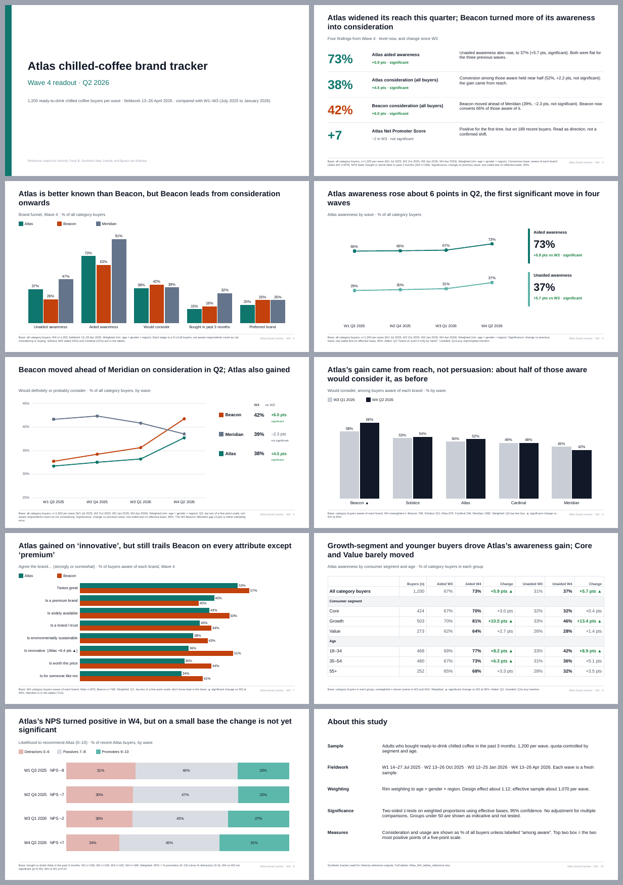

# Track B reference outputs, v2 (23 September 2026)

These files replace `atlas-awareness-exhibit.pptx` and `atlas-awareness-sheet.xlsx` as the *target* for Velocity's exports. They are made from the synthetic brand-tracker files (W1–W4), and every value is computed from the `.sav` data. They are not tidied-up Velocity output.

| File | What it is |
| :--- | :--- |
| `Atlas_W4_readout_reference.pptx` | 10-slide Wave 4 readout. All charts and tables are native and editable.  |
| `Atlas_W4_tables_reference.xlsx` | Agency-style tablebook: Read me, Contents, Key measures, Trend, Chart data, 18 banner tables, Data (long), Definitions. |
| `sheet-*.png` | LibreOffice renders of two sheets. |
| `generator/` | Scripts that rebuild both files from the `.sav` files. |

## Why v1 was not reviewable

- **Deck:**
  - Section dividers printed the literal text "Section Divider".
  - Every exhibit was a single-column table headed "Total", including trends and brand comparisons.
  - Titles made claims the exhibit could not show ("rose 6pts", "Beacon overtook Meridian"). One slide contradicted its own table.
  - Scale answers were sorted by value, and "Don't know 0.0%" rows were kept.
  - Source lines were about 6pt and sat at the foot of half-empty slides.
- **Workbook:** one question per sheet with a "Total" column and a weighted-count column of decimals. It had no banner, unweighted base, nets, mean, significance letters, contents, definitions or trend. The "after" image was a reconstruction, not a render.

## Patterns used, and where they come from

The "R" numbers refer to records in the product owner's *Research Reporting Benchmark Atlas* (September 2026).

| Pattern | Source | Where |
| :--- | :--- | :--- |
| Show the level and the change separately | GPPS national results (Atlas R131) | Deck slides 2, 4, 5 and 8; *Key measures* sheet |
| Show endpoints and put the change where the eye lands | Edelman Trust Barometer (R084) | Deck slides 4–5, right-hand panels |
| Keep question, measure and base with the chart | FCA Financial Lives (R099); Pew (R151); Ipsos Political Monitor base lines | Measure line under every title; base/question/test note on every slide |
| Show the tracker's history, not just the latest wave | Gallup Global Workplace (R176) | Slides 4, 5 and 9 |
| Pair a chart with a table that adds detail | FCA chart + subgroup table (R099/R130) | Slide 8, segment and age table |
| Put a direct label on each bar; order by the argument | Pew social media (R151); McKinsey (R047) | Slides 3, 6 and 7 |
| Layer the workbook: read me, chart data, full tables, definitions | FCA / GPPS / NCPES packages (R128, R135, R145); GSS spreadsheet guidance | Workbook structure |
| Long format: measure, wave, group, value, unweighted and weighted base, status | Atlas p.55 schema; NCPES long-format tables (R146) | *Data (long)* sheet, an Excel Table named `TrackerLong` |
| Keep zero, missing and suppressed values distinct | Atlas p.55; GSS shorthand | `–` = true zero, `[u]` = suppressed, amber = indicative |
| Banner with column letters, unweighted and weighted bases, nets, means | Ipsos Political Monitor tables; Q exports in the product owner's past work | Every T sheet |
| Contents with links, and a link back to contents on each table | The Q tablebooks in the product owner's past work (UM Older Women, StarHub) | Contents, and cell A1 of each table |

Where these outputs depart from the sources, on purpose:

- **Freeze panes.** GSS advises against them. Tablebook users scroll wide banners, so the banner and label column are frozen.
- **Font size.** Tables use Arial 10pt, not the GSS minimum of 12pt, to keep a 14-column banner on one landscape page.
- **Merged cells.** Banner group headers use centre-across-selection, not merged cells.

## Rubric (the Atlas's three-scorecard idea, applied)

- **Deck:**
  - Each title states a claim that the exhibit on the slide can prove.
  - Each exhibit has one comparison.
  - Level and change are shown separately, and significance is stated.
  - The base, question and test are on the slide.
  - No placeholder text; no value-sorted scales.
  - Charts are native and editable.
- **Tables:**
  - Percentages are stored as numbers.
  - Scale rows are in questionnaire order, with nets and a mean.
  - Unweighted and weighted bases are shown; low bases are flagged or suppressed.
  - Significance letters are scoped to a banner group.
  - Every chart value can be traced from *Chart data* to *Data (long)* and to its T sheet.
- **Shared floor:** the same numbers everywhere. Changes are computed from unrounded values, so deck and workbook agree; for example, Beacon consideration is +6.0 pts in both.

## Gap list: what Velocity's exporters would need

1. **Multi-wave input.** Trend slides and W3 comparisons need stacked wave files. The app currently works on one `.sav` at a time.
2. **Chart output in PPTX.** Needed: native line, clustered bar and 100% stacked bar charts, with direct labels and a colour for the focus brand.
3. **Significance vs previous wave, with the result in the words.** Titles and panels need to say "significant" or "not significant". Today the exporter only has a subtitle string.
4. **Structured context fields.** Base description, unweighted n, question text, weight, test and fieldwork need to be separate fields rather than one free-text subtitle.
5. **Scale awareness.** Keep code order; add top-two-box, bottom-two-box and mean; hide an all-zero "Don't know" row in decks but keep it in the tables.
6. **Tablebook export.** Needed: banner definition, column-letter tests with effective bases, low-base rules, contents and read-me sheets, and a long-format sheet.

## Limits

- The data is synthetic, and the storyline comes from the demo specification.
- Renders were made with LibreOffice, not native PowerPoint or Excel. The deck passes the OOXML validator, and the workbook reopens cleanly with openpyxl. Opening both in Office is the next check.
- Public originals (Ipsos, FCA and others) could not be downloaded in this session. Patterns cited from them were checked through publisher text and the product owner's atlas. The local Work-folder examples were rendered and inspected. They are useful for tablebook conventions (contents, back-links, base footers), but as decks they are ordinary: topic titles, no bases, and some numbers stored as text.
- Significance tests are not corrected for multiple comparisons, and there is no within-wave brand-vs-brand test (the samples overlap).

## Regenerate

```bash
pip install pyreadstat scipy openpyxl pandas
cd docs/assets/output-quality/reference-v2/generator
export VELOCITY_ROOT=../../../../..
python3 deckdata.py      # computes deck.json
python3 build_xlsx.py    # tablebook, including the Chart data sheet from deck.json
NODE_PATH=$VELOCITY_ROOT/node_modules node deck.js
```
