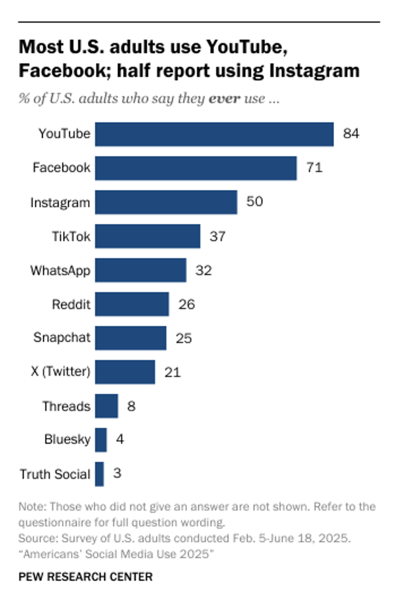
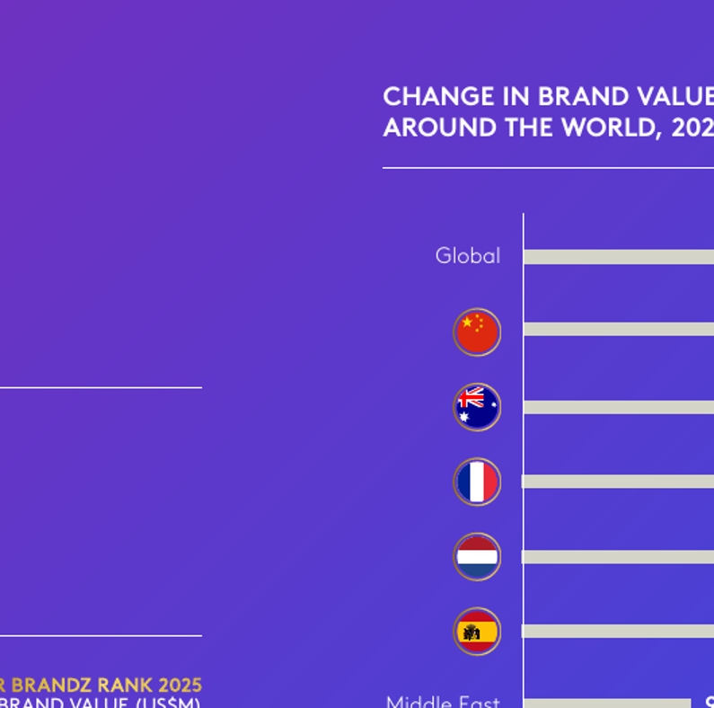
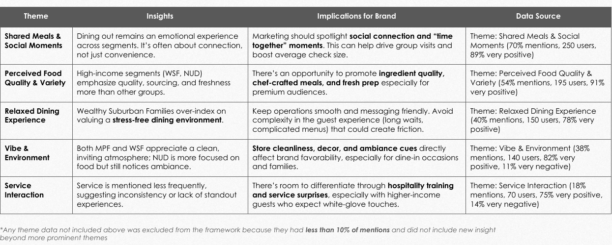
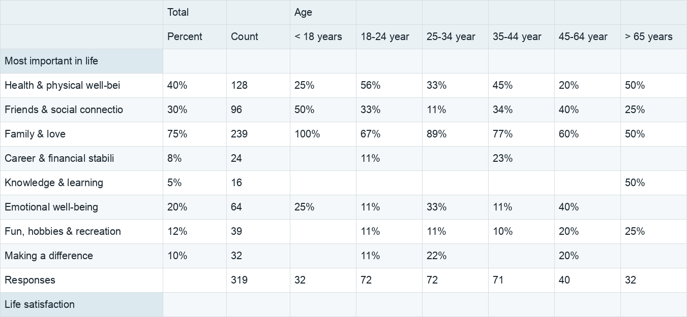
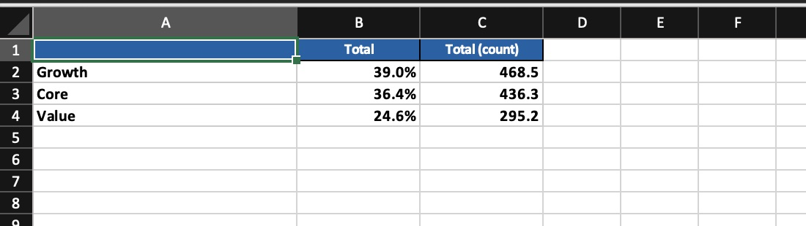
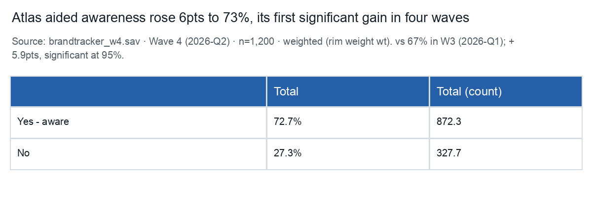
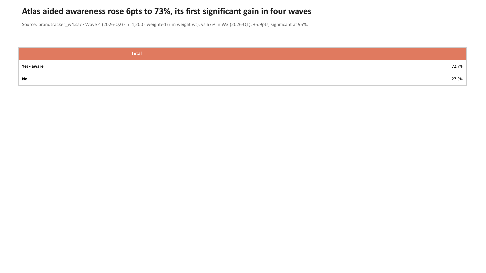
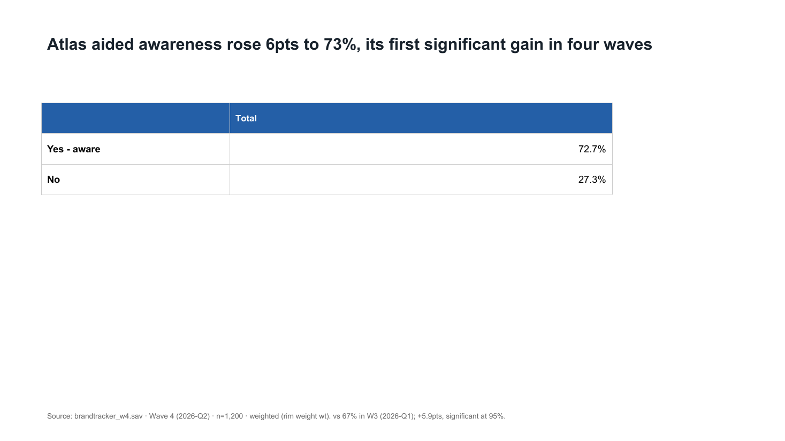

# Track B output quality evidence — 23 September 2026

This is comparison evidence for [Track B](../../plan_07_researcher_journey_and_output_quality.md), using the synthetic `brandtracker_w4.sav` analysis. The source crops below are brief excerpts for internal evaluation. Their publishers retain copyright; public access does not grant reuse in Velocity exports. The linked originals are the source of record.

## B1. Source inventory

| Source and inspected location | Date, format, audience | Access and role |
| :--- | :--- | :--- |
| [Pew Research Center, *Americans' Social Media Use 2025*, p. 4](https://www.pewresearch.org/wp-content/uploads/sites/20/2025/11/PI_2025.11.20_Social-Media-Use_REPORT.pdf#page=4) | 20 Nov 2025; public PDF research report; general and policy readers | Public view; copyright retained. Strong survey chart with question, unit, base/method note, source and a finding title. PDF is a visual reference, not evidence of editable PPTX structure. |
| [Kantar BrandZ, *Most Valuable UK Brands 2025*, single-page infographic](https://www.kantar.com/Campaigns/BrandZ/-/media/B25D89F1CE694BE08390A6278C922801.ashx) | 2025; public PDF exhibit; brand and marketing readers | Public view; copyright retained. Strong hierarchy for a dense brand comparison; its high density is unsuitable as a default for one Velocity crosstab. |
| [Brandtailers, *Example Customer Research Phase 1 Report*, p. 9](https://brandtailers.com/wp-content/uploads/2025/07/EXAMPLE_BRANDTAILERS-CUSTOMER-RESEARCH_PHASE-1-REPORT.pdf#page=9) | 2025; public sample slide report distributed as PDF; prospective clients | Public view; copyright retained. Ordinary agency example: explicit data-source column and implication text, but a long question and crowded cells. Sample content is illustrative, not a source of market facts. |
| [Research Automators, cross-tab demo workbook](https://researchautomators.com/wp-content/uploads/sites/2/2023/12/ResearchAutomators_Cross-tab-demo.xlsx), `1 - %` cells B5:J16 and `2 - n` cells B5:J16 | Download path dated Dec 2023; XLSX; working researchers | Public download; copyright retained, reuse permission unverified. Real formatted workbook example: separate numeric percentage and count sheets, banner labels, base row and frozen panes. Five tabs include averages and top-two-box variants. |
| [Displayr, PowerPoint reporting discussion](https://www.displayr.com/working-smarter-with-powerpoint/) | 2024 article; vendor page; working researchers | Context on recurring reporting only. It is **not** counted as an output example because no downloadable produced deck was inspected. |

## B2. Visual comparison board

### PowerPoint and report exhibits

| Source crop | Observation for Velocity |
| :--- | :--- |
|  | The chart title states a finding. Category labels sit beside bars; numbers sit at bar ends. The unit, omitted responses, source and survey dates remain close to the exhibit. The sparse palette helps scanning. |
|  | A headline metric and a ranked chart form separate levels. White bars on a strong brand field work here because the infographic is intentionally dense; this is a deliberate departure for Velocity's single-analysis slide. |
|  | A source column improves traceability, but the table packs long prose into each cell. It supports using visible research context without copying this density. |

Pew makes survey qualification integral to the chart; Kantar uses brand immersion and much higher density; the Brandtailers example uses a table to carry interpretation. These are different report jobs. For Velocity's first exhibit, use a finding title, a readable small table, and a visible source/base/weight note. Keep the numbers and table editable in PowerPoint.

### Spreadsheet analysis

| Source crop | Observation for Velocity |
| :--- | :--- |
|  | This crop is reconstructed from the downloadable XLSX values and styles in `1 - %`, B5:J17. The source file has percentage values as numbers, a distinct count tab, a banner/base row, and frozen panes at C7. It favours inspection across many questions over a narrative title for each table. |
|  | Native Excel view of the former one-sheet Velocity export: data starts at row 1, no analysis title or fieldwork/weight context is visible, and headings do not freeze. |
|  | Reconstruction from the revised XLSX cell values and formatting for the target sheet. Title and context precede numeric data. The actual workbook, linked below, is the editable review artifact. |

The public workbook separates percentages and counts into tabs; Velocity keeps both side by side for one analysis because the unit labels and typed values remain clear. Research Automators also groups many questions in each sheet; Velocity's current one-analysis-per-tab structure better preserves the saved slide boundary. These are deliberate departures, not a shared layout rule for all workbook exports.

## B3. Current-output audit

The baseline PowerPoint is the repository's `tests/fixtures/export/brandtracker-report.pptx`, opened and rendered through Microsoft PowerPoint. The baseline XLSX was generated from the same synthetic tracker with the current engine export. A full 18-sheet export failed before workbook creation; a one-sheet export opened in Microsoft Excel for inspection.

| Order | Type | Specific location and observed cost |
| :--- | :--- | :--- |
| 1 | Technical | The full XLSX failed on the tenth analysis because the title `'Innovative' associations...` yielded a sheet name starting with `'`. The researcher could not inspect or share the workbook. |
| 2 | Reuse | Significant XLSX percentages were stored as strings such as `60.0% ▲`; Excel could not sum or recalculate those cells as numbers. |
| 3 | Research context | The baseline workbook's first sheet began with a blue header at A1:C1 and data at A2:C4. Its title, fieldwork, base, weight and question context appeared only in the tab name or outside the workbook. |
| 4 | Visual | [Baseline aided-awareness slide](velocity-awareness-before.png) used a thin full-width table high on the slide. Its source line sat directly under the title at small size; values required more visual searching than in the matched Pew chart. |
| 5 | Manual rework | A researcher would add a title and context to each workbook sheet, repair the invalid sheet name, and enlarge/reposition the short slide table before normal editorial review. |

## B4–B5. Reference outputs and first exporter slice

The [PowerPoint exhibit](atlas-awareness-exhibit.pptx) and [spreadsheet sheet](atlas-awareness-sheet.xlsx) use Atlas aided awareness in the synthetic Wave 4 tracker. The slide has a finding title, two editable table rows (72.7% aware, 27.3% not aware) and a visible source/weight/base comparison note. The workbook retains underlying numeric percentages (72.6912949 and 27.3087051) and weighted counts (872.2955 and 327.7045), displays one decimal, and freezes row headings. The W3 comparison in the title/note is supplied by the existing synthetic demo specification; this slice does not recompute that comparison.

| Format | First-slice rubric | Result and remaining work |
| :--- | :--- | :--- |
| PPTX | Finding title readable; data editable and unclipped; values match processed result; fieldwork, base and weight visible; short table legible at presentation size. | The rendered revised slide meets those checks. A human still needs to judge the finding wording, whether a bar chart would be a better client exhibit, and the full deck's narrative. |
| XLSX | Every analysis exports; sheet names valid and unique; percent cells numeric; percentage/count units clear; title and context present; headings freeze; significance remains distinguishable. | All 18 synthetic tracker sheets now export. The target sheet meets the structural checks. Significance uses cell colour, a legend and a cell note with the 80% or 95% level rather than text appended to the number; a researcher still needs to review test settings and base definitions. |

### Verification and limits

- The 18-slide synthetic tracker deck was exported again after the change and rendered through Microsoft PowerPoint. The [revised full-deck contact sheet](velocity-pptx-contact.png) was inspected for sparse, wide and appendix layouts. Combined count-and-percent tables keep the existing dense layout; fractional weighted counts now display to one decimal instead of machine precision.
- The 18-sheet XLSX was opened structurally with `openpyxl`: all names are valid; the target sheet has `B5` freeze panes, numeric values and the expected source line. The baseline XLSX was inspected in Microsoft Excel. Excel did not respond to a later UI inspection of the revised workbook, so its final native view remains to be checked by the product owner.
- Export unit tests pin the short table, dense exception, numeric significant cells, sheet naming and context. `npm run ci` passed after both PPTX golden fixtures were refreshed from the revised output.
- The first parallel `npm run test:e2e` run passed 23 journeys and timed out on four browser contexts during worker boot or teardown. The four failed journeys passed when rerun with one worker, including the PPTX export and reopen path. The full parallel run is therefore not recorded as a clean pass.
- Current output still treats the subtitle as a single free-text source line. It does not split raw base, weighted base, filter, weight, significance method and date into individually reviewable fields. Long and multi-column results need a separate visual design pass.

## B6. Remaining scope

The first pattern is implemented for compact percent tables and every XLSX analysis sheet. Wider tables, sparse results, multi-slide narrative and other chart types have not been accepted as defaults from this evidence. The next review is the product owner's judgement of the two linked native artifacts, followed by a focused exception pass before extending the format rules.
