# Pilot Presentation Readiness Audit (July 1, 2026)

**Status:** Active reference — blocks confident `PILOT-6` photography/export demos until P0/P1 items close  
**Quality bar:** [Linear](https://linear.app) — restrained chrome, one typographic system, content-sized layouts, no dominant element fighting the hero artifact  
**Companion docs:** [`plan_02_ui_presentation_workstream.md`](plan_02_ui_presentation_workstream.md) (UXF register), [`tracker_00_implementation_status.md`](tracker_00_implementation_status.md) §4.3  
**Screenshot pack:** [`assets/ui-pilot-readiness-audit/screenshots/`](assets/ui-pilot-readiness-audit/screenshots/)

---

## 1. Executive summary

Velocity **functionally completes** the SAV-to-deck pilot workflow (upload → crosstab → export → reopen). Against **Displayr**, many surfaces already look stronger. Against **Linear**, **every stage of a typical workflow has at least one dominant component that reads as offputting** — taped-on coaching, dead space, truncation, accent overload, or anxious copy.

**Conclusion:** UI presentation is **not pilot-ready** for paid pilots who will screenshot, present, and judge output in the first five minutes. This is a **presentation and activation** problem, not an engine or stats problem.

**Tracker drift:** `STAB-UI-F1`–`F4` and `STAB-UI-T1`–`T7` are marked Done in the tracker, but the [`UXF` findings register](plan_02_ui_presentation_workstream.md#4-findings-register-uxf) still lists multiple P0/P1 items as `open`, and this live walkthrough surfaces additional gaps. Treat this document as the **authoritative pilot-readiness gate** until P0/P1 rows below are closed with screenshot evidence.

---

## 2. Method

| Parameter | Value |
| :--- | :--- |
| Date | July 1, 2026 |
| Viewport | 1440×900 @2× |
| Theme | Soft Machine (default) |
| Dataset | `test_data/sleep.sav` (271 rows, 59 cols) |
| Path | Fresh workspace → upload → `sex` × `marital status` crosstab → chart → export → Variable Manager → focus → ⌘K → return → reopen |
| Capture script | [`scripts/ui-workflow-screenshot-audit.mjs`](../scripts/ui-workflow-screenshot-audit.mjs) |

---

## 3. Stage-by-stage findings

Each row: workflow stage, screenshot, **dominant offputting element** (Linear bar), and existing UXF link where applicable.

### 3.1 Engine initialization

| | |
| :--- | :--- |
| **Dominant issue** | Full-screen marketing-style splash (serif “Velocity.” + spinner + “Checking local storage…”) before any app shell |
| **Linear gap** | Boot is invisible or a thin progress line inside the shell — never a separate landing moment |
| **Fix IDs** | PPR-001 |

---

### 3.2 Workspace landing (empty)

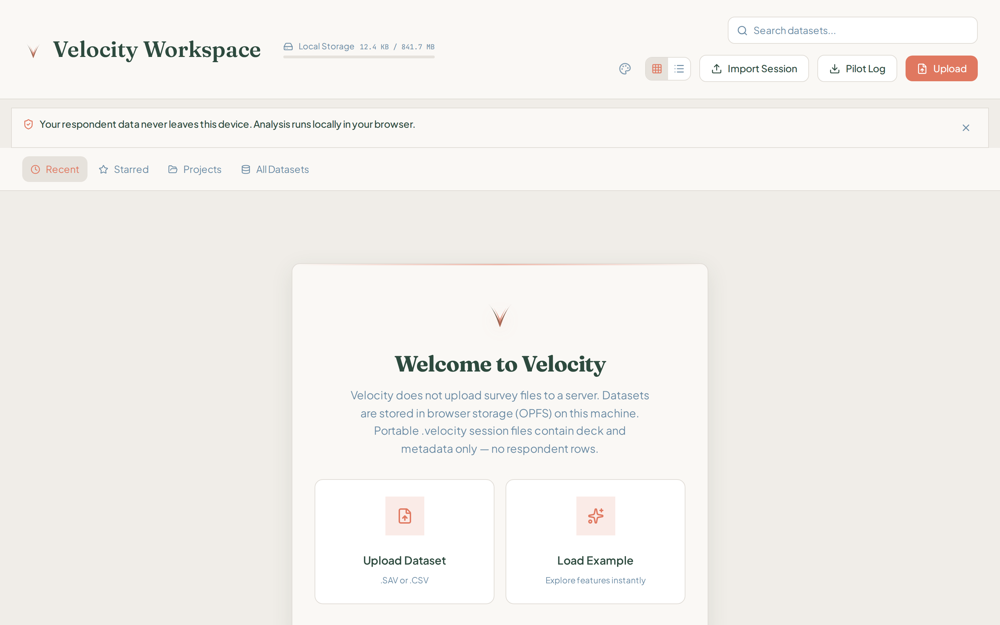

| | |
| :--- | :--- |
| **Dominant issue** | Stacked privacy banner + tabs + oversized centered welcome card — three onboarding layers before a work surface |
| **Linear gap** | Direct object list with one muted empty state; no card-in-card marketing block |
| **Fix IDs** | UXF-014 (partial), PPR-002, PPR-003 |

---

### 3.3 Pre-analysis canvas

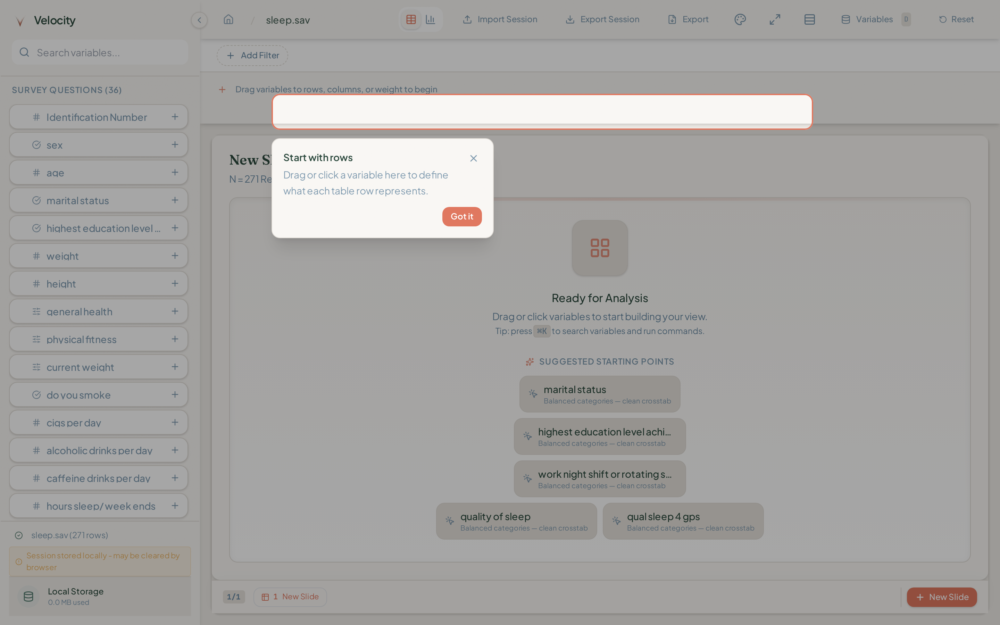

| | |
| :--- | :--- |
| **Dominant issue** | “Ready for Analysis” suggestion pills with **truncated labels** in a huge empty frame, competing with onboarding popover and coral drop-zone border |
| **Linear gap** | One empty-state line + one action; labels never clip |
| **Fix IDs** | PPR-004, PPR-005, UXF-011 (implementation quality) |

---

### 3.4 Building first crosstab

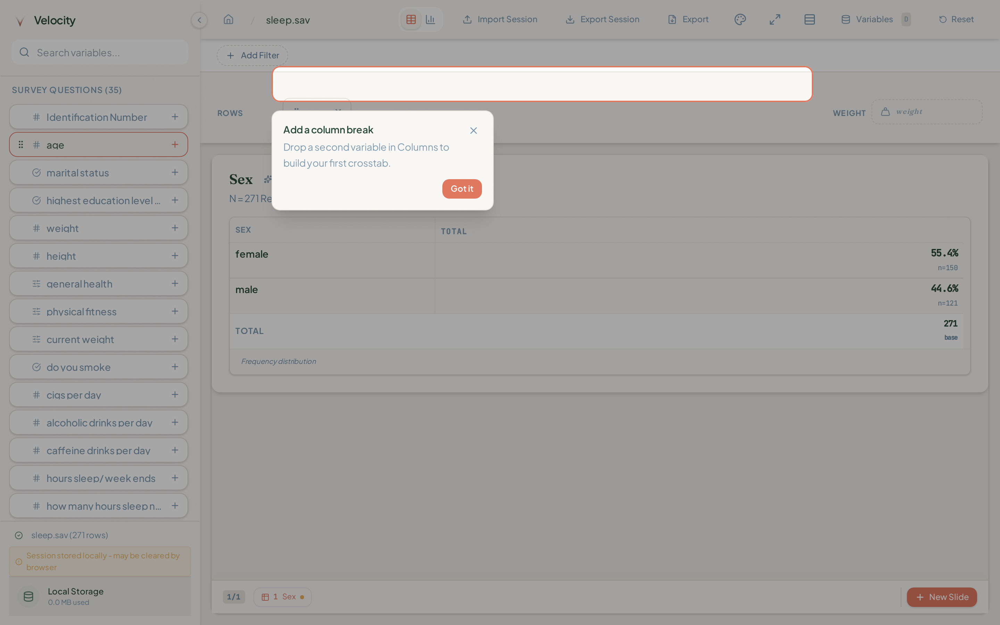

| | |
| :--- | :--- |
| **Dominant issue** | Coaching popover (“Add a column break”) + heavy coral outline on empty COLUMNS zone **over** the frequency table |
| **Linear gap** | Inline, dismiss-forever hints — never modal cards on hero output |
| **Fix IDs** | PPR-005, UXF-011 |

---

### 3.5 Crosstab result (hero output)

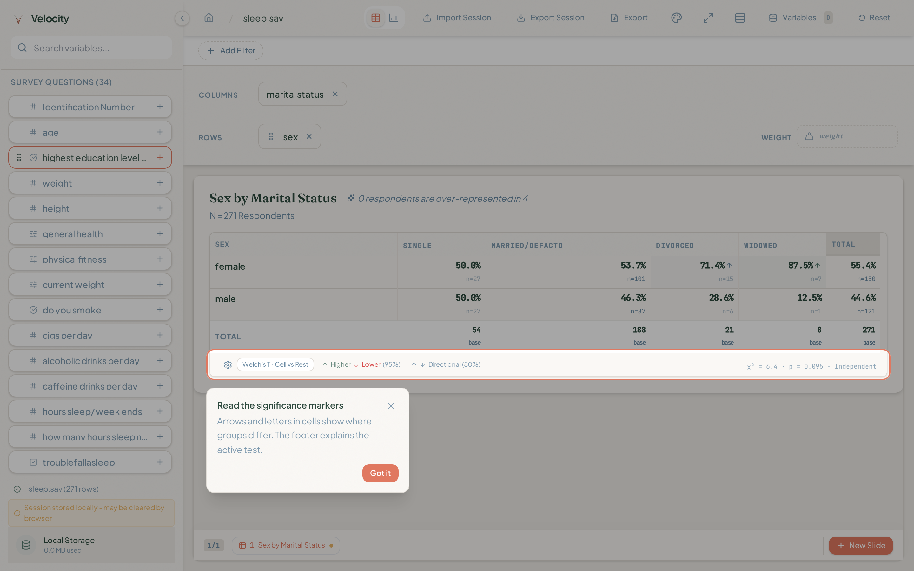

| | |
| :--- | :--- |
| **Dominant issue** | Small table floating in tall slide card (**vertical dead space**) + significance coaching popover **covering the stats footer** |
| **Linear gap** | Container shrink-wraps content; coaching never blocks the artifact users photograph |
| **Fix IDs** | **UXF-004**, PPR-005, PPR-006, PPR-007 |

---

### 3.6 Chart view

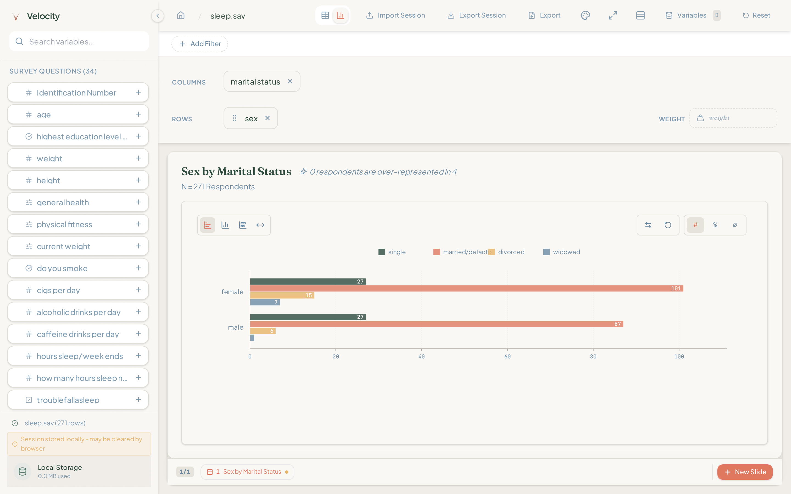

| | |
| :--- | :--- |
| **Dominant issue** | Truncated legend (“married/defact”), **raw counts on a 0–100 axis**, same dead-space frame |
| **Linear gap** | Chart fills frame; labels complete; axis semantics unambiguous |
| **Fix IDs** | **UXF-002**, PPR-008, UXF-004 |

---

### 3.7 Export modal

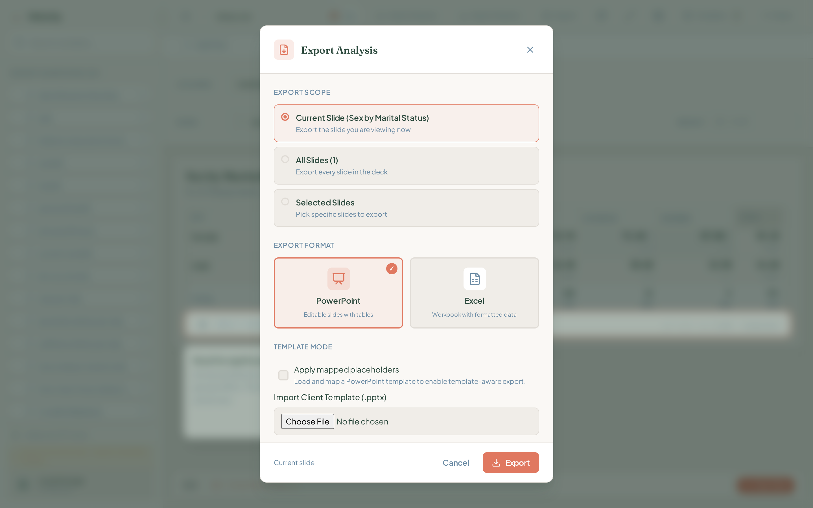

| | |
| :--- | :--- |
| **Dominant issue** | Native browser **“Choose File”** control breaks custom modal styling |
| **Linear gap** | All controls custom-styled; no native widget regression |
| **Fix IDs** | PPR-009 |

---

### 3.8 Variable Manager

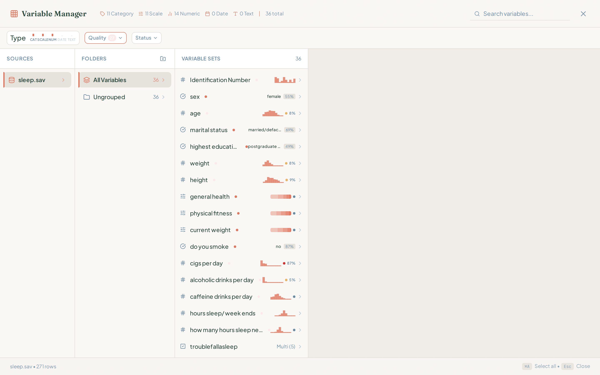

| | |
| :--- | :--- |
| **Dominant issue** | **~40% empty inspector pane** while variable list is cramped with truncated names and alarm-red quality badge (27) |
| **Linear gap** | Collapse unused pane or show guided empty state; list rows breathe |
| **Fix IDs** | **UXF-009** (regression vs tracker “fixed”), PPR-010, PPR-004 |

---

### 3.9 Focus mode

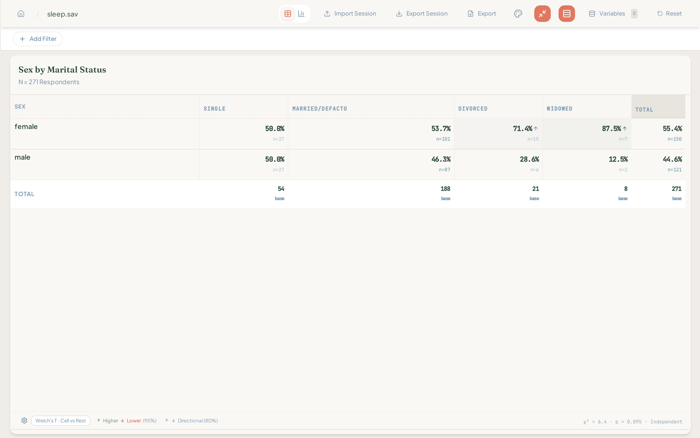

| | |
| :--- | :--- |
| **Dominant issue** | “Focus” hides sidebar only — **top toolbar still crowded** (Import/Export/Reset/Variables); dead space persists |
| **Linear gap** | Focus removes chrome; hero artifact centered with intentional margins only |
| **Fix IDs** | **UXF-006** (partial), UXF-004, PPR-011 |

---

### 3.10 Command palette

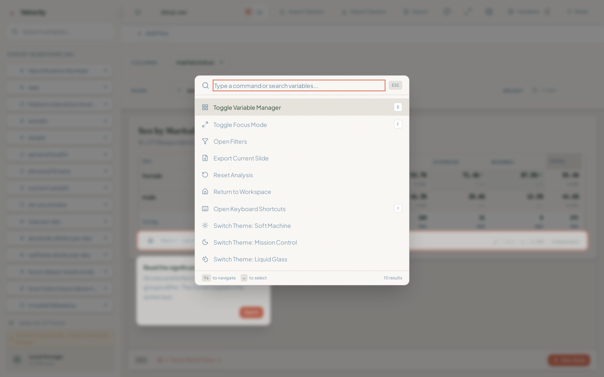

| | |
| :--- | :--- |
| **Dominant issue** | **Heavy coral focus ring** on search input reads as error state, not Linear-style command surface |
| **Linear gap** | Subtle border, tight density, dark/neutral palette option |
| **Fix IDs** | PPR-012 |

---

### 3.11 Workspace after session

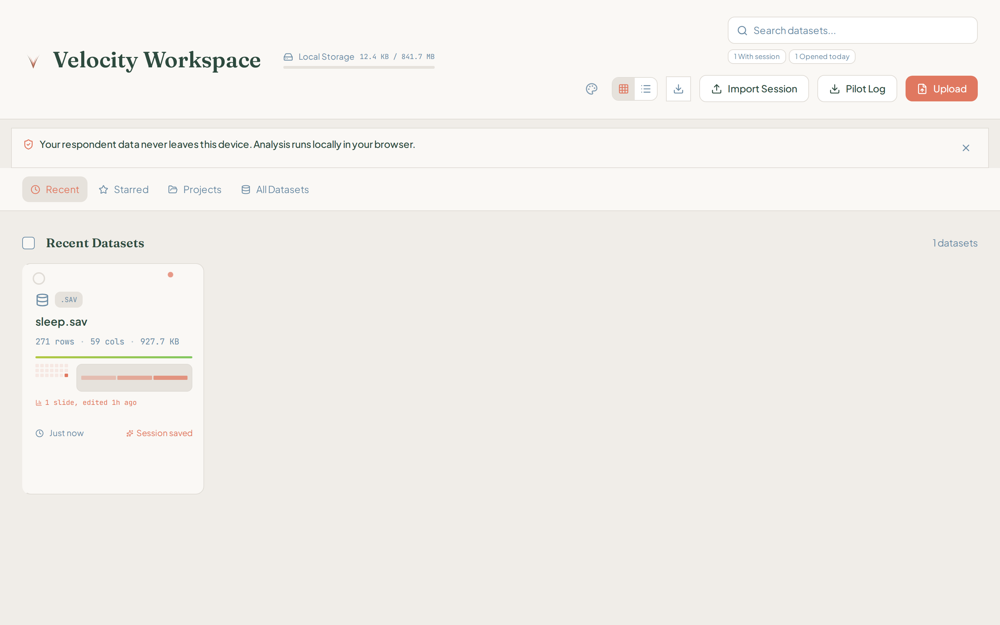

| | |
| :--- | :--- |
| **Dominant issue** | Busy dataset card (mini charts, dual timestamps, coral dot) + **“1 datasets”** grammar error |
| **Linear gap** | One title line + muted metadata row |
| **Fix IDs** | PPR-013, PPR-014 |

---

### 3.12 Reopen / search

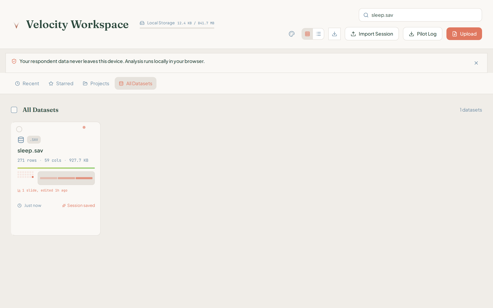

| | |
| :--- | :--- |
| **Dominant issue** | Single search result in **~80% empty viewport** |
| **Linear gap** | Tight list selection, keyboard-first, no vast void |
| **Fix IDs** | PPR-015 |

---

### 3.13 Resumed session

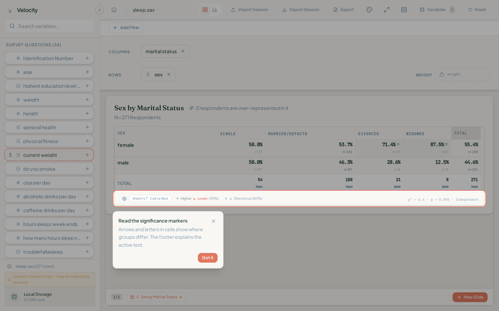

| | |
| :--- | :--- |
| **Dominant issue** | **Significance coaching popover reappears** on reopen, blocking footer — feels like session amnesia |
| **Linear gap** | First-run coaching never returns on resume |
| **Fix IDs** | **PPR-005** (persistence), PPR-016 |

---

## 4. Cross-cutting themes

| Theme | Manifestation | Priority |
| :--- | :--- | :--- |
| **Content-sized hero frame** | Table/chart floats in oversized slide card with large empty band below | P0 |
| **Coaching layer discipline** | Popovers stack on output; reappear after reopen | P0 |
| **Label truncation** | Sidebar, suggestions, chart legend, VM list | P0 |
| **Accent budget** | Coral used for borders, coaching, badges, focus rings, warnings simultaneously | P1 |
| **Typography split** | Serif display on workspace/slide titles vs sans UI | P1 |
| **Empty pane debt** | VM inspector, workspace grid, focus margins | P1 |
| **Anxious copy** | Persistent local-storage warning; cryptic insight strings | P1 |
| **Native control leaks** | Export template file input | P2 |
| **Copy polish** | “1 datasets”, awkward insight phrasing | P2 |

---

## 5. Prioritized fix list

**ID prefix:** `PPR-###` = Pilot Presentation Readiness (this audit). Rows also map to existing `UXF-###` where applicable.

**Gates:** T = typecheck, L = lint, U = unit, I = E2E/visual, V = pilot demo re-screenshot pass.

### P0 — Block paid pilot demos (fix before PILOT-6 photography)

| Rank | ID | Issue | Primary surfaces | Direction | UXF | Gates |
| :---: | :--- | :--- | :--- | :--- | :--- | :--- |
| 1 | **PPR-005** | Coaching popovers dominate hero output and **reappear on reopen** | Canvas, `contextualMicroTips`, first-run tour | Move hints to inline shelf/corner chips; **persist dismiss per tip ID** in session/local storage; never overlay stats footer or table body; max one tip visible | UXF-011 | T,L,U,I,V |
| 2 | **UXF-004** / **PPR-006** | Slide card vertical dead space — small tables/charts float in tall bathtub | `SlideContainer`, `AnalysisOutputFrame`, `AnalysisOutputFrame.shrinkWrap` | Shrink-wrap slide body to content height; cap max height with internal scroll only when needed; re-verify Focus bleed | UXF-004 | T,L,U,I,V |
| 3 | **PPR-004** | Variable label truncation in sidebar, suggestions, VM, legend | Variable list, story shelf, chart legend, VM rows | Min-width + tooltip, or wrap to two lines; suggestion pills use full labels or fewer items | — | T,L,I,V |
| 4 | **UXF-002** / **PPR-008** | Chart: truncated legend + count labels on percentage axis | Chart renderers, axis/label formatters | Legend full labels or horizontal scroll; show **% on bars** when axis is 0–100 (counts in tooltip or toggle) | UXF-002 | T,L,U,I,V |
| 5 | **UXF-001** | Crosstab horizontal clip / invisible overflow | `SlideContainer`, `DataTable` | Edge fade + scroll affordance; verify wide banners at 1440px | UXF-001 | T,L,I,V |
| 6 | **PPR-016** | Coaching + warnings erode resume trust | Resume flow, sidebar footer | Suppress first-run tips when `workspace_reopened` or session has `first_crosstab`; soften storage warning after first save | — | T,L,I,V |

### P1 — Required for “Linear-clean” pilot impression

| Rank | ID | Issue | Primary surfaces | Direction | UXF | Gates |
| :---: | :--- | :--- | :--- | :--- | :--- | :--- |
| 7 | **PPR-002** | Workspace empty state is marketing-card heavy | `WorkspaceEmptyState`, `WorkspaceView` | Replace center card with tight file list empty row (Linear-style); move privacy to footer or one-line strip | UXF-014 | T,L,I,V |
| 8 | **PPR-011** | Focus mode leaves full export toolbar | `DashboardShell`, focus chrome rules | In focus: hide Import/Export session, Variables badge, nonessential icons; keep Exit focus + slide nav | UXF-006 | T,L,I,V |
| 9 | **UXF-009** / **PPR-010** | VM inspector blank slab (~40% width) | Variable Manager inspector empty state | Show guided empty state when no selection; collapse inspector column until selected | UXF-009 | T,L,I,V |
| 10 | **PPR-007** | Cryptic insight chip copy (“0 respondents are over-represented in 4”) | Insight/summary line above table | Human-readable sentence or hide until meaningful | — | T,L,U,V |
| 11 | **UXF-003** | Table ↔ chart empty flash | View toggle, chart mount | Crossfade or skeleton in `AnalysisOutputFrame` | UXF-003 | T,L,I,V |
| 12 | **UXF-005** | Cell `n=` / column bases clutter deck screenshots | `AnalysisSettingsPanel`, deck density | Shipped toggles — **default deck mode off** for pilot profile | UXF-005 | T,L,I,V |
| 13 | **PPR-012** | Command palette coral ring | `CommandPalette` | Neutral focus ring (`--border-focus`); optional compact dark variant | — | T,L,I,V |
| 14 | **PPR-001** | Engine init full-screen splash | `SplashScreen`, boot orchestration | Inline init in workspace shell; spinner in header/storage row only | — | T,L,I,V |
| 15 | **PPR-003** | Serif/sans split on functional screens | Workspace + slide titles | Single sans stack for UI chrome; reserve serif for export/PPTX only if needed | — | T,L,V |

### P2 — Polish tail (before scale, not blocking first pilot if P0/P1 done)

| Rank | ID | Issue | Direction | UXF | Gates |
| :---: | :--- | :--- | :--- | :--- | :--- |
| 16 | **PPR-009** | Export modal native file input | Custom file dropzone matching format cards | — | T,L,I,V |
| 17 | **PPR-013** | Busy dataset card | Simplify to title + row/col/size + session badge | — | T,L,V |
| 18 | **PPR-014** | “1 datasets” grammar | Pluralization helper | — | T,L,U |
| 19 | **PPR-015** | Search single-result void | Compact list mode fills width | — | T,L,V |
| 20 | **UXF-010** | Welcome-back UUID labels | `returningResearcher.ts` label hydration | UXF-010 | T,L,U,V |
| 21 | **UXF-015** | Splash contrast on Soft Machine | Token fix for secondary init copy | UXF-015 | T,L,V |
| 22 | **UXF-016** | High-contrast / colorblind significance theme | `themes.ts` — defer unless pilot requests | UXF-016 | T,L,I |

---

## 6. Recommended execution order

Dependency-aware pull sequence for implementers:

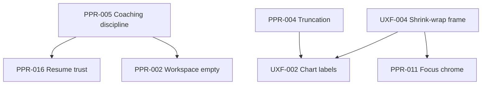

**First PR bundle (highest ROI):** PPR-005 + UXF-004 + PPR-004 — fixes the hero screenshot and first-run/resume trust in one pass.

**Validation:** Re-run `node scripts/ui-workflow-screenshot-audit.mjs`, replace screenshot pack, and attach before/after to PR. Pilot demo pass: complete workflow in &lt;15 min with zero popover obscuring output at capture time.

---

## 7. Relationship to existing workstreams

| Workstream | This audit |
| :--- | :--- |
| `STAB-UI-F` | Reopens F1/F3 acceptance — tracker Done status premature for pilot bar |
| `STAB-UI-T` | T2 modal/a11y items may remain open per `plan_03` register; secondary to PPR P0 |
| `PILOT-6` | Do not lead demos with current UI unless P0 rows closed |
| `plan_02` UXF register | Sync statuses when PPR rows close; add PPR-### cross-refs |

---

## 8. Update rules

1. When a PPR or UXF row closes, update this doc’s table status, [`plan_02`](plan_02_ui_presentation_workstream.md) UXF register, and tracker §4.3 in the **same PR**.
2. Replace screenshots in [`assets/ui-pilot-readiness-audit/screenshots/`](assets/ui-pilot-readiness-audit/screenshots/) when visual contracts change.
3. Re-run the capture script after any change to `SlideContainer`, coaching/tips, workspace empty state, or export modal.

---

## 9. Changelog

| Date | Change |
| :--- | :--- |
| 2026-07-01 | Initial audit — workflow screenshot pass, Linear bar, PPR prioritized fix list |
