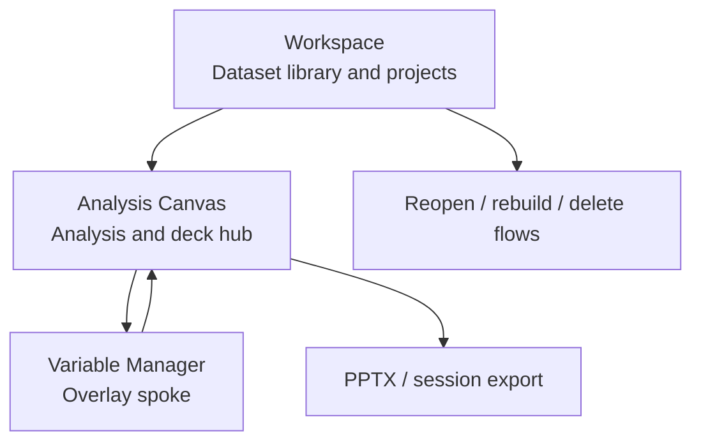

# UX Modes

Velocity uses three coordinated modes. The modes are not separate products; they are different working postures over the same local-first dataset and analysis state.

## 1. Workspace

**Purpose:** dataset and project management.

Users come here to import files, reopen stored datasets, manage projects, inspect longitudinal studies, and choose what dataset is active. Workspace is the product shell for local-first durability.

Primary responsibilities:

- dataset library and metadata
- import/export of workspace/session artifacts
- project grouping
- longitudinal study linking
- dataset reopen, switch, delete, and recovery flows

Workspace should not become the place for analytical computation. It prepares and selects data; analysis runs through the worker/engine path.

## 2. Analysis Canvas

**Purpose:** low-density analysis, interpretation, and presentation.

The Analysis Canvas is the hub. Users drag variables into rows, columns, filters, and weights; inspect crosstabs and charts; and build the Analysis Deck.

Primary responsibilities:

- crosstab and chart authoring
- filtering and weighting choices
- reading mode for analytical output
- slide/deck state capture
- export initiation
- stakeholder-facing narrative refinement

Canvas UI should optimize clarity and interpretation. Dense variable editing, bulk organization, and complex data cleaning belong in Variable Manager.

## 3. Variable Manager

**Purpose:** high-density variable organization and cleaning.

Variable Manager is the spoke. It overlays the Canvas rather than replacing the app route, preserving context while giving users room for sorting, grouping, labeling, and recoding.

Primary responsibilities:

- variable search, sorting, and inspection
- variable set/grid management
- recoding and cleanup workflows
- card/list/Miller-column style organization
- harmonization entry points when working across waves

Variable Manager may preview distributions and metadata, but it should not duplicate Canvas analysis output.

## 4. Mode Relationships

## 5. Design Rules

- Keep heavy compute off the main thread in every mode.
- Keep source-of-truth state in the store/engine path, not duplicated in ad hoc UI state.
- Use semantic design tokens from `design_01_system.md`.
- Preserve the distinction between selection/navigation UI and analysis computation.
- If a new feature crosses modes, document which mode owns the user decision and which mode only displays the result.

## 6. Current Stabilization Focus

The mode model is coherent, but the Workspace promise is not complete until stored datasets can reopen, switch, rebuild, and delete predictably across sessions. Treat that as the highest-priority UX-mode gap before adding new advanced surfaces.
