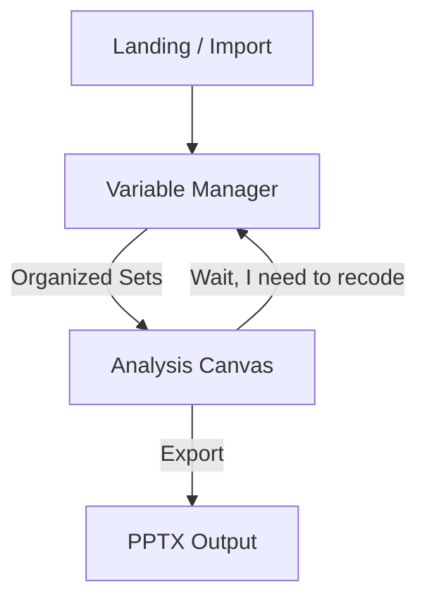

# Design: UX Architecture & Application Modes

## 1. Problem Definition
Currently, Velocity works as a **Single-Screen Prototype**.
*   The Sidebar lists all variables (List View).
*   The Canvas waits for drops.
*   Data management (Recoding, Renaming) happens in disjointed modals or is impossible.

**The Friction:**
*   Managing 500+ variables in a sidebar is cognitively overloaded.
*   Performing complex "Data Engineering" (Visual Recoding) on top of an active Analysis Table is cluttered.
*   Users need distinct "Mental Modes":
    1.  **Preparation Mode:** "I am organizing my variables (concepts)."
    2.  **Analysis Mode:** "I am asking questions of the data."

## 2. The Solution: Two Distinct Modes

We will introduce a global navigation (App Shell) that separates the application into two primary screens.

### Mode A: The Variable Manager (Preparation)
*Target: Milestone 2.2 (Visual ETL)*

**Purpose:** Organizing the messy list of raw columns into clean, semantic "Constructs".
**Visual Metaphor:** **Infinite Canvas with Cards** (Miro/Pinterest style).
**Key Interactions:**
*   **Card Sorting:** Variables are displayed as Cards (Label + Sparkline).
*   **Clustering:** Dragging cards together creates a "Variable Set" (e.g., stacking 5 "Brand Rating" columns into a single Grid Set).
*   **Visual Recoding:** Clicking a card enters "Focus Mode" (Histogram Bucketing).
*   **Drop Zone:** There is *no* Analysis Table here. The goal is pure organization.

### Mode B: The Analysis Canvas (Reporting)
*Target: Milestone 2.3 (Stats)*

**Purpose:** Creating Crosstabs, Charts, and Slides.
**Visual Metaphor:** **Dashboard / Slide Editor** (PowerPoint/Tableau style).
**Key Interactions:**
*   **Clean Sidebar:** The sidebar *only* shows the "Clean Sets" created in Mode A. No raw columns unless explicitly toggled.
*   **Drag & Drop:** Drag Sets onto the Table/Chart slots.
*   **Contextual Stats:** The sidebar provides statistical context (Mean/N) for the active selection.

## 3. Screen Flow & Navigation

### 3.1 The App Shell
A persistent Rail Navigation on the left:
1.  **Data (Icon)** -> Activates Variable Manager.
2.  **Analysis (Icon)** -> Activates Analysis Canvas.
3.  **Report (Icon)** -> Future (Storyboarding).
4.  **Settings (Icon)**

## 4. Detailed Component Design

### 4.1 The "Variable Card" (Mode A)
Instead of a text row, a "Card" uses roughly 150x100px:
*   **Top:** Variable Name/Label (truncated).
*   **Middle:** Micro-chart (Bar for Nominal, Histogram for Scale).
*   **Bottom:** Metadata badges (Type, Missing Count).
*   **Context Menu:** Recode, Rename, Delete.

### 4.2 The "Variable Set" (Sidebar in Mode B)
When switching to Analysis Mode, the user sees "Variable Sets":
*   **Icon:** Represents structure (Grid, Single, Multi).
*   **Label:** The Set Label (e.g. "Brand Awareness") not the raw variable label.
*   **Interaction:** Dragging the *Set* drags all underlying columns correctly.

## 5. Implementation Strategy

1.  **Phase 1 (The Shell):** Implement the `AppShell` layout and Client-side Routing (React Router or simpler State-based switching).
2.  **Phase 2 (The Views):**
    *   Move existing `DataTable` + `Sidebar` into `AnalysisView.tsx`.
    *   Create a blank `VariableManagerView.tsx`.
3.  **Phase 3 (The Bridge):**
    *   Ensure creating a "Set" in Manager immediately updates the List in Analysis.
