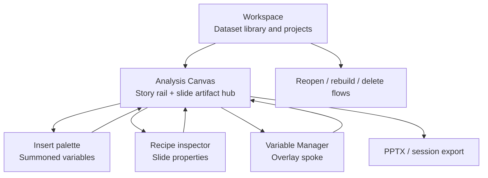

# UX Modes

Velocity uses three coordinated modes. The modes are not separate products; they are different working postures over the same local-first dataset and analysis state.

After the design reset (Pathway B), the **Analysis Canvas** inverted its information architecture: the deck outline is resident, variables are summoned, and analysis configuration is slide properties.

## 1. Workspace

**Purpose:** dataset and project management.

Users come here to import files, reopen stored datasets, manage projects, inspect longitudinal studies, and choose what dataset is active. Workspace is the product shell for local-first durability.

Primary responsibilities:

- dataset library and metadata
- import/export of workspace/session artifacts
- project grouping
- longitudinal study linking
- dataset reopen, switch, delete, and recovery flows

Workspace should not become the place for analytical computation. It prepares and selects data; analysis runs through the worker/engine path.

## 2. Analysis Canvas

**Purpose:** low-density analysis, interpretation, and presentation.

The Analysis Canvas is the hub. Users build crosstabs and charts on slides, refine deck narrative, and export stakeholder-ready output.

### Resident chrome

| Surface | Role | Entry |
| :--- | :--- | :--- |
| **Story rail** (left) | Deck outline — numbered slides, title, persistent recipe summary, reorder, `+ New slide`, persistence/footer summaries | Always visible; approved convergence makes it collapsible for small decks |
| **Toolbar** (top) | View toggle, Recipe toggle, Insert ⌘K, overflow `···`, primary Export | Always visible |
| **Slide artifact** (center) | Exportable content only — title, table/chart, shrink-wrapped card | Always visible |
| **Statistics margin note** | One-line chi-square / sample note outside the card | Below slide when stats apply |

### Summoned chrome

| Surface | Role | Entry |
| :--- | :--- | :--- |
| **Insert palette** | Variable search, dense rows, one canonical insertion grammar, commands behind `>` prefix | `Insert ⌘K`, empty-state Browse, keyboard ⌘K |
| **Recipe inspector** (right) | Rows / Columns / Filter / Weight chips, display settings (Cell n, Bases), significance method | `Recipe` ghost button; collapsed by default |
| **Variable Manager** | High-density find/inspect/recode (see §3) | Overflow `···` → Variable Manager, or keyboard `V` |
| **Export review** | Preview export-bound slides, recipe/significance state, then download PPTX or export a session | Primary Export button |

### What left the canvas

- Resident variable list (variables live in the palette and VM)
- Persistent analysis shelf / filter bar row (replaced by recipe inspector)
- Timeline dock (the story rail **is** the timeline)
- Coaching layer (tours, stacked toasts, suggested-starting-point pills)
- Focus mode (`F`, toolbar toggle, focus-only chrome) — retired; the default Analysis Canvas **is** the presentation surface (DESIGN-CONV-Q5)

### Primary responsibilities

- crosstab and chart authoring via palette + recipe inspector
- filtering and weighting as slide properties
- reading mode for analytical output
- slide/deck state capture in the story rail
- export initiation
- stakeholder-facing narrative refinement

Canvas UI optimizes clarity and interpretation. Dense variable editing, bulk organization, and complex data cleaning belong in Variable Manager.

## 3. Variable Manager

**Purpose:** high-density variable organization and cleaning.

Variable Manager is the spoke. It overlays the Canvas rather than replacing the app route, preserving context while giving users room for sorting, grouping, labeling, and recoding.

### Two-pane layout

| Pane | Contents |
| :--- | :--- |
| **List** (left) | Search + filter chips (type counts; sets/sources as chips), dense 32px rows (glyph · mono name · label · metadata) |
| **Inspector** (right) | Distribution preview, metadata, recode entry, set management |

Miller-column navigation and the VM stats header are removed. `BulkActionBar` appears only on multi-select.

### Primary responsibilities

- variable search, sorting, and inspection
- variable set management via chip filters
- recoding and cleanup workflows
- harmonization entry points when working across waves

Variable Manager may preview distributions and metadata, but it should not duplicate Canvas analysis output.

## 4. Mode Relationships

```mermaid
graph TD
    Workspace["Workspace\nDataset library and projects"] --> Canvas["Analysis Canvas\nStory rail + slide artifact hub"]
    Canvas --> Palette["Insert palette\nSummoned variables"]
    Canvas --> Inspector["Recipe inspector\nSlide properties"]
    Canvas --> Manager["Variable Manager\nOverlay spoke"]
    Manager --> Canvas
    Palette --> Canvas
    Inspector --> Canvas
    Canvas --> Export["PPTX / session export"]
    Workspace --> Recovery["Reopen / rebuild / delete flows"]
```

## 5. Design Rules

- Keep heavy compute off the main thread in every mode.
- Keep source-of-truth state in the store/engine path, not duplicated in ad hoc UI state.
- Use semantic design tokens from `design_01_system.md` (single evolved Soft Machine identity).
- Preserve the distinction between selection/navigation UI and analysis computation.
- Variables are **summoned** (palette, VM), not resident on the canvas.
- Deck recipe state binds to existing store/session structures — no parallel configuration model.
- If a new feature crosses modes, document which mode owns the user decision and which mode only displays the result.

## 6. Success metric

File-drop → three titled, reproducible slides → reviewed PPTX in under **5 minutes**, zero interruptions, zero forced interactions, and at most one accent-colored element visible at a time (excluding in-table significance marks). Automation must assert each slide's saved rows, columns, filter, weight, and view state. Representative users must also complete the final candidate without coaching. See [`plan_05_design_reset_implementation.md`](plan_05_design_reset_implementation.md) §6.

## 7. Current convergence focus

The product has three modes only: Workspace, Analysis Canvas, and Variable Manager. There is no separate focus/presentation mode — default canvas chrome is the presentation surface (`DESIGN-CONV-Q5`).

The mode model is the approved target, but the implementation is not yet complete. The active gaps are:

- add review-before-download export;
- settle and enforce one palette rows/columns grammar;
- restore saved weight and analysis settings when switching slides or reopening sessions;
- make recipe structure persistent and legible in the rail/inspector;
- fix menu hit testing, hidden-inspector focus, contrast, typography, and supported-width behavior;
- land retained Wave 2 discovery/continuity candidates per R0;
- recapture the journey and run 3–5 unscripted representative sessions on the final candidate.

The tracker §4.3.2 owns ordering and completion. Until `DESIGN-CONV-A` passes, the reset is implemented but not verified or validated as a complete redesign. PILOT-6 photography must use post-reset chrome without a focus-mode toggle.
