# Thermo-Nuclear Code Quality Remediation Kanban

**Source:** Seven-area thermo-nuclear review (June 2026) — Core, Engine+Worker, Store, Dashboard, Workspace+VM+Harmonization, App shell, MCP transport.

**Goal:** Restore layer invariants, decompose god files, and converge browser/MCP orchestration **without behavior change** per slice (follow `docs/playbooks/refactor_safely.md`).

**Relationship to tracker:** Complements `docs/tracker_00_implementation_status.md` (feature delivery). This board is **structural debt** only. Do not start Phase 5+ expansion (`S5-R-1`, etc.) until Phase 1 layer correction is underway.

**Status columns:** `Backlog` → `Ready` → `In Progress` → `Review` → `Done` | `Blocked`

---

## Dependency graph (phases)

```mermaid
graph TD
  subgraph P0["Phase 0 — Quick wins"]
    TN01["TN-0.1 loadProgress fix"]
    TN02["TN-0.2 buildCaseSql to core"]
    TN03["TN-0.3 Delete dead code"]
    TN04["TN-0.4 filterVariableSets"]
    TN05["TN-0.5 Canvas placement helper"]
  end

  subgraph P1["Phase 1 — Layer correction"]
    TN11["TN-1.1 queryBuilder → core"]
    TN12["TN-1.2 statistics → core"]
    TN13["TN-1.3 gridUtils → core"]
    TN14["TN-1.4 chartRecommender + analysisProcessor → core"]
    TN15["TN-1.5 WebREngine out of core"]
    TN16["TN-1.6 Matrix format in engine"]
    TN17["TN-1.7 Dataset types out of store"]
    TN18["TN-1.8 Import graph cleanup"]
  end

  subgraph P2["Phase 2 — God-file decomposition"]
    TN21["TN-2.1 Split analysisWorker"]
    TN22["TN-2.2 Split VelocityEngine"]
    TN23["TN-2.3 Split dataSlice"]
    TN24["TN-2.4 Split App.tsx"]
    TN25["TN-2.5 Split crosstabRunner"]
    TN26["TN-2.6 Split MCP tools.ts"]
  end

  subgraph P3["Phase 3 — Convergence & UI structure"]
    TN31["TN-3.1 BrowserEngine facade"]
    TN33["TN-3.3 ModalShell + chart primitives"]
    TN34["TN-3.4 Dashboard shell split"]
    TN35["TN-3.5 Workspace CSS + badges"]
    TN36["TN-3.6 Mutation ResultEnvelopes"]
    TN37["TN-3.7 SAV streaming collapse"]
    TN38["TN-3.8 Slide activation refactor"]
    TN39["TN-3.9 CrosstabSqlRow typing"]
  end

  TN01 --> TN21
  TN02 --> TN21
  TN02 --> TN22
  TN11 --> TN18
  TN12 --> TN18
  TN13 --> TN18
  TN14 --> TN18
  TN11 --> TN25
  TN12 --> TN25
  TN39 --> TN25
  TN17 --> TN23
  TN18 --> TN21
  TN18 --> TN22
  TN18 --> TN25
  TN21 --> TN31
  TN22 --> TN31
  TN16 --> TN26
  TN23 --> TN24
  TN04 --> TN34
  TN05 --> TN34
  TN33 --> TN34
  TN35 --> TN24
```

---

## Phase 0 — Quick wins

*(all cards complete — see Done)*

---

## Phase 1 — Layer correction

*(all cards complete — see Done)*

---

## Phase 2 — God-file decomposition

### In Progress

_None._

### Backlog

*(Phase 2 complete — see Done)*

---

## Phase 3 — Convergence & UI structure

### In Progress

*(none)*

### Backlog

*(Wave 2 complete — incremental store migration can proceed slice-by-slice)*

---

## Blocked

*(none — TN-2.5 unblocked by TN-3.9)*

---

## Done

| Card | Evidence |
| :--- | :--- |
| **TN-0.1** — Fix SAV loadProgress protocol | **Files:** `src/services/analysisWorker.ts` (9 sites: `type: 'loadProgress'` → `type: 'engine.loadProgress'`). **Grep:** no bare `loadProgress` posts in worker; legacy type retained in `src/types/worker.ts`. **Tests:** `npm run test:run` — 892 passed, 7 skipped (2026-06-24). **Manual:** SAV load progress path wired — worker → `EngineProxy.onProgress` → `dataSlice.applyLoadProgressMessage` → App progress bar. |
| **TN-0.2** — Extract `buildCaseSql` to core | **Files:** `src/core/transforms/recodeSql.ts` (canonical `buildCaseSql`); imports in `VelocityEngine.ts` and `analysisWorker.ts`; duplicates removed. **Tests:** `recodeSql.test.ts` — 5 tests; `npm run typecheck` green; `npm run test:run` — 915 passed (2026-06-24). |
| **TN-0.3** — Delete or wire dead orchestration paths | **Removed:** `src/hooks/useEngineProxy.ts` (grep: no `src/` imports), DataTable `viewMode`/chart branch + unused `isGrid` prop, `useWorkspace.openDataset` duplicate, unused `showCombineModal`/`handleSaveFilter`/export-modal destructuring in `DashboardShell.tsx`. **Wired:** `useWorkspaceOpen` canonical via `App.tsx` → `WorkspaceView`/`CrossWavePanel`. **Tests:** `npm run test:run` — 112 files / 915 passed; dashboard + workspace hook tests green (2026-06-24). |
| **TN-0.4** — Extract `filterVariableSets` | **Files:** `src/features/variableManager/variableSetFilters.ts` (`filterVariableSets` + existing grid-shell helpers); call sites in `VariableManager.tsx`, `VariableSetColumn.tsx`, `FacetedSearchBar.tsx`. **Tests:** `variableSetFilters.test.ts` — 12 tests (grid-shell, folder, search, type/status/quality facets, combined filters, facet-count parity). **Tests:** `npm run test:run` — 910 passed, 7 skipped (2026-06-24). |
| **TN-0.5** — Extract canvas variable placement helper | **Files:** `src/services/gridUtils.ts` (`placeVariableSet`, `applyCanvasPlacement`, `TableConfigSnapshot`); call sites in `DashboardShell.tsx` (drag + click), `SlideContainer.tsx` (suggest). **Tests:** `gridUtils.test.ts` — 9 new placement tests (grid/non-grid × rows/cols/canvas). **Tests:** `npm run test:run` — 910 passed, 7 skipped; `SlideContainer.test.tsx`, `DropZone.test.tsx` green (2026-06-24). |
| **TN-1.6** — Move matrix crosstab format into VelocityEngine | **Files:** `VelocityEngine.ts` (`applyCrosstabFormat`, `format` in crosstab config); removed matrix branch + `formatCrosstabMatrix` import from `mcp-server/tools.ts`. **Tests:** `formatCrosstabMatrix.test.ts` — 4 passed; `crosstabMatrixEnvelope.test.ts` — 2 passed; `mcp-server/__tests__/tools.test.ts` — 37 passed (matrix passthrough + `format` param); `npm run typecheck` + `typecheck:mcp` green (2026-06-24). |
| **TN-1.7** — Move dataset domain types out of dataSlice | **Files:** `src/types/dataset.ts` (canonical `Variable`, `Dataset`, `VariableSet`, `Folder`, `DataTransform`); `src/types/recode.ts` (extracted `RecodeConfig` to break circular deps); `dataSlice.ts` re-exports from dataset; session + variableManager features import from `types/dataset`. **Tests:** `npm run typecheck` green; `sessionRoundTrip.test.ts` — 1 passed (2026-06-24). |
| **TN-1.1** — Relocate `queryBuilder` to core | **Files:** `src/core/sql/queryBuilder.ts` (+ `queryBuilder.test.ts`, `queryBuilder_numeric_grid.test.ts`); imports updated in 11 call sites (`crosstabRunner`, `buildCrosstabRequest`, `harmonizationQueries`, `savIngestion`, `analysisWorker`, `EngineProxy`, `DuckDBNodeAdapter`, `drillDownSlice`, `worker.ts`, `engineWorker.ts`, `scripts/check-querybuilder-pure.mjs`). **Grep:** no `core/` → `services/queryBuilder`. **Tests:** `queryBuilder.test.ts` — 40 tests; `queryBuilder_numeric_grid.test.ts` — 3 tests; `npm run check:querybuilder-pure` green; `npm run typecheck` green (2026-06-24). |
| **TN-1.2** — Relocate `statistics` to core | **Files:** `src/core/stats/statistics.ts` (+ `statistics.test.ts`); imports updated in `crosstabRunner.ts`, `tests/golden/spss_parity.test.ts`. **Tests:** `statistics.test.ts` — 51 tests; `crosstabRunner.significance.test.ts` — 4 tests; `spss_parity.test.ts` — 18 tests; `npm run test:run` — 915 passed, 7 skipped (2026-06-24). |
| **TN-1.3** — Relocate `gridUtils` to core | **Files:** `src/core/grid/gridUtils.ts` (+ test); removed `src/services/gridUtils.ts`. **Imports:** `savLoader.ts`, `DashboardShell.tsx`, `SlideContainer.tsx`, `autoFirstCrosstab.ts` → core paths. **Grep:** no `services/gridUtils` in `src/`. **Tests:** `gridUtils.test.ts` — 18 passed; dual-state synthetic IDs (`{setId}_scale`, `{setId}_items`) unchanged. **Tests:** `npm run test:run` — 915 passed (2026-06-24). |
| **TN-1.4** — Relocate `chartRecommender` + `analysisProcessor` to core | **Files:** `src/core/visualization/chartRecommender.ts` (+ test), `src/core/analysis/analysisProcessor.ts` (+ test); removed service copies. **Imports:** `VelocityEngine.ts`, `DeckBuilder.ts`, `analysisWorker.ts`, `buildExportConfig.ts`, `AnalysisChart.tsx`, `SlideContainer.tsx`, `cli/velocity.ts` → core paths. **Grep:** no `engine/` → `services/` for recommender/processor. **Tests:** `chartRecommender.test.ts` — 5 passed; `analysisProcessor.test.ts` — 3 passed; `npm run typecheck` green; `npm run test:run` — 915 passed (2026-06-24). |
| **TN-1.5** — Move WebREngine out of core | **Files:** `src/engine/webr/WebREngine.ts` (worker lifecycle); `src/engine/webr/index.ts`; deleted `src/core/analysis/engines/WebREngine.ts`. **Core:** `SurveyWeightingRunner` + `MixedEffectsRunner` keep `generateRCode()` / `toWebRConfig()`; stub `run()` now throws. **Imports:** `webrSlice.ts` → `engine/webr`. **Grep:** no `Worker` API usage in `src/core/` (comment-only references remain). **Tests:** `npm run test:run` — 112 files / 915 passed, 7 skipped (2026-06-24). **Typecheck:** `tsc -p tsconfig.json` for moved modules clean; `typecheck:all` has pre-existing failures in `src/types/index.ts` (TN-1.7 in flight) unrelated to this card. |
| **TN-2.6** — Split `mcp-server/tools.ts` | **Files:** `mcp-server/schemas.ts` (36 tool JSON schemas), `mcp-server/responses.ts` (`successResponse`, `errorResponse`, `resolveSessionOutputPath`), `mcp-server/handlers/` (6 domain maps: `dataLifecycle`, `analysis`, `deck`, `harmonization`, `session`, `semantic` → `TOOL_HANDLERS` in `index.ts`); `tools.ts` thinned to ~40 lines (handler-map dispatch, no switch). **Pattern:** follows `deckTransport.ts` — pure formatting in transport, engine delegation in handlers. **Inventory:** 36 tools unchanged (arch_07 §6.1 not updated). **Tests:** `mcp-server/__tests__/tools.test.ts` — 37 passed; `npm run typecheck:mcp` green (2026-06-24). |
| **TN-1.8** — Import graph cleanup after relocations | **Cycles fixed:** `core/analysisProcessor` → `services/treeBuilder` (moved to `core/analysis/treeBuilder.ts`); `core/savLoader` + `core/scaleNormalization` → `services/dataHeuristics` (moved to `core/ingestion/dataHeuristics.ts`); `core/export/runCrosstabForExport` → `services/EngineProxy` (replaced with `CrosstabEnginePort` seam); `core/session/*` → `store/slices/analysisSlice` (types moved to `src/types/analysis.ts`). **Deduped:** `escapeIdentifier` — canonical in `core/sql/queryBuilder.ts`; local copy removed from `savIngestion.ts`. **Adapter seam:** `DuckDBNodeAdapter.createAppender()` replaces `(adapter as any).connection`. **Grep:** zero `core/` → `services/` or `core/` → `store/` imports. **AGENTS.md §2:** core portable (no React/DOM); dependency direction core ← types/engine/adapters only; dual-state unchanged. **Known (documented, not blocking Phase 2):** `savIngestion.ts` uses concrete `DuckDBNodeAdapter` for Node CLI appender path; UI/features may still import slice types (`uiSlice`, `dataSlice`) — out of core/session scope. **Tests:** `npm run typecheck` green; `npm run test:run` — 112 files / 918 passed, 7 skipped (2026-06-24). **Phase 2 unblocked.** |
| **TN-2.1** — Split `analysisWorker.ts` | **Before:** monolithic `src/services/analysisWorker.ts` (1,814 lines). **After:** thin shell (24 lines) + `src/services/worker/` package (14 modules, max 368 lines/file): `workerDbState`, `duckdbOpfs` (133), `duckdbInit` (179), `duckdbPersistence` (302), `duckdbErrorHelpers`, `workerIngestion` (174), `savArrowHelpers`, `savChunkedLoader` (288), `savChunkedLegacy` (159), `workerQueries`, `engineMessaging`, `engineHandlerTypes`, `engineHandlers` (368), `engineHandlersHarmonization` (104), `engineDispatch` (68). **Grep:** `engineHandlers[request.type]` in `engineDispatch.ts`; no `switch (request.type)` in worker modules. **Tests:** `opfsPersistence.test.ts` — 7 passed; `arrowIngestion.test.ts` — 10 passed; `enginePersistenceBridge.test.ts` — 2 passed; `worker.contract.test.ts` — 2 passed; `savIngestion.test.ts` — 1 passed; `npm run test:run` — 916 passed, 7 skipped (2 pre-existing `chartRecommender` import failures unrelated). **Typecheck:** worker modules clean; 4 pre-existing errors in `AnalysisChart.tsx` / `chartTypeResolver.ts` (TN-1.4 path drift, unrelated). **Behavior:** zero change — structural refactor only (2026-06-24). |
| **TN-2.2** — Split `VelocityEngine.ts` | **Files:** `VelocityEngine.ts` (761 lines, thin facade) delegates to `datasetLoading.ts` (244), `workspaceManager.ts` (243), `sessionState.ts` (154), `crosstabPostProcess.ts` (102), `semanticFacade.ts` (239), plus shared `velocityEngineTypes.ts` (97, `VelocityEngineHost` structural interface) and `engineEnvelope.ts` (59). **Pattern:** DeckBuilder-style `VelocityEngineHost` avoids circular imports; `VelocityEngine` implements host and wires module classes. **Public API:** unchanged (`src/engine/index.ts` re-exports). **Tests:** `VelocityEngine.test.ts` — 9 passed; `crosstabMatrixEnvelope.test.ts` — 2 passed; `session-roundtrip.test.ts` — 2 passed; `resolve-labels.test.ts` — 1 passed; `mcp-server/__tests__/tools.test.ts` — 37 passed; `npm run test:run` — 916 passed, 7 skipped (2 pre-existing UI import failures unrelated); `npm run typecheck:mcp` green (2026-06-24). |
| **TN-2.3** — Split `dataSlice.ts` | **Files:** `src/store/slices/data/` — `types.ts` (129), `variableNormalization.ts` (63), `sliceContext.ts` (21), `loadProgress.ts` (30), `engineActions.ts` (79), `persistenceActions.ts` (193), `datasetActions.ts` (274), `variableCatalogActions.ts` (336), `transformActions.ts` (204), `initialState.ts` (42), `index.ts` (35); `dataSlice.ts` thinned to 59-line compositor (was ~1,295). **Pattern:** extends STAB-ARCH-1 (`enginePersistenceBridge`, `workspaceDatasetLifecycle`); `DataSliceStore` typed cross-slice access replaces 15+ `as any` in slice body. **Grep:** zero `as any` in `slices/data/` or `dataSlice.ts`. **Tests:** `dataSlice.workspace.test.ts` — 2 passed; `persistence.test.ts` — 6 passed; `enginePersistenceBridge.test.ts` — 2 passed; `workspaceDatasetLifecycle.test.ts` — 2 passed; `npm run test:run` — 112 files / 916 passed, 7 skipped (2 pre-existing `AnalysisChart` import failures unrelated); data-slice `tsc` clean (2026-06-24). |
| **TN-3.9** — Introduce CrosstabSqlRow + extractRowKeys | **Files:** `src/core/analysis/crosstabSqlRow.ts` (new: `CrosstabSqlRow`, `CrosstabOverlapSqlRow`, `CrosstabHistogramBinSqlRow`, `extractRowKeys`, `extractRowKeyStrings`, `joinRowKeyPath`, `getColKeyString`); `mapCrosstabRows.ts` typed to `CrosstabSqlRow[]`; `crosstabRunner.ts` — 8 row-key loops + `any[]` casts replaced; `formatCrosstabMatrix.ts`, `tests/parity/runParity.test.ts` — shared helper; call sites in `DeckBuilder.ts`, `analysisSlice.ts`, `runCrosstabForExport.ts`. **Grep:** zero `while (rowKey_N)` loops outside `crosstabSqlRow.ts`; 11 shared-helper call sites in `src/`. **Tests:** `mapCrosstabRows.test.ts` — 6 passed (4 new extractRowKeys); `crosstabRunner.significance.test.ts` — 4 passed; `queryBuilder.test.ts` — 40 passed; `formatCrosstabMatrix.test.ts` — 4 passed; crosstab-related suite — 95 passed; `npm run typecheck` — no crosstab-related errors (2026-06-24). **TN-2.5 unblocked.** |
| **TN-3.2** — Add datasetSessionCoordinator | **Files:** `src/store/datasetSessionCoordinator.ts` (+ `datasetSessionCoordinator.test.ts` — 7 tests), `src/types/workspaceSession.ts` (`DatasetSessionState` with typed `Filter[]` + `DataTransform[]`). **Call sites:** `useWorkspaceOpen.ts` (`captureBeforeDatasetSwitch`), `useWorkspace.ts` (`persistDatasetSession`), `workspaceDatasetLifecycle.ts` + `datasetActions.ts` (`normalizeStoredSessionState`, `sessionStateToStorePatch`). **Types:** `StoredDataset.sessionState` and `WorkspaceDatasetOpenInput.sessionState` → `DatasetSessionState`; removed `activeFilters as Filter[]` casts in `datasetActions.ts`. **Tests:** `datasetSessionCoordinator.test.ts` — 7 passed; `workspaceDatasetLifecycle.test.ts` — 2 passed; `useWorkspaceOpen.test.ts` — 3 passed; `useWorkspace.test.ts` — 2 passed; `npm run test:run` — 937 passed, 7 skipped (2 pre-existing unrelated failures: `r_parity` chi-square, `agentWorkflow` commit deck envelope); `npm run typecheck` — pre-existing failures in `AnalysisChart` / `crosstabRunner` / `chartTypeResolver` unrelated (2026-06-24). **Behavior:** zero change — structural refactor only. |
| **TN-3.6** — Engine ResultEnvelopes for mutations | **Files:** `sessionState.ts` — `setWeight`, `addFilter`, `removeFilter`, `clearFilters`, `commitDeck` now return `ResultEnvelope` via `wrapSync`; `VelocityEngine.ts` delegates unchanged public surface; `types.ts` — mutation result types (`WeightMutationResult`, `FilterMutationResult`, `RemoveFilterResult`, `ClearFiltersResult`, `CommitDeckResult`). **MCP:** `handlers/analysis.ts` (`velocity_filter`, `velocity_clear_filters`, `velocity_set_weight`) and `handlers/deck.ts` (`velocity_commit_deck`) passthrough engine envelopes via `successResponse(result)` (removed ad-hoc `{ ok: true }` payloads). **Tests:** `VelocityEngine.test.ts` — 10 passed (mutation envelope contract); `session-roundtrip.test.ts` — 2 passed; `mcp-server/__tests__/tools.test.ts` — 40 passed (`expectEnvelopeShape` on mutation tools); `npm run typecheck:mcp` — pre-existing failures in `crosstabRunner.ts` / `DeckBuilder.ts` (TN-3.9 in flight), no new errors from this card (2026-06-24). |
| **TN-3.7** — Collapse SAV streaming paths | **Files:** `savChunkedLoader.ts` (251 lines, was 288) — merged `loadSAVChunkedV2` + `loadSAVChunkedV3SinglePass` into parameterized `loadSAVChunkedStreaming` + `runSavStreamingParser`; `savArrowHelpers.ts` — canonical flag `ENABLE_SAV_STREAMING_V3_SINGLE_PASS`, legacy gate `ENABLE_SAV_STREAMING_LEGACY`; removed `ENABLE_SAV_STREAMING_V2`, `STREAMING_V2_HIGH_RISK_BYTES`, `STREAMING_V3_HIGH_RISK_BYTES`. **Grep:** zero `loadSAVChunkedV2`, `loadSAVChunkedV3`, `ENABLE_SAV_STREAMING_V2`. **Diff:** −37 net lines (−152/+115); ~130 lines v2/v3 duplication eliminated. **Dual-state:** `processMetadata` + `buildVectorsFromBatch` unchanged; valueLabels path preserved. **Tests:** `savIngestion.test.ts` — 4 passed; `arrowIngestion.test.ts` — 10 passed; `npm run test:run` — 923 passed, 7 skipped (2 pre-existing MCP deck failures unrelated). **Behavior:** zero change on default v3 path (2026-06-24). |
| **TN-3.5** — Finish workspace presentation split | **Before:** monolithic `WorkspaceView.module.css` (1,344 lines); child components imported parent CSS (import-direction violation); `ProjectBadge`/`WaveBadge` lived in `WorkspaceDatasetCard.tsx`. **After:** 7 per-component CSS modules (max 615 lines): `WorkspaceView` (615), `WorkspaceDatasetCard` (282), `WorkspaceProjectCard` (150), `WorkspaceEmptyState` (116), `WorkspaceDatasetListItem` (101), `WorkspaceStorageIndicator` (61), `WorkspaceBadges` (27); new `WorkspaceBadges.tsx`. **Grep:** only `WorkspaceView.tsx` imports `WorkspaceView.module.css`; badges imported from `./WorkspaceBadges` (not card → list). **Typecheck:** workspace modules clean; repo has pre-existing unrelated errors in `AnalysisChart.tsx` / `crosstabRunner.ts`. **Behavior:** zero visual/behavior change — CSS extraction only (2026-06-24). |
| **TN-3.8** — Refactor slide activation model | **Before:** `setActiveSlide` restored incoming slide via `setTableConfig` + `clearFilters` + per-filter `addFilter` loop + explicit `runAnalysis` (N+1 analysis runs). **After:** slides own `SlideAnalysisState`; global `tableConfig`/`activeFilters` are projection via new `analysisSlice.applySlideAnalysisState` (atomic set + single optional `runAnalysis`); helpers `captureAnalysisStateFromStore` / `projectSlideAnalysisState` in `slidesSlice.ts`; `addSlide` uses silent projection for blank canvas. **Tests:** `slidesSlice.test.ts` — 13 passed (3 new `setActiveSlide` tests: snapshot outgoing, single `runCrosstab` on switch with 2 filters, no-op on same slide); `npm run test:run` — 936 passed, 7 skipped (2 pre-existing unrelated failures: `r_parity`, `agentWorkflow`). **Behavior:** slide switch snapshot/restore preserved; duplicate analysis on switch eliminated (2026-06-24). |
| **TN-3.3** — ModalShell + chart interaction primitives | **Files:** `src/components/overlays/ModalShell.tsx` (+ `ModalShell.test.tsx` — 5 tests); `src/components/charts/hooks/useChartSelection.ts` (+ test — 5 tests); `src/components/charts/shared/ChartPlotArea.tsx`. **Modals migrated (8):** `ConfirmModal`, `InputModal`, `ConvertSystemMissingModal`, `RecodeModal`, `FilterModal`, `ExportModal`, `SessionExportModal`, `SessionImportModal` — split/unified layouts, `escapeToClose`, backdrop-click disable preserved. **Charts migrated (6):** `VerticalBarRenderer`, `HorizontalBarRenderer`, `LollipopRenderer`, `StackedBarRenderer`, `DonutRenderer`, `DivergingBarRenderer` — shared toggle/context-menu + plot-area group. **Line reduction (est.):** ~280 lines modal boilerplate removed (−~350 gross / +~120 `ModalShell`); ~90 lines/chart selection copy-paste removed (−~540 gross / +~140 shared hooks). **Tests:** `ModalShell.test.tsx` — 5 passed; `useChartSelection.test.ts` — 5 passed; `AnalysisChart.test.tsx` — 2 passed; `npm run typecheck` — pre-existing unrelated errors in `AnalysisChart.tsx` / `chartTypeResolver.ts` only (2026-06-24). **Behavior:** zero change — structural refactor only; modal Escape/backdrop a11y preserved. |
| **TN-3.4** — Decompose DashboardShell + DataTable | **Before:** monolithic `DashboardShell.tsx` (740 lines); inline DnD/sidebar/toolbar/shelf; `DataTable.tsx` (564 lines) with inline `renderRow`; dead `useAggregatedTableData` hook; `filterSyntheticGridShellSets` in variableManager. **After:** `DashboardShell.tsx` (345 lines, compositor) + `DashboardSidebar` (181), `DashboardToolbar` (162), `AnalysisShelf` (92), `useDashboardDnD` (200); `CrosstabRow.tsx` (271) extracted from DataTable (412 lines, −152); `filterSyntheticGridShellSets` → `src/core/services/syntheticGridShellFilters.ts` (25); deleted `useAggregatedTableData.ts` + test (superseded by `useProcessedAnalysisData`). **Grep:** no `useAggregatedTableData` imports; TN-0.3 chart path already removed from DataTable. **Tests:** dashboard suite — 90 passed (`DataTable`, `SlideContainer`, `DropZone`, `TimelineDock`, `DraggableVariable`); `variableSetFilters.test.ts` — 12 passed; `npm run test:run` — 948 passed, 5 failed (pre-existing unrelated: `BrowserEngine`, `slidesSlice`/`storeWorker`, `agentWorkflow`); `npm run typecheck` — pre-existing unrelated errors only (2026-06-24). **Behavior:** zero change — structural refactor only. |
| **TN-2.4** — Split `App.tsx` | **Before:** monolithic `src/App.tsx` (1,009 lines). **After:** `src/App.tsx` (160 lines) + `src/app/` package (13 modules): `types.ts` (`AppPhase`, `AppOverlay`), `utils.ts`, `hooks/useAppOverlay.ts`, `hooks/useSessionLifecycle.ts`, `hooks/useWorkspaceOrchestration.ts`, `components/AppModeRouter.tsx`, `components/ModalHost.tsx`, screens (`SplashScreen`, `UploadOverlay`, `UploadProgressBar`, `RestorationPrompt`, `PartialLoadNotice`, `MetadataScreen`). **Coordinator:** `handleReturnToWorkspace` uses `persistDatasetSession` from `datasetSessionCoordinator` (no duplicate capture logic). **Tests:** `useWorkspaceOpen.test.ts` — 3 passed; `datasetSessionCoordinator.test.ts` — 7 passed; `npm run test:run` — 948 passed, 7 skipped (1 pre-existing `agentWorkflow` failure unrelated); app modules typecheck clean; repo pre-existing errors in `AnalysisChart.tsx` / `chartTypeResolver.ts` only. **E2E:** `workspace-switch.spec.ts` — failed (fixture `sleep.sav` heading not found; likely environmental, not app-shell regression). **Behavior:** zero change — structural refactor only (2026-06-24). |
| **TN-2.5** — Split `crosstabRunner.ts` | **Before:** monolithic `crosstabRunner.ts` (839 lines) + `crosstabSqlRow.ts` (83 lines). **After:** `crosstabRunner.ts` (76 lines, orchestrator) + `src/core/analysis/crosstab/` package: `types.ts` (82), `rowKeys.ts` (30), `prepare.ts` (171), `histogram.ts` (166), `significance.ts` (367), `significanceStrategies.ts` (237 — `MeansSignificanceStrategy` / `ProportionsSignificanceStrategy`), `chiSquare.ts` (48). **Removed:** `crosstabSqlRow.ts` (types/rowKeys absorbed into package). **Grep:** zero `crosstabSqlRow` imports in `src/`; chi-square retains raw `r.colKey` equality (not `getColKeyString`). **Tests:** `crosstabRunner.significance.test.ts` — 4 passed; crosstab-related suite — 204 passed (20 files); `npm run test:run` — 926 passed, 7 skipped (12 pre-existing unrelated failures); `npm run typecheck` — no crosstab-related errors (2026-06-24). **Behavior:** zero change — structural refactor only; stats integrity playbook followed. **Phase 2 complete.** |
| **TN-3.1** — BrowserEngine facade | **Files:** `src/engine/BrowserEngine.ts` (+ `BrowserEngine.test.ts` — 6 tests) wraps `EngineProxy`; `enginePersistenceBridge.ts` creates `BrowserEngine` via `createBrowserEngine()`; store field `engineProxy` → `browserEngine` (`DataSlice`, 22 call sites). **MCP parity (VelocityEngine-aligned):** `runAnalysis('crosstab'|'variableStats')`, `loadBuffer`, `recode`; transport delegated (`init`, `loadSAV`/`loadCSV`, `query`, transforms, harmonization, persistence). **Crosstab browser context:** `runAnalysis('crosstab', config, { dataset, variableSets })` until worker-hosted engine state lands. **Migrated slice:** `analysisSlice` — `runAnalysis` + `fetchVariableStats` use `browserEngine.runAnalysis` (no direct `runCrosstab`/`getVariableStats`). **Grep:** zero `engineProxy` in `src/store/`; `EngineProxy` only in `services/` + `BrowserEngine.getProxy()` escape hatch. **Tests:** `BrowserEngine.test.ts` — 6 passed; `storeWorker.test.ts` — 1 passed; `reorderRowVars.test.ts` — 4 passed; `slidesSlice.test.ts` — 13 passed; `npm run test:run` — 952 passed, 7 skipped (1 pre-existing `agentWorkflow` commit-deck envelope failure unrelated); `npm run typecheck` — pre-existing unrelated errors in `AnalysisChart.tsx` / `chartTypeResolver.ts` only (2026-06-24). **Behavior:** analysis path preserved via shared `buildCrosstabRequest` inside facade. |

---

## Dependency notes

1. **Phase 1 before Phase 2:** Decomposing god files before layer correction re-creates the same imports inside smaller files.
2. **TN-1.8 complete — Phase 1 gate cleared:** Phase 2 god-file splits (TN-2.x) may proceed.
3. **TN-3.1 complete — BrowserEngine contract established:** Remaining store slices may migrate incrementally to `browserEngine.runAnalysis` / shared engine methods; avoid parallel PRs that rename the facade.
4. **Stats integrity:** TN-1.2, TN-2.5, TN-3.9 require `docs/playbooks/stats_integrity.md` review.
5. **STAB-EXP-1a overlap:** TN-1.6 moves matrix orchestration from MCP to engine; formatter remains in core (`formatCrosstabMatrix.ts`).
6. **STAB-ARCH-1 overlap:** TN-2.3 and TN-2.4 continue unfinished STAB-ARCH-1 goals; reference §8 of tracker for shipped slices.

---

## Parallelization opportunities

| Safe to run in parallel now | Keep single-threaded |
| :--- | :--- |
| Incremental store slice migration (drillDown → data transforms) | Facade API changes on `BrowserEngine` |

---

## Recommended next pull (start here)

**Wave 2 complete.** Next: incremental store migration (e.g. `drillDownSlice` → `browserEngine.query`, `dataSlice` → `loadBuffer`).

**Suggested migration order (per `worker_migration.md`):**
1. `drillDownSlice` — single `query()` call
2. `variableCatalogActions` — `describeVariable` / stats
3. `dataSlice` load/transform paths — `loadBuffer`, `recode`

---

## Area verdict reference (audit input)

| Area | Verdict | Top blocker |
| :--- | :--- | :--- |
| Core | Partial | crosstabRunner split done (TN-2.5); inverted deps resolved (TN-1.8) |
| Engine + Worker | Partial | BrowserEngine facade done (TN-3.1); incremental store migration next |
| Store | Partial | `dataSlice` split done (TN-2.3); remaining slice `as any` in analysis/drillDown |
| Dashboard | Fail | God shell + DataTable; triplicated placement |
| Workspace + VM | Fail (incomplete) | CSS monolith; duplicate hooks |
| App shell | Partial | App.tsx split done (TN-2.4, 160 lines); SQL materialization still in orchestration hook |
| MCP | Partial | tools.ts split (TN-2.6); matrix moved to engine (TN-1.6) |

---

## Update rules

1. Move cards across columns in this file when status changes; link PR/commit in **Done** evidence.
2. One behavioral slice per PR; follow `refactor_safely.md`.
3. Do not add feature scope to remediation cards — new features go to `tracker_00_implementation_status.md`.
4. Refresh the Mermaid graph when dependencies change.
