# Thermo-Nuclear Code Quality Remediation Kanban

**Source:** Seven-area thermo-nuclear review (June 2026) — Core, Engine+Worker, Store, Dashboard, Workspace+VM+Harmonization, App shell, MCP transport.

**Goal:** Restore layer invariants, decompose god files, and converge browser/MCP orchestration **without behavior change** per slice (follow `docs/playbooks/refactor_safely.md`).

**Relationship to tracker:** Complements `docs/tracker_00_implementation_status.md` (feature delivery). This board is **structural debt** only. Do not start Phase 5+ expansion (`S5-R-1`, etc.) until Phase 1 layer correction is underway.

**Status columns:** `Backlog` → `Ready` → `In Progress` → `Review` → `Done` | `Blocked`

---

## Dependency graph (phases)

```mermaid
graph TD
  subgraph P0["Phase 0 — Quick wins"]
    TN01["TN-0.1 loadProgress fix"]
    TN02["TN-0.2 buildCaseSql to core"]
    TN03["TN-0.3 Delete dead code"]
    TN04["TN-0.4 filterVariableSets"]
    TN05["TN-0.5 Canvas placement helper"]
  end

  subgraph P1["Phase 1 — Layer correction"]
    TN11["TN-1.1 queryBuilder → core"]
    TN12["TN-1.2 statistics → core"]
    TN13["TN-1.3 gridUtils → core"]
    TN14["TN-1.4 chartRecommender + analysisProcessor → core"]
    TN15["TN-1.5 WebREngine out of core"]
    TN16["TN-1.6 Matrix format in engine"]
    TN17["TN-1.7 Dataset types out of store"]
    TN18["TN-1.8 Import graph cleanup"]
  end

  subgraph P2["Phase 2 — God-file decomposition"]
    TN21["TN-2.1 Split analysisWorker"]
    TN22["TN-2.2 Split VelocityEngine"]
    TN23["TN-2.3 Split dataSlice"]
    TN24["TN-2.4 Split App.tsx"]
    TN25["TN-2.5 Split crosstabRunner"]
    TN26["TN-2.6 Split MCP tools.ts"]
  end

  subgraph P3["Phase 3 — Convergence & UI structure"]
    TN31["TN-3.1 BrowserEngine facade"]
    TN32["TN-3.2 datasetSessionCoordinator"]
    TN33["TN-3.3 ModalShell + chart primitives"]
    TN34["TN-3.4 Dashboard shell split"]
    TN35["TN-3.5 Workspace CSS + badges"]
    TN36["TN-3.6 Mutation ResultEnvelopes"]
    TN37["TN-3.7 SAV streaming collapse"]
    TN38["TN-3.8 Slide activation refactor"]
    TN39["TN-3.9 CrosstabSqlRow typing"]
  end

  TN01 --> TN21
  TN02 --> TN21
  TN02 --> TN22
  TN11 --> TN18
  TN12 --> TN18
  TN13 --> TN18
  TN14 --> TN18
  TN11 --> TN25
  TN12 --> TN25
  TN39 --> TN25
  TN17 --> TN23
  TN18 --> TN21
  TN18 --> TN22
  TN18 --> TN25
  TN21 --> TN31
  TN22 --> TN31
  TN16 --> TN26
  TN23 --> TN32
  TN32 --> TN24
  TN04 --> TN34
  TN05 --> TN34
  TN33 --> TN34
  TN35 --> TN24
```

---

## Phase 0 — Quick wins

### Ready

#### TN-0.1 — Fix SAV loadProgress protocol

| Field | Value |
| :--- | :--- |
| **Outcome** | Worker posts `engine.loadProgress`; `EngineProxy` forwards to store `onLoadProgress`; SAV upload UI shows progress again. |
| **Dependencies** | none |
| **Parallelizable** | yes |
| **Owner** | unassigned |
| **Validation** | Manual SAV load shows progress; grep confirms no bare `type: 'loadProgress'` posts remain (or legacy shim documented); `npm run test:run` |
| **Notes** | ~9 sites in `analysisWorker.ts`. Known UXR-036 root cause. |

#### TN-0.2 — Extract `buildCaseSql` to core

| Field | Value |
| :--- | :--- |
| **Outcome** | Single `src/core/transforms/recodeSql.ts` (or equivalent); `VelocityEngine` and `analysisWorker` import it. |
| **Dependencies** | none |
| **Parallelizable** | yes |
| **Owner** | unassigned |
| **Validation** | Unit test for SQL output; recode E2E or slice tests green; `npm run typecheck:all` |
| **Notes** | Duplicate at `VelocityEngine.ts:134–153` and `analysisWorker.ts:1313–1334`. |

#### TN-0.3 — Delete or wire dead orchestration paths

| Field | Value |
| :--- | :--- |
| **Outcome** | Removed: `useEngineProxy.ts` (unused), `DataTable` chart branch + `viewMode` prop, unused Dashboard symbols (`showCombineModal`, `handleSaveFilter`, unused export modal destructuring). Wired or deleted: `useWorkspace.openDataset` duplicate vs `useWorkspaceOpen`. |
| **Dependencies** | none |
| **Parallelizable** | yes (sub-tasks can split by file) |
| **Owner** | unassigned |
| **Validation** | `npm run test:run`; grep shows no imports of deleted modules; Dashboard tests pass |
| **Notes** | Workspace hook decision: wire App through one canonical open path (feeds TN-3.2). |

#### TN-0.4 — Extract `filterVariableSets`

| Field | Value |
| :--- | :--- |
| **Outcome** | One function in `variableSetFilters.ts`; `VariableManager`, `VariableSetColumn`, and `FacetedSearchBar` use it for list + counts. |
| **Dependencies** | none |
| **Parallelizable** | yes |
| **Owner** | unassigned |
| **Validation** | `variableSetFilters.test.ts` covers folder/search/facet/grid-shell cases; facet counts match column render |
| **Notes** | Largest copy-paste surface in Variable Manager. |

#### TN-0.5 — Extract canvas variable placement helper

| Field | Value |
| :--- | :--- |
| **Outcome** | Pure `placeVariableSet` / `applyCanvasPlacement` in `services/` or extended `gridUtils`; `DashboardShell` drag, click, and `SlideContainer` suggest handlers delegate to it. |
| **Dependencies** | none |
| **Parallelizable** | yes |
| **Owner** | unassigned |
| **Validation** | Unit tests for grid vs non-grid intents; existing dashboard DnD tests green |
| **Notes** | Complements `applyGridSetDrop` (already approved). |

---

## Phase 1 — Layer correction

### Ready

#### TN-1.1 — Relocate `queryBuilder` to core

| Field | Value |
| :--- | :--- |
| **Outcome** | `src/core/sql/queryBuilder.ts` (or `core/analysis/queries/`); all imports updated; no `core/` → `services/queryBuilder` remains. |
| **Dependencies** | none |
| **Parallelizable** | yes (coordinate with TN-1.2 on same PR or sequential imports) |
| **Owner** | unassigned |
| **Validation** | `npm run typecheck:all`; `queryBuilder.test.ts` passes from new path; architecture grep: core does not import services for SQL |
| **Notes** | 773 lines — consider sub-split (`crosstabQueries`, `gridQueries`, `drillDownQueries`) in same card or follow-up. |

#### TN-1.2 — Relocate `statistics` to core

| Field | Value |
| :--- | :--- |
| **Outcome** | `src/core/stats/` per `arch_04`; `crosstabRunner` imports from core. |
| **Dependencies** | none |
| **Parallelizable** | yes (with TN-1.1) |
| **Owner** | unassigned |
| **Validation** | `statistics.test.ts` green; stats integrity gates per `docs/playbooks/stats_integrity.md` |
| **Notes** | 662 lines. |

#### TN-1.3 — Relocate `gridUtils` to core

| Field | Value |
| :--- | :--- |
| **Outcome** | `src/core/grid/gridUtils.ts`; ingestion and dashboard import from core. |
| **Dependencies** | none |
| **Parallelizable** | yes |
| **Owner** | unassigned |
| **Validation** | `gridUtils.test.ts` green; dual-state grid synthetic IDs unchanged |
| **Notes** | Pairs with dual-state invariant — no convention changes. |

#### TN-1.4 — Relocate `chartRecommender` + `analysisProcessor` to core

| Field | Value |
| :--- | :--- |
| **Outcome** | Pure modules under `core/visualization/` and `core/analysis/`; `VelocityEngine`, worker, `DeckBuilder` import from core. |
| **Dependencies** | none |
| **Parallelizable** | yes |
| **Owner** | unassigned |
| **Validation** | Existing recommender/processor tests; engine boundary check (no engine → services) |
| **Notes** | Unblocks TN-2.2 engine import fix. |

#### TN-1.5 — Move WebREngine out of core

| Field | Value |
| :--- | :--- |
| **Outcome** | Worker lifecycle in `src/engine/webr/` or `src/services/webr/`; core exposes pure R-code generation only; placeholder `AnalysisRunner.run()` throws or removed. |
| **Dependencies** | none |
| **Parallelizable** | yes |
| **Owner** | unassigned |
| **Validation** | Core portability grep (no `Worker` in `src/core/`); WebR slice tests if present |
| **Notes** | Phase 5 WebR work depends on clean boundary — do not expand WebR features in this card. |

#### TN-1.6 — Move matrix crosstab format into VelocityEngine

| Field | Value |
| :--- | :--- |
| **Outcome** | `format: 'matrix'` handled in `VelocityEngine.runAnalysis('crosstab')`; MCP `velocity_crosstab` handler deletes matrix branch; browser/CLI can share contract. |
| **Dependencies** | none |
| **Parallelizable** | yes |
| **Owner** | unassigned |
| **Validation** | `mcp-server/__tests__/tools.test.ts`; `formatCrosstabMatrix` tests; MCP matrix output unchanged |
| **Notes** | Reverses STAB-EXP-1a placement of orchestration in MCP — formatter stays in core, orchestration moves to engine. |

#### TN-1.7 — Move dataset domain types out of dataSlice

| Field | Value |
| :--- | :--- |
| **Outcome** | `Variable`, `Dataset`, `VariableSet`, `Folder`, `DataTransform` in `src/types/dataset.ts`; session and features import types without pulling store. |
| **Dependencies** | none |
| **Parallelizable** | yes |
| **Owner** | unassigned |
| **Validation** | `npm run typecheck:all`; session round-trip tests |
| **Notes** | Prerequisite for TN-2.3 slice split. |

### Backlog

#### TN-1.8 — Import graph cleanup after relocations

| Field | Value |
| :--- | :--- |
| **Outcome** | No circular core ↔ services imports; session types decoupled from Redux slices; `escapeIdentifier` deduped; `(adapter as any).connection` addressed via adapter seam. |
| **Dependencies** | TN-1.1, TN-1.2, TN-1.3, TN-1.4, TN-1.7 |
| **Parallelizable** | no |
| **Owner** | unassigned |
| **Validation** | Dependency-cruiser or manual audit; `AGENTS.md` §2 invariants documented in PR |
| **Notes** | Gate before Phase 2 large splits. |

---

## Phase 2 — God-file decomposition

### Backlog

#### TN-2.1 — Split `analysisWorker.ts` (1,836 lines)

| Field | Value |
| :--- | :--- |
| **Outcome** | Modules: bootstrap/dispatch, `duckdbPersistence`, ingestion (SAV/CSV), engine handlers; no file > ~400 lines. |
| **Dependencies** | TN-0.1, TN-0.2, TN-1.8 |
| **Parallelizable** | after TN-1.8 |
| **Owner** | unassigned |
| **Validation** | Full test suite; worker protocol tests; persistence + ingestion tests |
| **Notes** | Extract OPFS first (~450 lines). Replace 400-line switch with handler map. |

#### TN-2.2 — Split `VelocityEngine.ts` (1,571 lines)

| Field | Value |
| :--- | :--- |
| **Outcome** | Thin facade + `datasetLoading`, `workspaceManager`, `sessionState`, `crosstabPostProcess`, `semanticFacade` modules. |
| **Dependencies** | TN-1.4, TN-1.8 |
| **Parallelizable** | after TN-1.8 (parallel with TN-2.1 if different authors) |
| **Owner** | unassigned |
| **Validation** | `VelocityEngine.test.ts`; MCP tool wiring tests |
| **Notes** | `DeckBuilder.ts` (237 lines) is the decomposition model. |

#### TN-2.3 — Split `dataSlice.ts` (1,368 lines)

| Field | Value |
| :--- | :--- |
| **Outcome** | Slices: engine, persistence, dataset, variable catalog, transform; `dataSlice` < ~400 lines of delegators. |
| **Dependencies** | TN-1.7, TN-1.8 |
| **Parallelizable** | after TN-1.7 |
| **Owner** | unassigned |
| **Validation** | `dataSlice.workspace.test.ts`, `persistence.test.ts`, `enginePersistenceBridge.test.ts`; no `as any` cross-slice access |
| **Notes** | Extend STAB-ARCH-1 pattern (`enginePersistenceBridge`, `workspaceDatasetLifecycle`). |

#### TN-2.4 — Split `App.tsx` (999 lines)

| Field | Value |
| :--- | :--- |
| **Outcome** | `AppModeRouter`, `ModalHost`, lifecycle hooks (`useSessionLifecycle`, `useWorkspaceOrchestration`), extracted inline screens. |
| **Dependencies** | TN-3.2 (recommended), TN-3.5 (partial) |
| **Parallelizable** | after workspace coordinator |
| **Owner** | unassigned |
| **Validation** | E2E smoke; `npm run typecheck:all`; App.tsx < ~200 lines |
| **Notes** | Reframe `AppPhase` + `AppOverlay` typed models to collapse boolean sprawl. |

#### TN-2.5 — Split `crosstabRunner.ts` (880 lines)

| Field | Value |
| :--- | :--- |
| **Outcome** | `core/analysis/crosstab/` package: prepare, histogram, significance, chi-square, row keys, types; orchestrator < ~100 lines. |
| **Dependencies** | TN-1.1, TN-1.2, TN-3.9 |
| **Parallelizable** | after TN-3.9 |
| **Owner** | unassigned |
| **Validation** | `crosstabRunner.significance.test.ts`; stats integrity playbook |
| **Notes** | Significance block (~400 lines) → strategy objects. |

#### TN-2.6 — Split `mcp-server/tools.ts` (878 lines)

| Field | Value |
| :--- | :--- |
| **Outcome** | `schemas.ts`, handler map by domain, `responses.ts`; no 300-line switch. |
| **Dependencies** | TN-1.6 |
| **Parallelizable** | after TN-1.6 |
| **Owner** | unassigned |
| **Validation** | `mcp-server/__tests__/tools.test.ts`; update `arch_07` §6.1 tool inventory (37 tools) |
| **Notes** | Follow `deckTransport.ts` module pattern. |

---

## Phase 3 — Convergence & UI structure

### Backlog

#### TN-3.1 — Introduce BrowserEngine facade

| Field | Value |
| :--- | :--- |
| **Outcome** | `src/engine/BrowserEngine.ts` wraps `EngineProxy`; store slices migrate incrementally per `docs/playbooks/worker_migration.md`. |
| **Dependencies** | TN-2.1, TN-2.2 |
| **Parallelizable** | no (defines shared contract) |
| **Owner** | unassigned |
| **Validation** | Browser E2E; MCP parity checklist for shared methods |
| **Notes** | Eliminates split-brain: browser vs VelocityEngine duplication. |

#### TN-3.2 — Add datasetSessionCoordinator

| Field | Value |
| :--- | :--- |
| **Outcome** | Single capture/apply/switch module; `useWorkspaceOpen`, `useWorkspace`, and `openWorkspaceDatasetLifecycle` call it. |
| **Dependencies** | TN-2.3 (partial — can start typed API earlier) |
| **Parallelizable** | after TN-1.7 |
| **Owner** | unassigned |
| **Validation** | Coordinator unit tests; `workspace-switch.spec.ts` |
| **Notes** | Fixes `StoredDataset.sessionState` `unknown[]` → typed `Filter[]`. |

#### TN-3.3 — Introduce ModalShell + chart interaction primitives

| Field | Value |
| :--- | :--- |
| **Outcome** | `ModalShell` adopted by overlay modals; `useChartSelection`, `ChartPlotArea` shared across renderers. |
| **Dependencies** | none |
| **Parallelizable** | yes (can start in Phase 0/1) |
| **Owner** | unassigned |
| **Validation** | Modal a11y tests; chart renderer tests unchanged |
| **Notes** | ~300 lines modal duplication; ~80 lines/chart copy-paste. |

#### TN-3.4 — Decompose DashboardShell + DataTable

| Field | Value |
| :--- | :--- |
| **Outcome** | Sidebar, Toolbar, AnalysisShelf, `useDashboardDnD`; DataTable loses dead chart path; `CrosstabRow` extracted; wire or delete `useAggregatedTableData`. |
| **Dependencies** | TN-0.3, TN-0.5, TN-3.3 (optional) |
| **Parallelizable** | after TN-0.5 |
| **Owner** | unassigned |
| **Validation** | Dashboard unit tests; canvas E2E |
| **Notes** | Move `filterSyntheticGridShellSets` out of variableManager into core/services. |

#### TN-3.5 — Finish workspace presentation split

| Field | Value |
| :--- | :--- |
| **Outcome** | `WorkspaceView.module.css` split per component; `WorkspaceBadges.tsx`; import direction fixed. |
| **Dependencies** | none |
| **Parallelizable** | yes |
| **Owner** | unassigned |
| **Validation** | Visual regression or manual workspace pass; CSS module line counts < 1k each |
| **Notes** | 1344-line CSS is a 1k-rule violation. |

#### TN-3.6 — Engine ResultEnvelopes for mutations

| Field | Value |
| :--- | :--- |
| **Outcome** | `setWeight`, `addFilter`, `commitDeck`, etc. return envelopes; MCP passthrough consistent. |
| **Dependencies** | TN-2.2 |
| **Parallelizable** | after engine split |
| **Owner** | unassigned |
| **Validation** | MCP mutation tool tests assert envelope shape |
| **Notes** | Cross-cutting MCP + engine. |

#### TN-3.7 — Collapse SAV streaming paths

| Field | Value |
| :--- | :--- |
| **Outcome** | Single parameterized pipeline; v3 canonical; legacy behind one flag until deleted. |
| **Dependencies** | TN-2.1 |
| **Parallelizable** | after worker split |
| **Owner** | unassigned |
| **Validation** | SAV ingestion tests; large-file manual load |
| **Notes** | Deletes ~400 lines duplication between v2/v3. |

#### TN-3.8 — Refactor slide activation model

| Field | Value |
| :--- | :--- |
| **Outcome** | Slides own config; global analysis is projection of active slide; one `runAnalysis` on switch. |
| **Dependencies** | TN-2.3 |
| **Parallelizable** | after store split |
| **Owner** | unassigned |
| **Validation** | `slidesSlice.test.ts` for `setActiveSlide`; assert single analysis trigger |
| **Notes** | Removes N+1 filter replay loop. |

#### TN-3.9 — Introduce CrosstabSqlRow + extractRowKeys

| Field | Value |
| :--- | :--- |
| **Outcome** | Typed SQL row contract; `mapCrosstabRows` typed; row-key helper replaces 15+ copy-paste loops. |
| **Dependencies** | TN-1.1, TN-1.2 |
| **Parallelizable** | after core relocations |
| **Owner** | unassigned |
| **Validation** | Typecheck; crosstab unit tests |
| **Notes** | Prerequisite for TN-2.5; can land early. |

---

## Blocked

| Card | Blocker |
| :--- | :--- |
| *(none yet)* | — |

---

## Done

| Card | Evidence |
| :--- | :--- |
| *(none — board initialized June 2026)* | — |

---

## Dependency notes

1. **Phase 1 before Phase 2:** Decomposing god files before layer correction re-creates the same imports inside smaller files.
2. **TN-1.8 is the Phase 1 gate:** Do not start TN-2.x until relocations and import cycles are resolved.
3. **TN-3.1 (BrowserEngine) is single-threaded:** Defines the convergence contract; avoid parallel store migration PRs that fight it.
4. **Stats integrity:** TN-1.2, TN-2.5, TN-3.9 require `docs/playbooks/stats_integrity.md` review.
5. **STAB-EXP-1a overlap:** TN-1.6 moves matrix orchestration from MCP to engine; formatter remains in core (`formatCrosstabMatrix.ts`).
6. **STAB-ARCH-1 overlap:** TN-2.3 and TN-2.4 continue unfinished STAB-ARCH-1 goals; reference §8 of tracker for shipped slices.

---

## Parallelization opportunities

| Safe to run in parallel now | Keep single-threaded |
| :--- | :--- |
| TN-0.1, TN-0.2, TN-0.3, TN-0.4, TN-0.5 | TN-1.8 (integration pass) |
| TN-1.1 + TN-1.2 + TN-1.3 + TN-1.4 (one PR or coordinated) | TN-3.1 (BrowserEngine) |
| TN-1.5, TN-1.6, TN-1.7 | TN-2.3 + TN-2.4 if both touch store/App wiring |
| TN-3.3, TN-3.5 (UI-only, no layer deps) | |

---

## Recommended next pull (start here)

1. **TN-0.1** — Fix loadProgress (user-visible bug, ~9 line class of fix).
2. **TN-0.2 + TN-0.4** — Dedupe recode SQL and variable-set filters (high leverage, low risk).
3. **TN-1.1 + TN-1.2** — Relocate queryBuilder and statistics to core (architecture gate for everything else).

**First PR bundle suggestion:** TN-0.1 alone (hotfix). **Second PR:** TN-0.2 + TN-0.4. **Third PR:** TN-1.1 + TN-1.2 + TN-1.8 partial (imports only).

---

## Area verdict reference (audit input)

| Area | Verdict | Top blocker |
| :--- | :--- | :--- |
| Core | Fail | Inverted deps; crosstabRunner monolith |
| Engine + Worker | Fail | Split-brain; analysisWorker 1,836 lines |
| Store | Fail | dataSlice 1,368 lines; `as any` coupling |
| Dashboard | Fail | God shell + DataTable; triplicated placement |
| Workspace + VM | Fail (incomplete) | CSS monolith; duplicate hooks |
| App shell | Fail | App.tsx 999 lines; wrong layer for SQL/stats |
| MCP | Fail | Matrix logic in handler; tools.ts monolith |

---

## Update rules

1. Move cards across columns in this file when status changes; link PR/commit in **Done** evidence.
2. One behavioral slice per PR; follow `refactor_safely.md`.
3. Do not add feature scope to remediation cards — new features go to `tracker_00_implementation_status.md`.
4. Refresh the Mermaid graph when dependencies change.
