# Thermo-Nuclear Code Quality Remediation Kanban

**Source:** Seven-area thermo-nuclear review (June 2026) — Core, Engine+Worker, Store, Dashboard, Workspace+VM+Harmonization, App shell, MCP transport.

**Goal:** Restore layer invariants, decompose god files, and converge browser/MCP orchestration **without behavior change** per slice (follow `docs/playbooks/refactor_safely.md`).

**Relationship to tracker:** Complements `docs/tracker_00_implementation_status.md` (feature delivery). This board is **structural debt** only. Do not start Phase 5+ expansion (`S5-R-1`, etc.) until Phase 1 layer correction is underway.

**Status columns:** `Backlog` → `Ready` → `In Progress` → `Review` → `Done` | `Blocked`

---

## Dependency graph (phases)

```mermaid
graph TD
  subgraph P0["Phase 0 — Quick wins"]
    TN01["TN-0.1 loadProgress fix"]
    TN02["TN-0.2 buildCaseSql to core"]
    TN03["TN-0.3 Delete dead code"]
    TN04["TN-0.4 filterVariableSets"]
    TN05["TN-0.5 Canvas placement helper"]
  end

  subgraph P1["Phase 1 — Layer correction"]
    TN11["TN-1.1 queryBuilder → core"]
    TN12["TN-1.2 statistics → core"]
    TN13["TN-1.3 gridUtils → core"]
    TN14["TN-1.4 chartRecommender + analysisProcessor → core"]
    TN15["TN-1.5 WebREngine out of core"]
    TN16["TN-1.6 Matrix format in engine"]
    TN17["TN-1.7 Dataset types out of store"]
    TN18["TN-1.8 Import graph cleanup"]
  end

  subgraph P2["Phase 2 — God-file decomposition"]
    TN21["TN-2.1 Split analysisWorker"]
    TN22["TN-2.2 Split VelocityEngine"]
    TN23["TN-2.3 Split dataSlice"]
    TN24["TN-2.4 Split App.tsx"]
    TN25["TN-2.5 Split crosstabRunner"]
    TN26["TN-2.6 Split MCP tools.ts"]
  end

  subgraph P3["Phase 3 — Convergence & UI structure"]
    TN31["TN-3.1 BrowserEngine facade"]
    TN32["TN-3.2 datasetSessionCoordinator"]
    TN33["TN-3.3 ModalShell + chart primitives"]
    TN34["TN-3.4 Dashboard shell split"]
    TN35["TN-3.5 Workspace CSS + badges"]
    TN36["TN-3.6 Mutation ResultEnvelopes"]
    TN37["TN-3.7 SAV streaming collapse"]
    TN38["TN-3.8 Slide activation refactor"]
    TN39["TN-3.9 CrosstabSqlRow typing"]
  end

  TN01 --> TN21
  TN02 --> TN21
  TN02 --> TN22
  TN11 --> TN18
  TN12 --> TN18
  TN13 --> TN18
  TN14 --> TN18
  TN11 --> TN25
  TN12 --> TN25
  TN39 --> TN25
  TN17 --> TN23
  TN18 --> TN21
  TN18 --> TN22
  TN18 --> TN25
  TN21 --> TN31
  TN22 --> TN31
  TN16 --> TN26
  TN23 --> TN32
  TN32 --> TN24
  TN04 --> TN34
  TN05 --> TN34
  TN33 --> TN34
  TN35 --> TN24
```

---

## Phase 0 — Quick wins

*(all cards complete — see Done)*

---

## Phase 1 — Layer correction

*(all cards complete — see Done)*

---

## Phase 2 — God-file decomposition

### Backlog

#### TN-2.4 — Split `App.tsx` (999 lines)

| Field | Value |
| :--- | :--- |
| **Outcome** | `AppModeRouter`, `ModalHost`, lifecycle hooks (`useSessionLifecycle`, `useWorkspaceOrchestration`), extracted inline screens. |
| **Dependencies** | TN-3.2 (recommended), TN-3.5 (partial) |
| **Parallelizable** | after workspace coordinator |
| **Owner** | unassigned |
| **Validation** | E2E smoke; `npm run typecheck:all`; App.tsx < ~200 lines |
| **Notes** | Reframe `AppPhase` + `AppOverlay` typed models to collapse boolean sprawl. **Blocked:** wait for TN-3.2 (recommended) or TN-3.5 (partial). |

#### TN-2.5 — Split `crosstabRunner.ts` (880 lines)

| Field | Value |
| :--- | :--- |
| **Outcome** | `core/analysis/crosstab/` package: prepare, histogram, significance, chi-square, row keys, types; orchestrator < ~100 lines. |
| **Dependencies** | TN-1.1, TN-1.2, TN-3.9 |
| **Parallelizable** | after TN-3.9 |
| **Owner** | unassigned |
| **Validation** | `crosstabRunner.significance.test.ts`; stats integrity playbook |
| **Notes** | Significance block (~400 lines) → strategy objects. **Blocked:** TN-3.9 (CrosstabSqlRow + extractRowKeys) must land first. |

---

## Phase 3 — Convergence & UI structure

### Backlog

#### TN-3.1 — Introduce BrowserEngine facade

| Field | Value |
| :--- | :--- |
| **Outcome** | `src/engine/BrowserEngine.ts` wraps `EngineProxy`; store slices migrate incrementally per `docs/playbooks/worker_migration.md`. |
| **Dependencies** | TN-2.1, TN-2.2 |
| **Parallelizable** | no (defines shared contract) |
| **Owner** | unassigned |
| **Validation** | Browser E2E; MCP parity checklist for shared methods |
| **Notes** | Eliminates split-brain: browser vs VelocityEngine duplication. |

#### TN-3.2 — Add datasetSessionCoordinator

| Field | Value |
| :--- | :--- |
| **Outcome** | Single capture/apply/switch module; `useWorkspaceOpen`, `useWorkspace`, and `openWorkspaceDatasetLifecycle` call it. |
| **Dependencies** | TN-2.3 (partial — can start typed API earlier) |
| **Parallelizable** | after TN-1.7 |
| **Owner** | unassigned |
| **Validation** | Coordinator unit tests; `workspace-switch.spec.ts` |
| **Notes** | Fixes `StoredDataset.sessionState` `unknown[]` → typed `Filter[]`. |

#### TN-3.3 — Introduce ModalShell + chart interaction primitives

| Field | Value |
| :--- | :--- |
| **Outcome** | `ModalShell` adopted by overlay modals; `useChartSelection`, `ChartPlotArea` shared across renderers. |
| **Dependencies** | none |
| **Parallelizable** | yes (can start in Phase 0/1) |
| **Owner** | unassigned |
| **Validation** | Modal a11y tests; chart renderer tests unchanged |
| **Notes** | ~300 lines modal duplication; ~80 lines/chart copy-paste. |

#### TN-3.4 — Decompose DashboardShell + DataTable

| Field | Value |
| :--- | :--- |
| **Outcome** | Sidebar, Toolbar, AnalysisShelf, `useDashboardDnD`; DataTable loses dead chart path; `CrosstabRow` extracted; wire or delete `useAggregatedTableData`. |
| **Dependencies** | TN-0.3, TN-0.5, TN-3.3 (optional) |
| **Parallelizable** | after TN-0.5 |
| **Owner** | unassigned |
| **Validation** | Dashboard unit tests; canvas E2E |
| **Notes** | Move `filterSyntheticGridShellSets` out of variableManager into core/services. |

#### TN-3.5 — Finish workspace presentation split

| Field | Value |
| :--- | :--- |
| **Outcome** | `WorkspaceView.module.css` split per component; `WorkspaceBadges.tsx`; import direction fixed. |
| **Dependencies** | none |
| **Parallelizable** | yes |
| **Owner** | unassigned |
| **Validation** | Visual regression or manual workspace pass; CSS module line counts < 1k each |
| **Notes** | 1344-line CSS is a 1k-rule violation. |

#### TN-3.6 — Engine ResultEnvelopes for mutations

| Field | Value |
| :--- | :--- |
| **Outcome** | `setWeight`, `addFilter`, `commitDeck`, etc. return envelopes; MCP passthrough consistent. |
| **Dependencies** | TN-2.2 |
| **Parallelizable** | after engine split |
| **Owner** | unassigned |
| **Validation** | MCP mutation tool tests assert envelope shape |
| **Notes** | Cross-cutting MCP + engine. |

#### TN-3.7 — Collapse SAV streaming paths

| Field | Value |
| :--- | :--- |
| **Outcome** | Single parameterized pipeline; v3 canonical; legacy behind one flag until deleted. |
| **Dependencies** | TN-2.1 |
| **Parallelizable** | after worker split |
| **Owner** | unassigned |
| **Validation** | SAV ingestion tests; large-file manual load |
| **Notes** | Deletes ~400 lines duplication between v2/v3. |

#### TN-3.8 — Refactor slide activation model

| Field | Value |
| :--- | :--- |
| **Outcome** | Slides own config; global analysis is projection of active slide; one `runAnalysis` on switch. |
| **Dependencies** | TN-2.3 |
| **Parallelizable** | after store split |
| **Owner** | unassigned |
| **Validation** | `slidesSlice.test.ts` for `setActiveSlide`; assert single analysis trigger |
| **Notes** | Removes N+1 filter replay loop. |

#### TN-3.9 — Introduce CrosstabSqlRow + extractRowKeys

| Field | Value |
| :--- | :--- |
| **Outcome** | Typed SQL row contract; `mapCrosstabRows` typed; row-key helper replaces 15+ copy-paste loops. |
| **Dependencies** | TN-1.1, TN-1.2 |
| **Parallelizable** | after core relocations |
| **Owner** | unassigned |
| **Validation** | Typecheck; crosstab unit tests |
| **Notes** | Prerequisite for TN-2.5; can land early. |

---

## Blocked

| Card | Blocker |
| :--- | :--- |
| **TN-2.4** — Split `App.tsx` | TN-3.2 (datasetSessionCoordinator, recommended), TN-3.5 (workspace CSS, partial) |
| **TN-2.5** — Split `crosstabRunner.ts` | TN-3.9 (CrosstabSqlRow + extractRowKeys) |

---

## Done

| Card | Evidence |
| :--- | :--- |
| **TN-0.1** — Fix SAV loadProgress protocol | **Files:** `src/services/analysisWorker.ts` (9 sites: `type: 'loadProgress'` → `type: 'engine.loadProgress'`). **Grep:** no bare `loadProgress` posts in worker; legacy type retained in `src/types/worker.ts`. **Tests:** `npm run test:run` — 892 passed, 7 skipped (2026-06-24). **Manual:** SAV load progress path wired — worker → `EngineProxy.onProgress` → `dataSlice.applyLoadProgressMessage` → App progress bar. |
| **TN-0.2** — Extract `buildCaseSql` to core | **Files:** `src/core/transforms/recodeSql.ts` (canonical `buildCaseSql`); imports in `VelocityEngine.ts` and `analysisWorker.ts`; duplicates removed. **Tests:** `recodeSql.test.ts` — 5 tests; `npm run typecheck` green; `npm run test:run` — 915 passed (2026-06-24). |
| **TN-0.3** — Delete or wire dead orchestration paths | **Removed:** `src/hooks/useEngineProxy.ts` (grep: no `src/` imports), DataTable `viewMode`/chart branch + unused `isGrid` prop, `useWorkspace.openDataset` duplicate, unused `showCombineModal`/`handleSaveFilter`/export-modal destructuring in `DashboardShell.tsx`. **Wired:** `useWorkspaceOpen` canonical via `App.tsx` → `WorkspaceView`/`CrossWavePanel`. **Tests:** `npm run test:run` — 112 files / 915 passed; dashboard + workspace hook tests green (2026-06-24). |
| **TN-0.4** — Extract `filterVariableSets` | **Files:** `src/features/variableManager/variableSetFilters.ts` (`filterVariableSets` + existing grid-shell helpers); call sites in `VariableManager.tsx`, `VariableSetColumn.tsx`, `FacetedSearchBar.tsx`. **Tests:** `variableSetFilters.test.ts` — 12 tests (grid-shell, folder, search, type/status/quality facets, combined filters, facet-count parity). **Tests:** `npm run test:run` — 910 passed, 7 skipped (2026-06-24). |
| **TN-0.5** — Extract canvas variable placement helper | **Files:** `src/services/gridUtils.ts` (`placeVariableSet`, `applyCanvasPlacement`, `TableConfigSnapshot`); call sites in `DashboardShell.tsx` (drag + click), `SlideContainer.tsx` (suggest). **Tests:** `gridUtils.test.ts` — 9 new placement tests (grid/non-grid × rows/cols/canvas). **Tests:** `npm run test:run` — 910 passed, 7 skipped; `SlideContainer.test.tsx`, `DropZone.test.tsx` green (2026-06-24). |
| **TN-1.6** — Move matrix crosstab format into VelocityEngine | **Files:** `VelocityEngine.ts` (`applyCrosstabFormat`, `format` in crosstab config); removed matrix branch + `formatCrosstabMatrix` import from `mcp-server/tools.ts`. **Tests:** `formatCrosstabMatrix.test.ts` — 4 passed; `crosstabMatrixEnvelope.test.ts` — 2 passed; `mcp-server/__tests__/tools.test.ts` — 37 passed (matrix passthrough + `format` param); `npm run typecheck` + `typecheck:mcp` green (2026-06-24). |
| **TN-1.7** — Move dataset domain types out of dataSlice | **Files:** `src/types/dataset.ts` (canonical `Variable`, `Dataset`, `VariableSet`, `Folder`, `DataTransform`); `src/types/recode.ts` (extracted `RecodeConfig` to break circular deps); `dataSlice.ts` re-exports from dataset; session + variableManager features import from `types/dataset`. **Tests:** `npm run typecheck` green; `sessionRoundTrip.test.ts` — 1 passed (2026-06-24). |
| **TN-1.1** — Relocate `queryBuilder` to core | **Files:** `src/core/sql/queryBuilder.ts` (+ `queryBuilder.test.ts`, `queryBuilder_numeric_grid.test.ts`); imports updated in 11 call sites (`crosstabRunner`, `buildCrosstabRequest`, `harmonizationQueries`, `savIngestion`, `analysisWorker`, `EngineProxy`, `DuckDBNodeAdapter`, `drillDownSlice`, `worker.ts`, `engineWorker.ts`, `scripts/check-querybuilder-pure.mjs`). **Grep:** no `core/` → `services/queryBuilder`. **Tests:** `queryBuilder.test.ts` — 40 tests; `queryBuilder_numeric_grid.test.ts` — 3 tests; `npm run check:querybuilder-pure` green; `npm run typecheck` green (2026-06-24). |
| **TN-1.2** — Relocate `statistics` to core | **Files:** `src/core/stats/statistics.ts` (+ `statistics.test.ts`); imports updated in `crosstabRunner.ts`, `tests/golden/spss_parity.test.ts`. **Tests:** `statistics.test.ts` — 51 tests; `crosstabRunner.significance.test.ts` — 4 tests; `spss_parity.test.ts` — 18 tests; `npm run test:run` — 915 passed, 7 skipped (2026-06-24). |
| **TN-1.3** — Relocate `gridUtils` to core | **Files:** `src/core/grid/gridUtils.ts` (+ test); removed `src/services/gridUtils.ts`. **Imports:** `savLoader.ts`, `DashboardShell.tsx`, `SlideContainer.tsx`, `autoFirstCrosstab.ts` → core paths. **Grep:** no `services/gridUtils` in `src/`. **Tests:** `gridUtils.test.ts` — 18 passed; dual-state synthetic IDs (`{setId}_scale`, `{setId}_items`) unchanged. **Tests:** `npm run test:run` — 915 passed (2026-06-24). |
| **TN-1.4** — Relocate `chartRecommender` + `analysisProcessor` to core | **Files:** `src/core/visualization/chartRecommender.ts` (+ test), `src/core/analysis/analysisProcessor.ts` (+ test); removed service copies. **Imports:** `VelocityEngine.ts`, `DeckBuilder.ts`, `analysisWorker.ts`, `buildExportConfig.ts`, `AnalysisChart.tsx`, `SlideContainer.tsx`, `cli/velocity.ts` → core paths. **Grep:** no `engine/` → `services/` for recommender/processor. **Tests:** `chartRecommender.test.ts` — 5 passed; `analysisProcessor.test.ts` — 3 passed; `npm run typecheck` green; `npm run test:run` — 915 passed (2026-06-24). |
| **TN-1.5** — Move WebREngine out of core | **Files:** `src/engine/webr/WebREngine.ts` (worker lifecycle); `src/engine/webr/index.ts`; deleted `src/core/analysis/engines/WebREngine.ts`. **Core:** `SurveyWeightingRunner` + `MixedEffectsRunner` keep `generateRCode()` / `toWebRConfig()`; stub `run()` now throws. **Imports:** `webrSlice.ts` → `engine/webr`. **Grep:** no `Worker` API usage in `src/core/` (comment-only references remain). **Tests:** `npm run test:run` — 112 files / 915 passed, 7 skipped (2026-06-24). **Typecheck:** `tsc -p tsconfig.json` for moved modules clean; `typecheck:all` has pre-existing failures in `src/types/index.ts` (TN-1.7 in flight) unrelated to this card. |
| **TN-2.6** — Split `mcp-server/tools.ts` | **Files:** `mcp-server/schemas.ts` (36 tool JSON schemas), `mcp-server/responses.ts` (`successResponse`, `errorResponse`, `resolveSessionOutputPath`), `mcp-server/handlers/` (6 domain maps: `dataLifecycle`, `analysis`, `deck`, `harmonization`, `session`, `semantic` → `TOOL_HANDLERS` in `index.ts`); `tools.ts` thinned to ~40 lines (handler-map dispatch, no switch). **Pattern:** follows `deckTransport.ts` — pure formatting in transport, engine delegation in handlers. **Inventory:** 36 tools unchanged (arch_07 §6.1 not updated). **Tests:** `mcp-server/__tests__/tools.test.ts` — 37 passed; `npm run typecheck:mcp` green (2026-06-24). |
| **TN-1.8** — Import graph cleanup after relocations | **Cycles fixed:** `core/analysisProcessor` → `services/treeBuilder` (moved to `core/analysis/treeBuilder.ts`); `core/savLoader` + `core/scaleNormalization` → `services/dataHeuristics` (moved to `core/ingestion/dataHeuristics.ts`); `core/export/runCrosstabForExport` → `services/EngineProxy` (replaced with `CrosstabEnginePort` seam); `core/session/*` → `store/slices/analysisSlice` (types moved to `src/types/analysis.ts`). **Deduped:** `escapeIdentifier` — canonical in `core/sql/queryBuilder.ts`; local copy removed from `savIngestion.ts`. **Adapter seam:** `DuckDBNodeAdapter.createAppender()` replaces `(adapter as any).connection`. **Grep:** zero `core/` → `services/` or `core/` → `store/` imports. **AGENTS.md §2:** core portable (no React/DOM); dependency direction core ← types/engine/adapters only; dual-state unchanged. **Known (documented, not blocking Phase 2):** `savIngestion.ts` uses concrete `DuckDBNodeAdapter` for Node CLI appender path; UI/features may still import slice types (`uiSlice`, `dataSlice`) — out of core/session scope. **Tests:** `npm run typecheck` green; `npm run test:run` — 112 files / 918 passed, 7 skipped (2026-06-24). **Phase 2 unblocked.** |
| **TN-2.1** — Split `analysisWorker.ts` | **Before:** monolithic `src/services/analysisWorker.ts` (1,814 lines). **After:** thin shell (24 lines) + `src/services/worker/` package (14 modules, max 368 lines/file): `workerDbState`, `duckdbOpfs` (133), `duckdbInit` (179), `duckdbPersistence` (302), `duckdbErrorHelpers`, `workerIngestion` (174), `savArrowHelpers`, `savChunkedLoader` (288), `savChunkedLegacy` (159), `workerQueries`, `engineMessaging`, `engineHandlerTypes`, `engineHandlers` (368), `engineHandlersHarmonization` (104), `engineDispatch` (68). **Grep:** `engineHandlers[request.type]` in `engineDispatch.ts`; no `switch (request.type)` in worker modules. **Tests:** `opfsPersistence.test.ts` — 7 passed; `arrowIngestion.test.ts` — 10 passed; `enginePersistenceBridge.test.ts` — 2 passed; `worker.contract.test.ts` — 2 passed; `savIngestion.test.ts` — 1 passed; `npm run test:run` — 916 passed, 7 skipped (2 pre-existing `chartRecommender` import failures unrelated). **Typecheck:** worker modules clean; 4 pre-existing errors in `AnalysisChart.tsx` / `chartTypeResolver.ts` (TN-1.4 path drift, unrelated). **Behavior:** zero change — structural refactor only (2026-06-24). |
| **TN-2.2** — Split `VelocityEngine.ts` | **Files:** `VelocityEngine.ts` (761 lines, thin facade) delegates to `datasetLoading.ts` (244), `workspaceManager.ts` (243), `sessionState.ts` (154), `crosstabPostProcess.ts` (102), `semanticFacade.ts` (239), plus shared `velocityEngineTypes.ts` (97, `VelocityEngineHost` structural interface) and `engineEnvelope.ts` (59). **Pattern:** DeckBuilder-style `VelocityEngineHost` avoids circular imports; `VelocityEngine` implements host and wires module classes. **Public API:** unchanged (`src/engine/index.ts` re-exports). **Tests:** `VelocityEngine.test.ts` — 9 passed; `crosstabMatrixEnvelope.test.ts` — 2 passed; `session-roundtrip.test.ts` — 2 passed; `resolve-labels.test.ts` — 1 passed; `mcp-server/__tests__/tools.test.ts` — 37 passed; `npm run test:run` — 916 passed, 7 skipped (2 pre-existing UI import failures unrelated); `npm run typecheck:mcp` green (2026-06-24). |
| **TN-2.3** — Split `dataSlice.ts` | **Files:** `src/store/slices/data/` — `types.ts` (129), `variableNormalization.ts` (63), `sliceContext.ts` (21), `loadProgress.ts` (30), `engineActions.ts` (79), `persistenceActions.ts` (193), `datasetActions.ts` (274), `variableCatalogActions.ts` (336), `transformActions.ts` (204), `initialState.ts` (42), `index.ts` (35); `dataSlice.ts` thinned to 59-line compositor (was ~1,295). **Pattern:** extends STAB-ARCH-1 (`enginePersistenceBridge`, `workspaceDatasetLifecycle`); `DataSliceStore` typed cross-slice access replaces 15+ `as any` in slice body. **Grep:** zero `as any` in `slices/data/` or `dataSlice.ts`. **Tests:** `dataSlice.workspace.test.ts` — 2 passed; `persistence.test.ts` — 6 passed; `enginePersistenceBridge.test.ts` — 2 passed; `workspaceDatasetLifecycle.test.ts` — 2 passed; `npm run test:run` — 112 files / 916 passed, 7 skipped (2 pre-existing `AnalysisChart` import failures unrelated); data-slice `tsc` clean (2026-06-24). |

---

## Dependency notes

1. **Phase 1 before Phase 2:** Decomposing god files before layer correction re-creates the same imports inside smaller files.
2. **TN-1.8 complete — Phase 1 gate cleared:** Phase 2 god-file splits (TN-2.x) may proceed.
3. **TN-3.1 (BrowserEngine) is single-threaded:** Defines the convergence contract; avoid parallel store migration PRs that fight it.
4. **Stats integrity:** TN-1.2, TN-2.5, TN-3.9 require `docs/playbooks/stats_integrity.md` review.
5. **STAB-EXP-1a overlap:** TN-1.6 moves matrix orchestration from MCP to engine; formatter remains in core (`formatCrosstabMatrix.ts`).
6. **STAB-ARCH-1 overlap:** TN-2.3 and TN-2.4 continue unfinished STAB-ARCH-1 goals; reference §8 of tracker for shipped slices.

---

## Parallelization opportunities

| Safe to run in parallel now | Keep single-threaded |
| :--- | :--- |
| TN-1.1 + TN-1.2 + TN-1.3 + TN-1.4 (one PR or coordinated) | TN-3.1 (BrowserEngine) |
| TN-3.3, TN-3.5 (UI-only, no layer deps) | |

---

## Recommended next pull (start here)

1. **TN-3.1** — Introduce BrowserEngine facade (TN-2.1 + TN-2.2 complete).
2. **TN-2.4** — Split `App.tsx` (after TN-3.2 recommended).

---

## Area verdict reference (audit input)

| Area | Verdict | Top blocker |
| :--- | :--- | :--- |
| Core | Fail | Inverted deps; crosstabRunner monolith |
| Engine + Worker | Partial | `analysisWorker` + `VelocityEngine` splits done (TN-2.1, TN-2.2); BrowserEngine facade (TN-3.1) next |
| Store | Partial | `dataSlice` split done (TN-2.3); remaining slice `as any` in analysis/drillDown |
| Dashboard | Fail | God shell + DataTable; triplicated placement |
| Workspace + VM | Fail (incomplete) | CSS monolith; duplicate hooks |
| App shell | Fail | App.tsx 999 lines; wrong layer for SQL/stats |
| MCP | Partial | tools.ts split (TN-2.6); matrix moved to engine (TN-1.6) |

---

## Update rules

1. Move cards across columns in this file when status changes; link PR/commit in **Done** evidence.
2. One behavioral slice per PR; follow `refactor_safely.md`.
3. Do not add feature scope to remediation cards — new features go to `tracker_00_implementation_status.md`.
4. Refresh the Mermaid graph when dependencies change.
