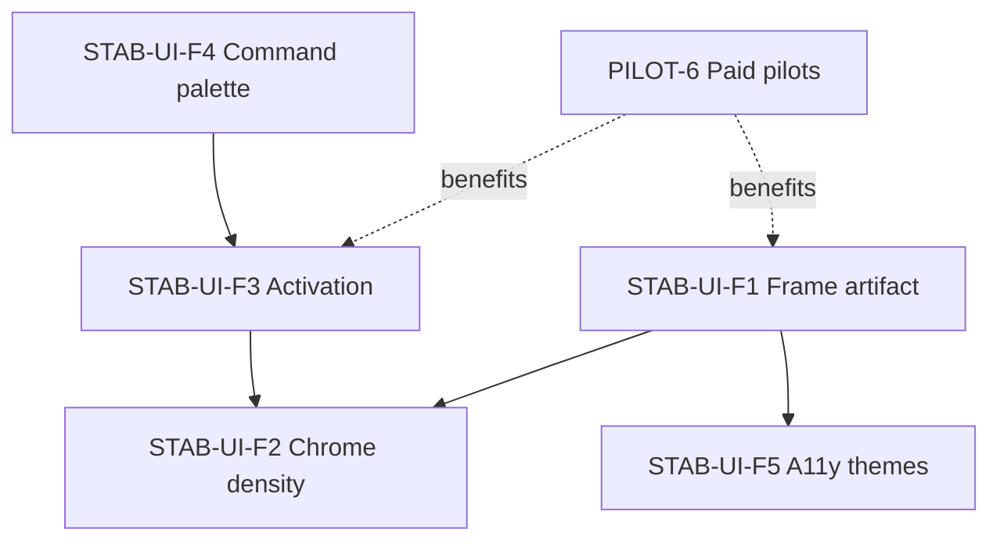

# STAB-UI-F: Presentation & Activation Workstream

**Created:** July 1, 2026  
**Status:** Active — tracker §4.3  
**Owner flow:** Architect → Implementer → Reviewer (`AGENTS.md`)  
**Playbooks:** `docs/playbooks/ui_mode_change.md`, `docs/playbooks/add_tests_first.md`

**Companion workstream:** [`plan_03_ui_technical_foundation.md`](plan_03_ui_technical_foundation.md) (`STAB-UI-T`) — perf, modal infra, resilience; run in parallel where noted below.

---

## 1. Purpose

Velocity’s UI passed stabilization and the May 2026 UXR program (`STAB-UI-D`, all `UXR-###` fixed). Visual polish sprint `STAB-UI-P` shipped crosstab alignment (`CrosstabCell`, Strategy A), `AnalysisOutputFrame`, typography/case rules, and delight-layer validation (VP-D).

**STAB-UI-F** closes the remaining gap between “functionally credible” and “client-presentable without manual tweaking” — the surfaces that paid pilots (`PILOT-6`) will photograph, export, and judge in the first five minutes.

This document is the **single reference** for scope, findings, slice specs, acceptance criteria, and validation. Tracker rows live in `docs/tracker_00_implementation_status.md` §4.3.

---

## 2. Relationship to prior work

| Prior stream | What it optimized | STAB-UI-F builds on |
| :--- | :--- | :--- |
| `STAB-UI-D` + UXR | Trust, journeys, modals, responsive blockers | Does not reopen UXR items |
| `STAB-UI-P` / UXP-001–023 | Crosstab grammar, frame unification, shelf rhythm | Fixes overflow/clipping UXP did not cover |
| `STAB-UI-C` | Command palette MVP | Expands palette in F4 |
| `STAB-UI-E` | Back-room delight (phosphor, story shelf) | Preserves; no behavior regression |
| `audit_02_ui_gap_analysis_2026-05-19.md` | Motion, empty states, density | Informs F2/F3 sequencing |
| July 2026 live audit | Hero output, chrome, activation | Source of UXF register below |
| `STAB-UI-T` | Perf, modal infra, resilience, stacking | Parallel — T5/T7 before F2 VM work |

**ID prefixes**

| Prefix | Meaning |
| :--- | :--- |
| `UXF-###` | New findings from July 2026 presentation audit (this workstream) |
| `UXP-###` | Visual polish register (`docs/reviews/ui_ux_review_2026-05/visual-polish-review.md`) |
| `UXR-###` | Trust/journey register — **closed**; do not duplicate |

---

## 3. Strategic context

**Pilot thesis** (`docs/pilot_00_brief.md`): analysis-ready SAV → defensible, editable client deck in &lt;15 minutes.

**Why now:** `PILOT-6` recruits paid pilots while `PILOT-1` packaging is done. UI defects on the hero artifact (clipped columns, empty chart flash, UUID welcome copy) undermine the wedge before processing or agent gaps matter.

**Non-goals (STAB-UI-F):**

- Phase 5+ features (Insight Engine, infinite canvas, living slides)
- Liquid Glass maturity or dark Soft Machine variants (defer to post-`PILOT-7`)
- Mobile-native layout (desktop ≥1280px remains the pilot contract; improve narrow messaging only)
- Large component refactors (`ExportModal` decomposition) unless required by a slice

---

## 4. Findings register (UXF)

Update **Status** when addressed: `open` | `in_progress` | `fixed` | `wontfix` | `deferred`.

| ID | Surface | Issue | Severity | Slice | Status |
| :--- | :--- | :--- | :--- | :--- | :--- |
| **UXF-001** | Crosstab slide | Data columns clip at card edge (e.g. “NORTH” truncated); horizontal overflow not surfaced to user | P0 | F1 | open |
| **UXF-002** | Chart slide | Grouped bar chart clips right at 1920px inside `max-w-[1200px]` frame | P0 | F1 | open |
| **UXF-003** | Table ↔ chart toggle | Brief empty canvas flash when switching views | P1 | F1 | open |
| **UXF-004** | Slide layout | Large vertical dead space below small crosstabs; artifact does not scale to content | P1 | F1 | open |
| **UXF-005** | Deck display | No user toggle for cell `n=` / column bases in presentation mode (UXP-040 deferred) | P1 | F1 | open |
| **UXF-006** | Focus mode | Feature exists but is undiscoverable; chrome competes with output by default | P1 | F2 | fixed |
| **UXF-007** | Timeline dock | Duplicate wayfinding with bottom tab (“1 Gender by Region” ×2) | P2 | F2 | fixed |
| **UXF-008** | Accent budget | Headers, sig markers, shelf chips, timeline dots all use accent | P2 | F2 | fixed |
| **UXF-009** | Variable Manager | Inspector pane ~35% blank with no placeholder when nothing selected | P2 | F2 | fixed |
| **UXF-010** | Welcome back | Resume card shows raw variable UUIDs when workspace record lacks `variables` labels | P0 | F3 | open |
| **UXF-011** | First run | No guided spotlight for first crosstab (rows → columns → significance) | P1 | F3 | open |
| **UXF-012** | Discovery | Weighting, significance settings, drill-down paths undiscoverable without exploration | P2 | F3 | fixed |
| **UXF-013** | Command palette | `⌘K` is action-only; no variable search or filter/export commands | P1 | F4 | open |
| **UXF-014** | Workspace | Privacy + welcome + pilot banners stack above sparse dataset grid | P2 | F3 | fixed |
| **UXF-015** | Splash | “Checking local storage…” secondary copy fails contrast on Soft Machine | P2 | F5 | open |
| **UXF-016** | Themes | No high-contrast or colorblind-safe significance theme | P2 | F5 | deferred |

**Evidence (July 1, 2026):** Live session at `localhost:3000`, dataset `mock_data.csv`, `gender × region`, Soft Machine theme; code refs `SlideContainer.tsx` (`max-w-[1200px]`), `returningResearcher.ts` (`resolveVarLabel` fallback to id).

---

## 5. Workstream slices

### STAB-UI-F1 — Frame the artifact (Hero output)

**Outcome:** Crosstab and chart slides are screenshot- and export-ready at common viewport widths without column/chart clipping; deck-density toggles available; view transitions do not flash empty state.

**Depends on:** None (STAB-UI-P complete)

**Parallelizable:** F2, F5 (after F1 overflow contract is defined)

#### F1.1 — Overflow & scroll affordance

**Problem:** `SlideContainer` caps width at 1200px with `overflow-hidden`; `DataTable` scroll region exists but clipping is invisible.

**Direction:**

1. When table/chart content exceeds frame width, show **horizontal scroll** with edge fade or shadow (not silent clip).
2. Revisit `max-w-[1200px]`: in default mode, allow frame to use available canvas width up to a sensible max (e.g. `min(100%, 1400px)`); keep Focus bleed behavior.
3. Charts: ensure `AnalysisChart` / renderers respect frame `overflow-x: auto` or scale-to-fit with explicit “scaled to fit” indicator.

**Touch map:**

- `src/features/dashboard/components/SlideContainer.tsx`
- `src/features/dashboard/components/DataTable.module.css`
- `src/features/dashboard/components/AnalysisOutputFrame.module.css`
- `src/components/charts/AnalysisChart.tsx`

**Acceptance:**

- [ ] `gender × region` on 1920px: all column headers visible or scroll affordance obvious
- [ ] Grouped bar chart: full plot + legend visible or horizontally scrollable
- [ ] No regression on Focus mode bleed (`frameBleed`)
- [ ] Playwright: extend `tests/e2e/visual-polish-theme-table.spec.ts` or add overflow assertion

#### F1.2 — Content-aware slide height

**Problem:** Small tables float in tall cards with excessive whitespace (UXF-004).

**Direction:**

1. Slide body uses `min-h-0 flex-1` but card should **shrink-wrap** when content is shorter than viewport (optional `max-h` + internal scroll only when needed).
2. Presentation density (`generous`) may keep taller frame; compact mode should tighten.

**Acceptance:**

- [ ] 3-row crosstab: slide card height proportional; no large empty band below footer
- [ ] Tall/virtualized tables still scroll inside frame

#### F1.3 — Table ↔ chart transition

**Problem:** Empty flash on view toggle (UXF-003).

**Direction:**

1. Keep previous view mounted with opacity crossfade until next view has data, **or**
2. Show skeleton matching `AnalysisOutputFrame` during `isQuerying` / chart mount.

**Acceptance:**

- [ ] Toggle table/chart 5×: no fully blank white card intermediate state

#### F1.4 — Statistics visibility toggles (UXP-040)

**Problem:** Research users want bases; deck users want less chrome (UXF-005).

**Direction (Displayr-simple, not Displayr-heavy):**

| Statistic | Default (explore) | Toggle |
| :--- | :--- | :--- |
| Column % | On | Always on |
| Cell `n=` | On | **Show cell n** |
| Column base row | On | **Show column bases** |

1. Add toggles to `AnalysisSettingsPanel` or compact “Table display” popover on slide footer.
2. Persist per slide in slide state (preferred) or per workspace analysis settings.
3. Hiding stats **removes from layout flow** (no `opacity-0` reserve).
4. Export/MCP: document whether hidden bases appear in PPTX (default: match canvas).

**Touch map:**

- `src/features/dashboard/components/CrosstabCell.tsx`
- `src/store/slices/*` (slide or analysis settings)
- `src/components/common/AnalysisSettingsPanel.tsx`
- `docs/design_01_system.md` §10 (document toggle contract)

**Acceptance:**

- [ ] Both toggles independently control visibility
- [ ] Column widths reflow without ghost gutters
- [ ] Filtered N in subtitle unchanged when cell `n=` hidden (trust invariant from UXR-010)

**Gates:** T, L, U, I (visual-polish e2e), A

---

### STAB-UI-F2 — Content is king (Chrome density)

**Outcome:** Analysis output owns the visual field; supporting chrome recedes by default or through obvious Focus entry.

**Depends on:** F1 overflow contract (shared frame behavior)

**Parallelizable:** F3, F4

#### F2.1 — Focus mode discoverability

**Direction:**

1. After first successful crosstab render, show one-time tip: “Press **F** for Focus mode” (toast or story shelf; reuse `pilotOnboarding` event deferral pattern from UXR-005).
2. Optional: “Presentation” toolbar cluster labels Focus more clearly vs “Enter Focus Mode”.

**Acceptance:**

- [ ] New session: tip appears once after first table render; dismissible
- [ ] `F` still toggles; no conflict with input focus

#### F2.2 — Timeline dock compaction

**Direction:**

1. Default dock height reduced; expand on hover/focus.
2. Remove or merge redundant bottom tab if it duplicates active slide label (UXF-007).

**Touch map:** `src/features/dashboard/components/TimelineDock.tsx`, `DashboardShell.tsx`

**Acceptance:**

- [ ] Timeline ≤48px default; slide title readable on hover
- [ ] Keyboard nav to slides unchanged

#### F2.3 — Accent budget pass

**Direction:** Apply UXP-012 remainder — column headers `text-secondary`; accent only on interactive controls + significant cells.

**Touch map:** `DataTable.tsx`, `AnalysisShelf.tsx`, `TimelineDock.tsx`, `SlideHeader.tsx`

**Acceptance:**

- [ ] Mission Control screenshot: headers muted; sig markers still visible

#### F2.4 — Variable Manager inspector empty state

**Direction:** Placeholder panel copy + illustration when no variable selected (UXF-009).

**Touch map:** `src/features/variableManager/VariableInspector.tsx`

**Acceptance:**

- [ ] Open Manager: right pane shows guided empty state, not blank beige

**Gates:** T, L, U, I (workspace-switch / pilot-workflow smoke)

---

### STAB-UI-F3 — Teach by doing (Activation)

**Outcome:** Returning and first-time users understand what to do next without reading docs; workspace copy is human-readable.

**Depends on:** None (F3.1 can start immediately)

**Parallelizable:** F4; F2.1 should coordinate tip timing with F3.2

#### F3.1 — Welcome back label hydration (UXF-010)

**Problem:** `findResumeCandidate` falls back to variable id when `pick.variables` is undefined on stored dataset.

**Direction:**

1. Persist row/col **labels** in `sessionState.tableConfig` at save time, **or**
2. Hydrate variables from OPFS before rendering welcome card, **or**
3. Defer card until labels resolvable; show generic “Resume your last analysis in {dataset}” as fallback.

**Touch map:**

- `src/features/workspace/lib/returningResearcher.ts`
- `src/features/workspace/components/WelcomeBackCard.tsx`
- Session persistence layer

**Acceptance:**

- [ ] Welcome card never shows UUIDs in user-visible copy
- [ ] Unit test: `findResumeCandidate` with missing `variables` uses persisted labels

#### F3.2 — First crosstab spotlight (UXF-011)

**Direction:**

3-step non-blocking spotlight (reuse pilot onboarding / story shelf infrastructure):

1. Drag/add variable to **Rows**
2. Drag/add variable to **Columns**
3. Read significance markers / footer legend

Dismissible; replay from Help / `?` modal.

**Touch map:** New small module e.g. `src/features/dashboard/onboarding/firstCrosstabTour.ts`; wire in `DashboardShell` or `SlideContainer`.

**Acceptance:**

- [ ] Fresh profile / cleared onboarding flag: tour triggers after dataset load
- [ ] Completing or dismissing tour sets persistent flag
- [ ] Does not block interaction (no modal trap)

#### F3.3 — Contextual micro-tips (UXF-012)

**Direction:** After N repetitions of an action, show subtle tip chips (Focus, weight, drill-down). Store dismissed tips in localStorage.

**Acceptance:**

- [ ] At least 3 tips implemented (Focus, Export, Variable Manager)
- [ ] Each tip shows once unless reset

#### F3.4 — Workspace banner discipline (UXF-014)

**Direction:** Collapse dismissed banners for session; single combined status strip where possible (privacy + storage).

**Touch map:** `WorkspaceView.tsx`, `PilotEnvironmentBanner`, `WelcomeBackCard`

**Acceptance:**

- [ ] After dismiss, banners do not reappear same session
- [ ] Max one full-width banner visible by default

**Gates:** T, L, U, I (`pilot-workflow.spec.ts`, welcome-back unit tests)

---

### STAB-UI-F4 — Command palette depth

**Outcome:** `⌘K` is the universal action surface for power users (UXF-013).

**Depends on:** None (MVP can ship parallel to F1)

#### F4.1 — Variable search → shelf actions

**Direction:**

1. Index visible variable sets (label + name + semantic category if cheap).
2. Palette results: “Add **gender** to Rows”, “Add to Columns”, “Add to Weight”.
3. Fuzzy match on query; arrow keys + Enter execute.

**Touch map:** `src/components/common/CommandPalette.tsx`, store shelf actions

**Acceptance:**

- [ ] `⌘K` → type “reg” → add region to columns in one action
- [ ] Palette closes on execute; toast confirms action

#### F4.2 — Action commands

**Direction:** Add commands: Export deck, Toggle Focus, Open Variable Manager, Reset analysis, Switch theme (existing), Open filters.

**Acceptance:**

- [ ] “export” matches Export current slide/deck entry point
- [ ] Documented in `KeyboardShortcuts` modal

#### F4.3 — Empty state hint

**Direction:** Empty canvas DropZone helper text mentions `⌘K`.

**Gates:** T, L, U (`CommandPalette.test.tsx` extensions)

---

### STAB-UI-F5 — Inclusive presentation (Accessibility themes)

**Outcome:** Enterprise-credible accessibility options without blocking pilot.

**Depends on:** F1 sig/color stability

**Status:** **Deferred** until F1–F3 complete or pilot requests a11y theme

#### F5.1 — High-contrast theme

**Direction:** WCAG AAA palette; significance uses shape + color (▲/▼ already in `CrosstabCell`).

#### F5.2 — Deuteranopia-safe significance

**Direction:** Blue/orange significance ramp option in theme switcher.

#### F5.3 — Splash contrast fix (UXF-015)

**Direction:** Bump `--text-secondary` or dedicated splash muted token for loading copy.

**Gates:** T, L, U, manual contrast check

---

## 6. Dependency graph



**Recommended pull order:**

1. **F3.1** (welcome UUID) — quick trust win, no frame dependency  
2. **F1.1–F1.2** (overflow + height) — highest visual impact  
3. **F1.4** (UXP-040 toggles) — deck vs research density  
4. **F2.1 + F3.2** (Focus tip + first crosstab tour) — activation  
5. **F4.1** (palette variable search) — power users  
6. **F2.2–F2.4, F3.3–F3.4, F1.3** — polish batch  
7. **F5** — when pilot or compliance asks  

---

## 7. Validation checklist (human, 10 minutes)

Run after **F1** merges on `mock_data.csv`, `gender × region`:

- [ ] All region columns visible or scroll cue obvious at 1920px and 1280px  
- [ ] Chart view: full plot readable  
- [ ] Toggle table/chart: no blank flash  
- [ ] Hide cell `n=`: layout tightens; % alignment preserved  
- [ ] Welcome back: no UUIDs  
- [ ] `⌘K` → add variable works  
- [ ] Focus mode tip appears once after first table  
- [ ] Screenshot embeddable in slide deck without annotation  

**Automated commands:**

```bash
npm run check:design-tokens
npm run typecheck
npm run test:run -- src/features/dashboard/components/CrosstabCell.test.tsx src/features/dashboard/components/DataTable.test.tsx src/features/workspace/lib/returningResearcher.test.ts src/components/common/CommandPalette.test.tsx
npx playwright test tests/e2e/visual-polish-theme-table.spec.ts tests/e2e/pilot-workflow.spec.ts
```

---

## 8. Design principles (carry forward)

1. **Content is king** — Chrome recedes; the slide artifact is the product photograph.  
2. **Honest layout** — Never reserve space for hidden stats (`opacity-0` in flow).  
3. **Progressive disclosure** — Teach first crosstab; advanced features via tips and palette.  
4. **Pilot-safe scope** — No new modes; polish existing Workspace / Canvas / Manager.  
5. **Dual register discipline** — Trust fixes → UXR process; presentation → UXF/UXP here.  

---

## 9. Completion criteria (workstream sign-off)

STAB-UI-F is **Done** when:

- All UXF-001–015 are `fixed` or `wontfix` with rationale  
- UXP-040 implemented or explicitly merged into F1.4 acceptance  
- Tracker §4.3 rows are `Done` with PR links  
- Human validation checklist passes on Soft Machine + Mission Control  
- `PILOT-6` runbook references this doc for UI smoke before pilot sessions  

Move narrative summary to `docs/completed_foundations_summary.md` §UI excellence; keep this plan as the historical spec.

---

## 10. Changelog

| Date | Change |
| :--- | :--- |
| 2026-07-01 | Initial workstream spec from full UI audit (live app + code review) |
