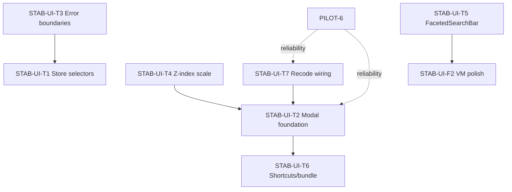

# STAB-UI-T: Technical UI Foundation Workstream

**Created:** July 1, 2026  
**Status:** Active — tracker §4.4  
**Owner flow:** Architect → Implementer → Reviewer (`AGENTS.md`)  
**Playbooks:** `docs/playbooks/ui_mode_change.md`, `docs/playbooks/add_tests_first.md`, `docs/playbooks/refactor_safely.md`

**Companion workstream:** [`plan_02_ui_presentation_workstream.md`](plan_02_ui_presentation_workstream.md) (`STAB-UI-F`) — presentation and activation; this stream covers perf, resilience, modal/a11y infrastructure, and stacking.

---

## 1. Purpose

An independent engineering UI audit (July 2026) identified high-leverage **exceptions** to an otherwise strong frontend: granular Zustand usage exists in hot paths (`SlideContainer`, `DataTable`) but is not propagated; `ModalShell` lacks dialog semantics; z-index values conflict; and several functional/a11y bugs affect pilot reliability.

**STAB-UI-T** makes the UI **fast, accessible, and resilient** under real pilot use (`PILOT-6`) without expanding product scope.

---

## 2. Relationship to other streams

| Stream | Optimizes for | Overlap with STAB-UI-T |
| :--- | :--- | :--- |
| `STAB-UI-F` | Client-presentable slides, activation | FacetedSearchBar theme (F2 uses VM); modals/z-index affect both |
| `STAB-UI-D` / UXR | Trust journeys — **closed** | Modal Esc/focus were UXR targets; T2 completes infra in `ModalShell` |
| `STAB-UI-P` | Visual polish — **closed** | Z-index scale supports frame-it checklist |
| `STAB-DS-1` | Design-token CI | T4 z-index tokens extend token discipline |

**ID prefixes**

| Prefix | Meaning |
| :--- | :--- |
| `UXT-###` | Technical UI findings (this workstream) |
| `UXF-###` | Presentation findings (`plan_02`) |
| `UXR-###` | Trust/journey — **closed** |

---

## 3. Non-goals

- Blanket `React.memo` on all 130+ components (selectors first; memo hot leaves only if profiled)
- Full `ExportModal` / `WorkspaceView` decomposition (unless a slice requires it)
- Mobile-native layout
- Removing all `console.*` before pilot (T6 hygiene batch only)

---

## 4. Findings register (UXT)

Update **Status:** `open` | `in_progress` | `fixed` | `wontfix` | `deferred`.

| ID | Area | Issue | Severity | Slice | Status |
| :--- | :--- | :--- | :--- | :--- | :--- |
| **UXT-001** | Store | Whole-store `useVelocityStore()` in 18 files (~20 call sites); any tick re-renders heavy subtrees | P0 | T1 | open |
| **UXT-002** | Perf | Zero `React.memo` on hot leaves (crosstab cells, chart SVG, variable cards) | P1 | T1 | open |
| **UXT-003** | Modals | `ModalShell` lacks `role="dialog"`, `aria-modal`, focus trap, focus restore; `escapeToClose` defaults `false` | P0 | T2 | open |
| **UXT-004** | Modals | Overlays bypassing `ModalShell` miss shared behavior (`DataDrawer`, `CommandPalette`, `ProjectLinkModal`, `CrossWavePanel`, `ExportImportModal`) | P1 | T2 | open |
| **UXT-005** | Resilience | No `ErrorBoundary` — chart/D3 exception unmounts entire dashboard | P0 | T3 | fixed |
| **UXT-006** | Forms | ~31 `<label>` elements; ~2 use `htmlFor` — SR announces unlabeled fields | P1 | T2 | open |
| **UXT-007** | A11y | Icon-only close buttons without `aria-label` (9+ sites) | P1 | T2 | open |
| **UXT-008** | A11y | Click-to-edit `<div onClick>` without keyboard path (`InspectorHeader`, `WorkspaceProjectCard`, `DataTable` merge UI) | P1 | T2 | open |
| **UXT-009** | Stacking | Ad hoc z-index (37+ values); toast z-130 under session modal z-140; chart menu z-1000 under table sticky z-9999 | P0 | T4 | open |
| **UXT-010** | Theme | `FacetedSearchBar.module.css` hardcodes `rgba(255,255,255,…)` — invisible on Soft Machine cream panels | P0 | T5 | open |
| **UXT-011** | Shortcuts | 6+ parallel `document.keydown` listeners; precedence depends on mount order | P1 | T6 | open |
| **UXT-012** | Bug | `ModalHost` mounts `<RecodeModal onSave={async () => {}}>` — recodes may not persist from this path | P0 | T7 | open |
| **UXT-013** | Bundle | Monaco eagerly imported in `RCodeEditor.tsx` — multi-MB main chunk | P2 | T6 | open |
| **UXT-014** | A11y | No skip link; receded canvas not `aria-hidden`/`inert` when Variable Manager open | P2 | T2 | open |
| **UXT-015** | Menus | Context menus lack `role="menu"` / `menuitem`, arrow nav (`ContextMenu`, `ChartContextMenu`) | P2 | T2 | open |
| **UXT-016** | Tables | `RecodeModal` table headers lack `scope` | P3 | T2 | open |
| **UXT-017** | Tokens | `--space-*` unused in CSS modules; ~611 raw px values | P3 | deferred | deferred |
| **UXT-018** | Charts | ~20 hardcoded SVG `fontSize: '10px'/'11px'` in renderers | P3 | deferred | deferred |
| **UXT-019** | Hygiene | 30+ `console.*` in shipped paths (10 in `usePersistenceManager.ts`) | P3 | T6 | open |
| **UXT-020** | Types | ~40 `any` in variable-manager + chart subsystems | P3 | deferred | deferred |
| **UXT-021** | Tokens | `tailwind.config.cjs` dead gray hexes; stray warning hex in `index.css:180` | P3 | T5 | open |

---

## 5. Whole-store subscription inventory (UXT-001)

Migrate to selector pattern `(state) => state.field` or shallow compare; colocate actions with minimal subscriptions.

| File | Notes |
| :--- | :--- |
| `src/App.tsx` | Largest destructuring — split by concern or pass props from thin container |
| `src/features/dashboard/DashboardShell.tsx` | Canvas shell — high churn |
| `src/components/layout/AppShell.tsx` | **3 separate** `useVelocityStore()` calls (lines ~21, ~24, ~116) |
| `src/features/variableManager/VariableManager.tsx` | Full overlay |
| `src/features/variableManager/VariableSetColumn.tsx` | Virtualized list parent |
| `src/features/variableManager/VariableInspector.tsx` | Inspector pane |
| `src/features/variableManager/VariableColumn.tsx` | Column list |
| `src/features/variableManager/components/FacetedSearchBar.tsx` | Filter bar |
| `src/features/variableManager/components/InspectorHeader.tsx` | Rename UI |
| `src/features/variableManager/components/InspectorStats.tsx` | Stats panel |
| `src/features/variableManager/FolderPanel.tsx` | Folder UI |
| `src/features/variableManager/FolderColumn.tsx` | Miller column |
| `src/features/variableManager/DataSourceColumn.tsx` | Source column |
| `src/features/variableManager/BulkActionBar.tsx` | Bulk actions |
| `src/features/harmonization/HarmonizationWorkspace.tsx` | Harmonization shell |
| `src/components/common/CommandPalette.tsx` | Palette state |
| `src/components/common/KeyboardShortcuts.tsx` | Shortcuts modal flag |

**Reference implementation:** `src/features/dashboard/components/SlideContainer.tsx`, `DataTable.tsx` (granular selectors).

**Acceptance (T1):**

- [ ] Zero whole-store hooks in files above (grep `useVelocityStore()` returns no bare calls)
- [ ] Profile or React DevTools: crosstab update does not re-render `VariableManager` when closed
- [ ] Optional: `React.memo` on `CrosstabCell`, `DraggableVariable` if profiling still shows churn

**Gates:** T, L, U, `npm run test:run -- src/features/dashboard`

---

## 6. Workstream slices

### STAB-UI-T7 — Recode modal wiring (UXT-012) — pull first

**Outcome:** Recode saves persist regardless of which host opens the modal.

**Problem:**

```123:128:src/app/components/ModalHost.tsx
    <RecodeModal
      isOpen={recodeModal.isOpen}
      onClose={onCloseRecodeModal}
      variable={recodeModal.variable as Parameters<typeof RecodeModal>[0]['variable']}
      onSave={async () => {}}
    />
```

**Direction:**

1. Trace all recode entrypoints (`DashboardShell`, sidebar context menu, Variable Manager).
2. Wire `ModalHost` to store `saveRecode` / equivalent action used by working paths.
3. Add integration test: open recode via global host → save → verify transform log / variable state.

**Gates:** T, L, U

---

### STAB-UI-T5 — FacetedSearchBar theme fix (UXT-010, UXT-021)

**Outcome:** Variable Manager quality/status filters readable on Soft Machine (default theme).

**Direction:**

1. Replace `rgba(255,255,255,…)` in `FacetedSearchBar.module.css` with `color-mix(in srgb, var(--text-primary) X%, transparent)` or semantic surface tokens.
2. Visual check on Soft Machine + Mission Control.
3. Clean dead hex in `tailwind.config.cjs` and `index.css:180` if touched.

**Gates:** T, L, U, manual VM screenshot

---

### STAB-UI-T2 — Modal & dialog foundation (UXT-003, UXT-004, UXT-006–008, UXT-014–016)

**Outcome:** All overlays behave as accessible dialogs with consistent Esc, focus trap, and labeling.

#### T2.1 — `ModalShell` upgrade

Add to `src/components/overlays/ModalShell.tsx`:

- `role="dialog"` + `aria-modal="true"` on panel
- `aria-labelledby` / `aria-describedby` hooks (props for title/description ids)
- Focus trap on open (first focusable / title close button); restore focus on close
- Default `escapeToClose={true}` unless explicitly disabled; coordinate with `useModalEscape` to avoid double handlers
- Optional: use `@radix-ui/react-dialog` or `focus-trap-react` if already in dependency tree — prefer minimal deps

**Touch:** `ModalShell.test.tsx` — assert dialog role, Esc closes, focus returns to trigger.

#### T2.2 — Migrate or align bypass modals

| Component | Action |
| :--- | :--- |
| `CommandPalette` | dialog semantics + trap (already z-200) |
| `DataDrawer` | `role="dialog"` or `complementary` + labelled drawer |
| `ProjectLinkModal`, `CrossWavePanel`, `ExportImportModal` | Use `ModalShell` or shared dialog primitive |
| `KeyboardShortcuts` | dialog pattern |

#### T2.3 — Form labels batch

Add `htmlFor` + matching `id` on inputs in: `RecodeModal`, `ConvertSystemMissingModal`, `ProjectLinkModal`, `CrossWavePanel`, `AdvancedAnalysisPanel`, `AnalysisSettingsPanel`.

#### T2.4 — Close button labels

Add `aria-label="Close …"` to icon-only X buttons (match `ExportModal`, `SessionImportModal`, `VariableManager` close).

#### T2.5 — Click-to-edit keyboard parity

Follow `WorkspaceDatasetListItem.tsx` pattern: `role="button"`, `tabIndex={0}`, `onKeyDown` (Enter/Space) for rename/open/merge affordances.

#### T2.6 — Variable Manager backdrop

When `appMode === 'variables'`: `aria-hidden="true"` + `inert` on receded canvas (feature-detect `inert`).

**Gates:** T, L, U, I (`pilot-workflow.spec.ts`), manual screen reader spot-check on Export + Filter modals

---

### STAB-UI-T4 — Z-index token scale (UXT-009)

**Outcome:** Predictable stacking; toasts above modals; context menus above sticky headers.

**Direction:**

1. Add semantic tokens in `index.css`:

```css
--z-sticky: 10;
--z-dropdown: 50;
--z-popover: 100;
--z-toast: 150;
--z-modal: 200;
--z-menu: 250;
```

2. Extend `scripts/check-design-tokens.mjs` to flag raw `z-[9999]` outside allowlist (optional phase 2).
3. Migrate: `ToastLayer` → `--z-toast`; session modals → `--z-modal`; `DataTable` sticky → `--z-sticky`; context menus → `--z-menu`.
4. Remove conflicting literals (`z-9999`, `z-1000`, `z-140`).

**Acceptance:**

- [ ] Toast visible while session import modal open
- [ ] Chart/table context menu not clipped by sticky header
- [ ] Theme switcher popover stacks correctly

**Gates:** T, L, U, visual/manual stacking test

---

### STAB-UI-T3 — Error boundaries (UXT-005)

**Outcome:** Chart/table failures show recoverable fallback, not white screen.

**Direction:**

1. Add `src/components/common/AnalysisErrorBoundary.tsx` (class component or `react-error-boundary` if present).
2. Wrap `SlideContainer` render output and each chart renderer entry in `AnalysisChart`.
3. Fallback UI: “This chart could not render” + Retry + slide id; log to pilot event log optional.
4. Test: throw in test renderer → boundary catches → dashboard shell still mounted.

**Gates:** T, L, U

---

### STAB-UI-T1 — Store selector migration (UXT-001, UXT-002)

**Outcome:** Store updates scoped to subscribers; hot paths avoid full-tree re-render.

**Phased migration (order matters):**

1. `App.tsx` — extract `useAppStore()` hook with grouped selectors or split containers
2. `DashboardShell.tsx`, `AppShell.tsx` (merge 3 calls into one selector hook)
3. `VariableManager.tsx` + column components (`VariableSetColumn`, `VariableInspector`, …)
4. `CommandPalette`, `HarmonizationWorkspace`, `BulkActionBar`

**Do not** memo everything upfront. After selectors, profile `gender × region` update with React DevTools.

**Gates:** T, L, U, optional `benchmark:crosstab` regression

---

### STAB-UI-T6 — Shortcuts, bundle, hygiene (UXT-011, UXT-013, UXT-019)

**Outcome:** Single shortcut registry; smaller initial bundle; quieter production console.

#### T6.1 — Shortcut registry

Replace scattered listeners in `AppShell`, `VariableManager`, `TimelineDock`, `KeyboardShortcuts`, `CommandPalette`, `StatisticsStatusBar` with one module:

- Context stack: `global` | `canvas` | `manager` | `modal`
- Modal context pushes on open, pops on close
- Document single precedence table in `KeyboardShortcuts` modal

#### T6.2 — Lazy Monaco

`React.lazy(() => import('./RCodeEditor'))` from `ModalHost` or recode entry only.

#### T6.3 — Console hygiene

Gate `console.log/debug` behind `import.meta.env.DEV` in `usePersistenceManager` and top offenders; keep `console.error` for real failures.

**Gates:** T, L, U, build size snapshot optional

---

## 7. Dependency graph



**Recommended pull order:**

1. **T7** — Recode noop (hours, P0 bug)  
2. **T5** — FacetedSearchBar theme (hours, visible on default theme)  
3. **T4** — Z-index scale (unblocks toast/menu bugs)  
4. **T2** — ModalShell dialog + focus trap  
5. **T3** — Error boundaries  
6. **T1** — Store selectors (largest diff, highest perf win)  
7. **T6** — Shortcut registry + lazy Monaco  

Run **T7/T5** in parallel with **STAB-UI-F3.1** (welcome-back copy).

---

## 8. Validation checklist

**Automated:**

```bash
npm run check:design-tokens
npm run typecheck
npm run test:run -- src/components/overlays/ModalShell.test.tsx src/app/components/ModalHost.test.tsx
npx playwright test tests/e2e/pilot-workflow.spec.ts
```

**Manual (15 min):**

- [ ] Soft Machine: FacetedSearchBar filters visible  
- [ ] Open Export modal: focus trapped, Esc closes, focus restored  
- [ ] Toast appears above session import modal  
- [ ] Right-click crosstab cell: context menu fully visible  
- [ ] Recode from ModalHost path: save persists  
- [ ] Force chart error (dev): boundary fallback, sidebar still works  

**Regression grep (post-T1):**

```bash
rg 'useVelocityStore\(\)' src --glob '*.tsx'  # expect zero bare calls
```

---

## 9. Completion criteria

STAB-UI-T is **Done** when:

- UXT-001–012 are `fixed` or `wontfix` with rationale  
- UXT-013–016 fixed or deferred with tracker note  
- Tracker §4.4 rows `Done` with PR links  
- No bare `useVelocityStore()` in component files  
- ModalShell tests cover dialog + Esc + focus restore  

Summarize in `docs/completed_foundations_summary.md` §UI excellence; keep this plan as the spec.

---

## 10. Changelog

| Date | Change |
| :--- | :--- |
| 2026-07-01 | Initial workstream from independent technical UI audit |
