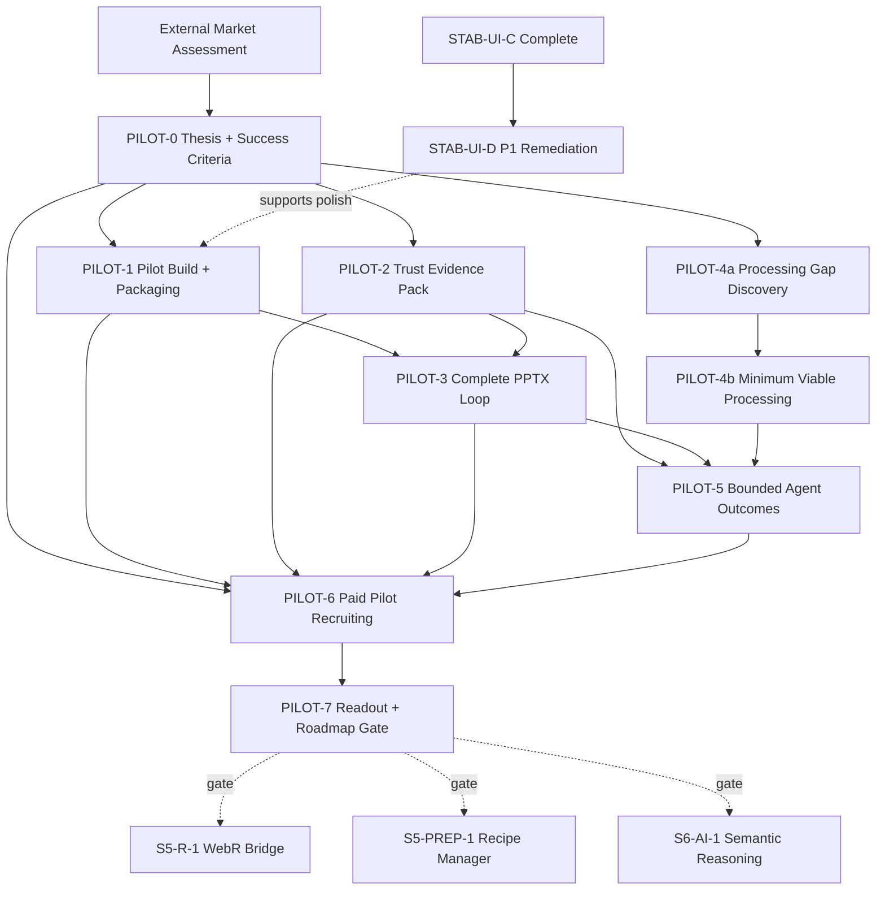

# Velocity Implementation Tracker (Active Work)

This tracker is the operational delivery board. It is dependency-first, optimized for multi-agent orchestration, and now focused on active and decision-relevant work.

Use with:
- Documentation index: `docs/README.md`
- Completed foundations summary: `docs/completed_foundations_summary.md`
- Strategic roadmap: `docs/roadmap_00_strategic_guide.md`
- Scope gates: `docs/blue_02_feature_matrix.md`
- External market assessment: `docs/velocity_external_market_assessment.pdf`
- Agent rules: `AGENTS.md`

## 1. Status Model

- `Not started`: work item has not begun
- `In progress`: active implementation
- `Blocked`: waiting on dependency or decision
- `In review`: implementation complete, awaiting review gates
- `Done`: merged with required evidence
- `Merged`: absorbed into another tracker row (do not start separately)
- `Frozen`: explicitly deferred until the relevant gate opens

## 2. Gate Legend

- `T`: Typecheck
- `L`: Lint
- `U`: Targeted unit tests
- `I`: Integration tests / E2E
- `G`: Golden, parity, or benchmark evidence
- `A`: Architecture/invariant checks (`src/core` seam, Worker compute, dual-state integrity, ResultEnvelope/session rules)
- `V`: Market validation evidence (paid pilot, observed workflow, willingness-to-pay signal)

Default owner flow for all implementation items: `Architect -> Implementer -> Reviewer`.
Handoff required for every owner transition using `docs/agent_handoff_template.md`.

## 3. Active Dependency Graph

Completed Phase 1-4, stabilization, UI polish, engine/MCP, export, parity, and harmonization work is summarized in `docs/completed_foundations_summary.md`. The active critical path is now the market-reset pilot workstream: prove the narrow SAV-to-deck wedge before expanding the platform.

## 4. Execution Board

### 4.1 SAV-to-Deck Pilot Workstream

**Source:** `docs/velocity_external_market_assessment.pdf` (June 2026) and the codebase review against current tracker/source state.

**Product thesis:** The fastest, simplest, most private path from an analysis-ready SAV file to a defensible, editable client deck.

**Beachhead:** Boutique quantitative agencies and independent consultants who receive SAV files, produce editable client decks, run frequent crosstabs/subgroup cuts/tracker updates, and feel incumbent license/training friction.

**Non-goals until validation:** Broad SPSS replacement, enterprise collaboration, direct survey platform imports, general-purpose AI, full advanced-methods breadth, and cloud/team governance.

| ID | Stream | Outcome | Depends on | Status | Contract change | Gates | Evidence / validation |
| :--- | :--- | :--- | :--- | :--- | :--- | :--- | :--- |
| PILOT-0 | Strategy / Validation | Pilot thesis, ICP screen, workflow definition, success metrics, and pricing hypotheses for the SAV-to-deck wedge | External market assessment | Done | No | A,V | [`docs/pilot_00_brief.md`](pilot_00_brief.md) — thesis, workflow targets (<5 min crosstab, <15 min slide), 8 qualification criteria, 3 pricing hypotheses, scope boundaries; gate A conditional pass (June 2026 sub-agent audit) |
| PILOT-1 | Release / Packaging | Deployable pilot build with durable project flow, clear privacy language, browser-limit warnings, and onboarding instrumentation | PILOT-0, STAB-UI-D preferred | Done | Yes | T,L,U,I,A,V | [`docs/pilot_01_packaging.md`](pilot_01_packaging.md) — v0.1.0-pilot build, privacy banner, browser checks, local event log (`pilotOnboarding.ts`), `tests/e2e/pilot-workflow.spec.ts` |
| PILOT-2 | Trust Evidence | Buyer-facing trust pack: parity results, performance benchmarks, missing-value behavior, weighting assumptions, known unsupported cases, and reproducible methodology notes | PILOT-0 | Done | No | G,A,V | [`docs/pilot_02_trust_pack.md`](pilot_02_trust_pack.md) — R/SPSS/golden parity, adapter parity (8/8, 2026-06-25), fresh `benchmark:sav` (sleep + WVS7), missing-value/weighting/limitations sections; `arch_04` weighted-mean gap corrected |
| PILOT-3 | PowerPoint Loop | Complete the high-value PPTX loop: client template import/map, editable object preservation, saved slide recipes, dataset/wave replacement, review-before-export | PILOT-1, PILOT-2 | Not started | Yes | T,L,U,I,A,V | Template fixture tests; PPTX golden/semantic checks; manual blind review against incumbent/current workflow; recipe refresh preserves analyst edits where specified |
| PILOT-4a | Processing Discovery | Observe pilot files and classify which prep gaps actually block the Friday-4pm job: raking/RIM, nets, derived variables, banner plans, reshaping, repeatable recipes | PILOT-0 | Not started | No | V,A | 10-15 project/file review notes; ranked blockers by frequency/severity; explicit "do not build yet" list |
| PILOT-4b | Minimum Viable Processing | Implement only the smallest processing layer required by PILOT-4a: reusable derived variables/nets, saved banner/break plans, common transformation recipes; raking only if repeatedly pilot-blocking | PILOT-4a | Blocked | Yes | T,L,U,I,G,A,V | Narrow implementation PRs with add-tests-first; transform/session replay tests; dual-state safeguards; pilot unblock evidence |
| PILOT-5 | Bounded Agent Outcomes | Package the agent as auditable outcomes, not infrastructure: first-pass deck, tracker update, client-request assistant; manual control adjacent to every action | PILOT-2, PILOT-3, PILOT-4b if needed | Not started | Yes | T,L,U,I,A,V | MCP/engine flow tests; provenance visible in outputs; observed time reduction without increased corrections or trust failures |
| PILOT-6 | Paid Pilot Program | Recruit and run 5-8 qualified paid boutique-agency/consultant pilots | PILOT-0; can start before PILOT-3 if scope is explicit | Not started | No | V | Signed paid pilots or equivalent commitment; observed workflows; conversion, retention intent, and willingness-to-pay notes |
| PILOT-7 | Roadmap Gate | Decide whether to continue, narrow, pause, or expand based on paid-pilot evidence; update roadmap, feature matrix, and this tracker | PILOT-6 | Not started | No | A,V | Decision memo with metrics, retained wedge, rejected assumptions, next 1-3 workstreams |

#### Dependency Notes

- `PILOT-0` is the shared contract. Do not start broad build work until the pilot workflow, ICP, and success metrics are explicit.
- `PILOT-1`, `PILOT-2`, and `PILOT-4a` can run in parallel after `PILOT-0`.
- `PILOT-3` should stay single-threaded while it defines template/recipe contracts that export, session, and deck code will share.
- `PILOT-4b` remains blocked until real pilot/project evidence shows which processing gaps are adoption blockers.
- `PILOT-6` can begin immediately after `PILOT-0`, but the promise to pilots must match the current product surface.
- `PILOT-7` is the gate before re-opening broad Phase 5+ expansion.

#### Recommended Next Pull

1. `PILOT-6`: recruit paid pilots — deploy per `pilot_01_packaging.md`, collect Pilot Log exports.
2. `STAB-UI-D`: close P1 UX findings that threaten <5 min / <15 min targets (UXR-037, 040, 010).
3. `PILOT-3`: complete PPTX template loop once pilots confirm wedge value.

### 4.2 Active UI Remediation

This is the remaining active UI quality row from the May 2026 review program. It supports pilot readiness but should not expand engine, MCP, or persistence contracts.

| ID | Stream | Outcome | Depends on | Status | Contract change | Gates | Evidence / validation |
| :--- | :--- | :--- | :--- | :--- | :--- | :--- | :--- |
| STAB-UI-D | UI/UX review remediation | Close P1 findings from comprehensive review: UXR-037, 040, 008, 010, 024; modal Esc/focus (041-042); OPFS user-facing copy (047); responsive Canvas chrome (044-045) | STAB-UI-C | Not started | No | T,U,I,A | `docs/reviews/ui_ux_review_2026-05/findings.md`, `session-12-synthesis.md`, `docs/audit_06_ui_ux_review_2026-05.md`; targeted component/E2E evidence |

### 4.3 Future Gates

These rows remain directionally valid, but should not become active until `PILOT-7` shows retention, willingness to pay, or repeated pilot blockers that justify them.

| ID | Stream | Outcome | Depends on | Status | Contract change | Gates | Gate to activate |
| :--- | :--- | :--- | :--- | :--- | :--- | :--- | :--- |
| S5-R-1 | Runtime | Productized WebR Worker + Arrow-to-R marshalling | S5-HARM-1, PILOT-7 | Frozen | Yes | T,L,U,I,A | Activate only if advanced methods/raking repeatedly block paid pilots |
| S5-STATS-1 | Stats | Advanced models (`lme4`) + raking path integration | S5-R-1 | Frozen | Yes | T,L,U,I,G,A | Activate only after WebR runtime is productized and pilot evidence demands it |
| S5-PREP-1 | Data Prep | Recipe manager + time travel | PILOT-7 or PILOT-4b | Frozen | Yes | T,L,U,I,A | Activate if saved transformation recipes become a retention requirement |
| S5-PREP-2 | Data Prep | Block formula builder + programming-by-example | S5-PREP-1 | Frozen | Yes | T,L,U,I,A | Activate after recipe manager proves useful |
| S6-AI-1 | AI | Semantic reasoning + auto-code for text | PILOT-7, S5-PREP-1 | Frozen | Yes | T,L,U,I,A,V | Activate only after bounded agent outcomes prove value |
| S6-AI-2 | AI | Text-to-SQL/Text-to-state interpreter | S6-AI-1 | Frozen | Yes | T,L,U,I,A,V | Activate after semantic reasoning is validated |
| S6-AI-3 | AI | Action hub workflows | S6-AI-2 | Frozen | Yes | T,L,U,I,A,V | Activate after repeatable agent workflows exist |
| S7-CLOUD-1 | Cloud | Realtime collaboration backend + UI integration | S6-AI-3 | Frozen | Yes | T,L,U,I,A,V | Activate only for in-house/team ICP expansion |
| S7-CLOUD-2 | Cloud | Direct survey platform imports via backend proxy | S7-CLOUD-1 | Frozen | Yes | T,L,U,I,A,V | Activate only after governance/import pain is observed in target segment |

## 5. Completed Work Reference

Completed work is no longer expanded in this tracker. Use `docs/completed_foundations_summary.md` for the durable summary of:

- Phase 1 core ingestion, worker, canvas, and design-system foundations
- Phase 2 survey workbench, weighting application, recoding, grids, significance, PPTX/XLSX export
- Phase 3 `VelocityEngine`, MCP, browser convergence, and semantic layer
- Phase 4 eval program, benchmark baselines, capability-gap synthesis, and follow-through
- Stabilization: workspace reopen, export quality, design tokens, truthful CI, thin-slice architecture cleanup
- UI excellence: motion/accessibility, canvas polish, theme/density, delight layers
- Harmonization workspace and fuzzy EVAL-05 follow-up
- Testing and evidence anchors

## 6. Update Rules

When updating this file:
1. Keep active work in the execution board; move completed narratives to `docs/completed_foundations_summary.md`.
2. Never add a work item without an `ID`, `Depends on`, `Status`, and validation evidence.
3. If `Contract change` is `Yes`, link evidence in PR descriptions using `.github/pull_request_template.md`.
4. Move items only by status transitions (`Not started` -> `In progress` -> `In review` -> `Done`; or `Blocked`/`Frozen` when gated).
5. Keep the Mermaid dependency graph and tables in sync in the same commit.
6. Do not activate Phase 5+ expansion without `PILOT-7` evidence or an explicit roadmap decision.
