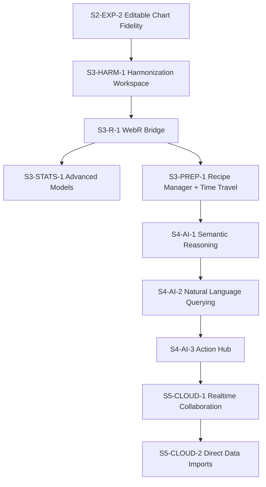

# Velocity Implementation Tracker (Execution DAG)

This tracker is the operational delivery board. It is dependency-first and optimized for multi-agent orchestration.

Use with:
- Strategic roadmap: `docs/roadmap_00_strategic_guide.md`
- Scope gates: `docs/blue_02_feature_matrix.md`
- Agent rules: `docs/AGENTS.md`
- Handoff template: `docs/agent_handoff_template.md`

## 1. Status Model

- `Not started`: work item has not begun
- `In progress`: active implementation
- `Blocked`: waiting on dependency or decision
- `In review`: implementation complete, awaiting review gates
- `Done`: merged with required evidence

## 2. Gate Legend

- `T`: Typecheck
- `L`: Lint
- `U`: Targeted unit tests
- `I`: Integration tests
- `G`: Golden tests (for statistical/chart parity)
- `A`: Architecture/invariant checks (`src/core` seam, Worker compute, dual-state integrity)

Default owner flow for all items: `Architect -> Implementer -> Reviewer`
Handoff required for every owner transition using `docs/agent_handoff_template.md`.

## 3. Dependency Graph (Open Work)

S2-STAT-1 through S2-STAT-4 are resolved. S2-EXP-1 and S2-EXP-2 are done. Phase 2 critical path blockers are cleared for Phase 3 start.

## 4. Execution Board

### 4.1 Critical Path (Now)

| ID | Stream | Outcome | Depends on | Status | Contract change | Gates | Evidence |
| :--- | :--- | :--- | :--- | :--- | :--- | :--- | :--- |
| S2-EXP-2 | Export | Editable chart fidelity verification in PowerPoint | S2-EXP-1 | Done | No | U,I,A | cab233a, bf7e58a, 488a436, 57bcf66 |

### 4.2 Next (Phase 3)

| ID | Stream | Outcome | Depends on | Status | Contract change | Gates | Evidence |
| :--- | :--- | :--- | :--- | :--- | :--- | :--- | :--- |
| S3-HARM-1 | Harmonization | Lasso + Sankey + mapping workflow baseline | S2-STAT-4, S2-EXP-2 | Not started | Yes | T,L,U,I,A | - |
| S3-R-1 | Runtime | WebR Worker + Arrow-to-R marshalling | S3-HARM-1 | Not started | Yes | T,L,U,I,A | - |
| S3-STATS-1 | Stats | Advanced models (`lme4`) + raking path integration | S3-R-1 | Not started | Yes | T,L,U,I,G,A | - |
| S3-PREP-1 | Data Prep | Recipe manager + time travel | S3-R-1 (if R-backed steps), else S3-HARM-1 | Not started | Yes | T,L,U,I,A | - |
| S3-PREP-2 | Data Prep | Block formula builder + programming-by-example | S3-PREP-1 | Not started | Yes | T,L,U,I,A | - |

### 4.3 Later (Phase 4-5)

| ID | Stream | Outcome | Depends on | Status | Contract change | Gates | Evidence |
| :--- | :--- | :--- | :--- | :--- | :--- | :--- | :--- |
| S4-AI-1 | AI | Semantic reasoning + auto-code for text | S3-PREP-1 | Not started | Yes | T,L,U,I,A | - |
| S4-AI-2 | AI | Text-to-SQL/Text-to-state interpreter | S4-AI-1 | Not started | Yes | T,L,U,I,A | - |
| S4-AI-3 | AI | Action hub (Linear/Jira export workflows) | S4-AI-2 | Not started | Yes | T,L,U,I,A | - |
| S5-CLOUD-1 | Cloud | Realtime collaboration backend + UI integration | S4-AI-3 | Not started | Yes | T,L,U,I,A | - |
| S5-CLOUD-2 | Cloud | Direct survey platform imports via backend proxy | S5-CLOUD-1 | Not started | Yes | T,L,U,I,A | - |

### 4.4 Recent Delivered (Last 20 Commits Snapshot)

Snapshot reference window: commits on February 5, 2026 through February 25, 2026.

| ID | Stream | Outcome | Depends on | Status | Contract change | Gates | Evidence |
| :--- | :--- | :--- | :--- | :--- | :--- | :--- | :--- |
| S2-VAL-1 | Validation | R parity test suite (12 tests vs R reference on real SAV files); fixes `regularizedGammaP` CF bug (chi-square p-values) and `STDDEV→STDDEV_POP` formula consistency | S2-STAT-1–4 | Done | No | G,A | 56a2241 |
| S2-EXP-1 | Export | Browser-side PPTX export using `PptxGenJS` | Milestone 2.4 complete | Done | Yes | T,L,U,I,A | 3d80d06, cab233a, e840767, c9cc564 |
| S2-DECK-1 | Analysis Deck | Analysis state capture, editable headers, unsaved indicator | Hub-and-spoke baseline | Done | Yes | T,L,U,A | a3679f7 |
| S2-DECK-2 | Analysis Deck | Duplicate/delete slide actions + inline film-strip timeline dock | S2-DECK-1 | Done | Yes | T,L,U,A | b97658f, 14adb12 |
| S2-DECK-3 | Analysis Deck | Empty-variable fallback for slide rendering robustness | S2-DECK-2 | Done | No | U,A | 26e0d6f |
| S3-WS-1 | Workspace | Longitudinal workspace support (WaveTimeline, CrossWavePanel) | Workspace baseline | Done | Yes | T,L,U,I,A | 947f2fd |
| S3-WS-2 | Workspace | Batch operations + workspace export/import modal | S3-WS-1 | Done | Yes | T,L,U,I,A | 11bfd89 |
| S2-STAT-1 | Stats | Pairwise column proportions tests (A/B/C letters) | Milestone 2.3 complete | Done | Yes | T,L,U,G,A | 3a9f2a1 (audit confirms pre-existing) |
| S2-STAT-2 | Stats | FDR + Bonferroni corrections wired into crosstab pipeline | S2-STAT-1 | Done | Yes (additive: `adjustedPValue`, `correctionMethod` on stats; `SignificanceOptions` on runner) | T,L,U,G,A | 8d1b585, bf7e58a |
| S2-STAT-3 | Stats | Dependent-sample overlap handling for multi-response column banners | S2-STAT-1 | Done | Yes (additive: `isOverlapCorrected` on stats; `buildOverlapQuery` in queryBuilder) | T,L,U,G,A | 8d1b585, a8b63e8, bf7e58a |
| S2-STAT-4 | Stats | TSL variance estimation go/no-go decision | S2-STAT-2, S2-STAT-3 | Done | No (decision only: NO-GO — deferred to Phase 3+ via WebR) | A | 3a9f2a1 |

## 5. Completed Foundations (Summary)

Completed work remains documented in git history and prior tracker revisions. Current completed anchors that open work depends on:
- Phase 1 core ingestion, canvas, design system, testing baseline, and worker unification
- Phase 2 hub-and-spoke architecture and visual ETL foundation
- Phase 2 statistical foundation (Phase 1 significance)
- Phase 2 charting refactor and weighting application
- **Export engine closure (S2-EXP-1):** Browser-side PPTX/XLSX export via PptxGenJS, slide-deck-level modal, multi-slide scope selection. All critical and medium bugs resolved; 22 tests passing.
- Analysis deck interaction foundation (state capture, timeline actions, timeline rail redesign)
- Workspace expansion: longitudinal support plus batch operations/export-import workflows
- **Statistical engine closure (S2-STAT-1–4):** Pairwise comparisons, FDR/Bonferroni correction pipeline, dependent-sample overlap handling for multi-response, TSL NO-GO decision. Phase 3 statistical dependency is cleared.
- **R parity validation (S2-VAL-1):** 12 Vitest tests comparing Velocity's crosstab engine against R (`haven` + `survey`) on `sleep.sav` and `bsa93.sav`. Fixtures pre-committed; CI has no R dependency. Two engine bugs found and fixed: `regularizedGammaP` continued fraction (correct chi-square p-values) and `STDDEV→STDDEV_POP` (population formula consistency across weighted/unweighted paths). Three WVS Wave 7 tests remain `.todo` pending a ReadStat-WASM parsing fix.

## 6. Update Rules

When updating this file:
1. Never add a work item without an `ID` and `Depends on` field.
2. If `Contract change` is `Yes`, link evidence in PR description using `.github/pull_request_template.md`.
3. Move items only by status transitions (`Not started` -> `In progress` -> `In review` -> `Done`).
4. Keep dependency graph and tables in sync in the same commit.
