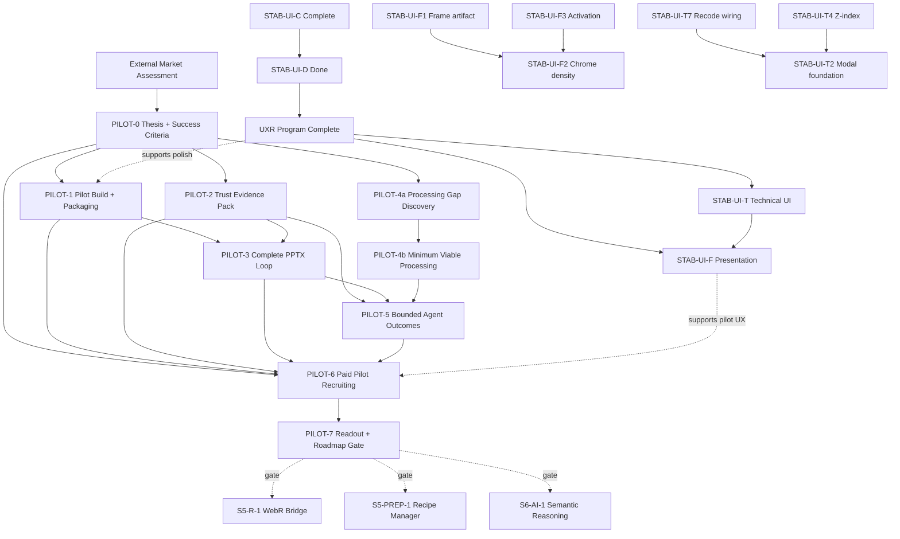

# Velocity Implementation Tracker (Active Work)

This tracker is the operational delivery board. It is dependency-first, optimized for multi-agent orchestration, and now focused on active and decision-relevant work.

Use with:
- Documentation index: `docs/README.md`
- Completed foundations summary: `docs/completed_foundations_summary.md`
- Strategic roadmap: `docs/roadmap_00_strategic_guide.md`
- Scope gates: `docs/blue_02_feature_matrix.md`
- External market assessment: `docs/velocity_external_market_assessment.pdf`
- Agent rules: `AGENTS.md`

## 1. Status Model

- `Not started`: work item has not begun
- `In progress`: active implementation
- `Blocked`: waiting on dependency or decision
- `In review`: implementation complete, awaiting review gates
- `Done`: merged with required evidence
- `Merged`: absorbed into another tracker row (do not start separately)
- `Frozen`: explicitly deferred until the relevant gate opens

## 2. Gate Legend

- `T`: Typecheck
- `L`: Lint
- `U`: Targeted unit tests
- `I`: Integration tests / E2E
- `G`: Golden, parity, or benchmark evidence
- `A`: Architecture/invariant checks (`src/core` seam, Worker compute, dual-state integrity, ResultEnvelope/session rules)
- `V`: Market validation evidence (paid pilot, observed workflow, willingness-to-pay signal)

Default owner flow for all implementation items: `Architect -> Implementer -> Reviewer`.
Handoff required for every owner transition using `docs/agent_handoff_template.md`.

## 3. Active Dependency Graph

Completed Phase 1-4, stabilization, UI polish, engine/MCP, export, parity, and harmonization work is summarized in `docs/completed_foundations_summary.md`. The active critical path is now the market-reset pilot workstream: prove the narrow SAV-to-deck wedge before expanding the platform.

## 4. Execution Board

### 4.1 SAV-to-Deck Pilot Workstream

**Source:** `docs/velocity_external_market_assessment.pdf` (June 2026) and the codebase review against current tracker/source state.

**Product thesis:** The fastest, simplest, most private path from an analysis-ready SAV file to a defensible, editable client deck.

**Beachhead:** Boutique quantitative agencies and independent consultants who receive SAV files, produce editable client decks, run frequent crosstabs/subgroup cuts/tracker updates, and feel incumbent license/training friction.

**Non-goals until validation:** Broad SPSS replacement, enterprise collaboration, direct survey platform imports, general-purpose AI, full advanced-methods breadth, and cloud/team governance.

| ID | Stream | Outcome | Depends on | Status | Contract change | Gates | Evidence / validation |
| :--- | :--- | :--- | :--- | :--- | :--- | :--- | :--- |
| PILOT-0 | Strategy / Validation | Pilot thesis, ICP screen, workflow definition, success metrics, and pricing hypotheses for the SAV-to-deck wedge | External market assessment | Done | No | A,V | [`docs/pilot_00_brief.md`](pilot_00_brief.md) — thesis, workflow targets (<5 min crosstab, <15 min slide), 8 qualification criteria, 3 pricing hypotheses, scope boundaries; gate A conditional pass (June 2026 sub-agent audit) |
| PILOT-1 | Release / Packaging | Deployable pilot build with durable project flow, clear privacy language, browser-limit warnings, and onboarding instrumentation | PILOT-0 | Done | Yes | T,L,U,I,A,V | [`docs/pilot_01_packaging.md`](pilot_01_packaging.md) — v0.1.0-pilot build, privacy banner, browser checks, local event log (`pilotOnboarding.ts`), `tests/e2e/pilot-workflow.spec.ts` |
| PILOT-2 | Trust Evidence | Buyer-facing trust pack: parity results, performance benchmarks, missing-value behavior, weighting assumptions, known unsupported cases, and reproducible methodology notes | PILOT-0 | Done | No | G,A,V | [`docs/pilot_02_trust_pack.md`](pilot_02_trust_pack.md) — R/SPSS/golden parity, adapter parity (8/8, 2026-06-25), fresh `benchmark:sav` (sleep + WVS7), missing-value/weighting/limitations sections; `arch_04` weighted-mean gap corrected |
| PILOT-3 | PowerPoint Loop | Complete the high-value PPTX loop: client template import/map, editable object preservation, saved slide recipes, dataset/wave replacement, review-before-export | PILOT-1, PILOT-2 | Done | Yes | T,L,U,I,A,V | Remaining gate closed: `src/components/overlays/ExportModal.tsx` now wires user-facing client template import (`.pptx`), default placeholder-slot mapping, and persisted template/mapping state across modal reopen (local storage draft restore), then routes template-mode exports through production `templateOptions` with `baseTemplate` + `applyTemplateBindings`; `src/core/export/templateMapping.ts` now provides binary PPTX metadata extraction (`extractTemplateMetadataFromPptxBinary`), default mapping builder, and concrete binary binding application (`applyTemplateBindingsToPptx`) used by export flow; integration evidence added in `src/core/export/__tests__/pptxExporter.semantics.test.ts` (real binary apply path through `exportPptx`), `src/core/export/templateMapping.test.ts` (binary extraction + binding application), and `src/components/overlays/ExportModal.test.tsx` (template import + persistence on reopen). Validation commands: `npm run test:run -- src/core/export/templateMapping.test.ts src/core/export/__tests__/pptxExporter.semantics.test.ts src/components/overlays/ExportModal.test.tsx` and `npm run typecheck`. |
| PILOT-4a | Processing Discovery | Observe pilot files and classify which prep gaps actually block the Friday-4pm job: raking/RIM, nets, derived variables, banner plans, reshaping, repeatable recipes | PILOT-0 | In progress | No | V,A | Discovery kit + execution workflow: [`docs/pilot_04a_processing_gap_discovery.md`](pilot_04a_processing_gap_discovery.md), [`docs/pilot_evidence_collection_checklist.md`](pilot_evidence_collection_checklist.md); still requires 10-15 external project/file review notes, ranked blockers, and explicit "do not build yet" list from real pilot observations |
| PILOT-4b | Minimum Viable Processing | Implement only the smallest processing layer required by PILOT-4a: reusable derived variables/nets, saved banner/break plans, common transformation recipes; raking only if repeatedly pilot-blocking | PILOT-4a | Blocked | Yes | T,L,U,I,G,A,V | Narrow implementation PRs with add-tests-first; transform/session replay tests; dual-state safeguards; pilot unblock evidence |
| PILOT-5 | Bounded Agent Outcomes | Package the agent as auditable outcomes, not infrastructure: first-pass deck, tracker update, client-request assistant; manual control adjacent to every action | PILOT-2, PILOT-3, PILOT-4b if needed | Not started | Yes | T,L,U,I,A,V | Deck-native Gate 5 technical foundation exists (`VelocityEngine.draftDeckPlan`, `velocity_draft_deck_plan`, approval-required actions, malformed-spec rejection, variable-reference caveats), but full `PILOT-5` remains unpromoted until human acceptance, observed time reduction, and trust/correction evidence are available. |
| PILOT-6 | Paid Pilot Program | Recruit and run 5-8 qualified paid boutique-agency/consultant pilots | PILOT-0; can start before PILOT-3 if scope is explicit | In progress | No | V | Program kit + execution workflow: [`docs/pilot_06_paid_pilot_program.md`](pilot_06_paid_pilot_program.md), [`docs/pilot_evidence_collection_checklist.md`](pilot_evidence_collection_checklist.md); remaining gate evidence: signed paid commitments + observed workflow records |
| PILOT-7 | Roadmap Gate | Decide whether to continue, narrow, pause, or expand based on paid-pilot evidence; update roadmap, feature matrix, and this tracker | PILOT-6 | Not started | No | A,V | Decision memo with metrics, retained wedge, rejected assumptions, next 1-3 workstreams |

#### Dependency Notes

- `PILOT-0` is the shared contract. Do not start broad build work until the pilot workflow, ICP, and success metrics are explicit.
- `PILOT-1`, `PILOT-2`, and `PILOT-4a` can run in parallel after `PILOT-0`.
- `PILOT-3` should stay single-threaded while it defines template/recipe contracts that export, session, and deck code will share.
- `PILOT-4b` remains blocked until real pilot/project evidence shows which processing gaps are adoption blockers.
- `PILOT-6` can begin immediately after `PILOT-0`, but the promise to pilots must match the current product surface.
- `PILOT-7` is the gate before re-opening broad Phase 5+ expansion.

#### Recommended Next Pull

1. **`audit_07` PPR P0 bundle** — coaching discipline (PPR-005), shrink-wrap hero frame (UXF-004), label truncation (PPR-004), chart axis/legend (UXF-002/PPR-008), resume trust (PPR-016). Re-screenshot per [`assets/ui-pilot-readiness-audit/`](assets/ui-pilot-readiness-audit/README.md) before PILOT-6 demo photography.
2. `PILOT-4a`: continue processing gap discovery with external project/file reviews.
3. `PILOT-6`: recruit paid pilots only after PPR P0 closes or demo scope explicitly avoids hero-output screenshots.
4. `STAB-UI-F5`: accessibility themes (only if pilot requests).

### 4.2 Future Gates

These rows remain directionally valid, but should not become active until `PILOT-7` shows retention, willingness to pay, or repeated pilot blockers that justify them.

| ID | Stream | Outcome | Depends on | Status | Contract change | Gates | Gate to activate |
| :--- | :--- | :--- | :--- | :--- | :--- | :--- | :--- |
| S5-R-1 | Runtime | Productized WebR Worker + Arrow-to-R marshalling | S5-HARM-1, PILOT-7 | Frozen | Yes | T,L,U,I,A | Activate only if advanced methods/raking repeatedly block paid pilots |
| S5-STATS-1 | Stats | Advanced models (`lme4`) + raking path integration | S5-R-1 | Frozen | Yes | T,L,U,I,G,A | Activate only after WebR runtime is productized and pilot evidence demands it |
| S5-PREP-1 | Data Prep | Recipe manager + time travel | PILOT-7 or PILOT-4b | Frozen | Yes | T,L,U,I,A | Activate if saved transformation recipes become a retention requirement |
| S5-PREP-2 | Data Prep | Block formula builder + programming-by-example | S5-PREP-1 | Frozen | Yes | T,L,U,I,A | Activate after recipe manager proves useful |
| S6-AI-1 | AI | Semantic reasoning + auto-code for text | PILOT-7, S5-PREP-1 | Frozen | Yes | T,L,U,I,A,V | Activate only after bounded agent outcomes prove value |
| S6-AI-2 | AI | Text-to-SQL/Text-to-state interpreter | S6-AI-1 | Frozen | Yes | T,L,U,I,A,V | Activate after semantic reasoning is validated |
| S6-AI-3 | AI | Action hub workflows | S6-AI-2 | Frozen | Yes | T,L,U,I,A,V | Activate after repeatable agent workflows exist |
| S7-CLOUD-1 | Cloud | Realtime collaboration backend + UI integration | S6-AI-3 | Frozen | Yes | T,L,U,I,A,V | Activate only for in-house/team ICP expansion |
| S7-CLOUD-2 | Cloud | Direct survey platform imports via backend proxy | S7-CLOUD-1 | Frozen | Yes | T,L,U,I,A,V | Activate only after governance/import pain is observed in target segment |

### 4.3 Presentation & Activation (`STAB-UI-F`)

**Source:** July 2026 full UI audit; extends closed `STAB-UI-P` / UXR programs.  
**Reference:** [`docs/plan_02_ui_presentation_workstream.md`](plan_02_ui_presentation_workstream.md) — findings register (`UXF-###`), slice specs, acceptance checklists.  
**Pilot presentation gate:** [`docs/audit_07_pilot_presentation_readiness_2026-07-01.md`](audit_07_pilot_presentation_readiness_2026-07-01.md) — Linear-bar workflow screenshot audit (July 1, 2026). Tracker rows F1–F4 marked Done below reflect shipped slices; **PPR P0 items in audit §5 remain open** for paid-pilot demo readiness.  
**Goal:** Client-presentable crosstab/chart slides and credible first-five-minutes activation for `PILOT-6`.

| ID | Stream | Outcome | Depends on | Status | Contract change | Gates | Evidence / validation |
| :--- | :--- | :--- | :--- | :--- | :--- | :--- | :--- |
| STAB-UI-F1 | Hero output | Overflow/scroll affordance, content-aware slide height, table↔chart transition, statistics visibility toggles (UXP-040 / UXF-001–005) | STAB-UI-P (Done) | Done | Yes | T,L,U,I,A | **P0 slice Done (PR #6):** widened slide frame, horizontal scroll, chart placeholder. **F1.2 Done:** compact table shrink-wrap via `AnalysisOutputFrame.shrinkWrap` + `SlideContainer` flex contract. **F1.4 Done:** `showCellN` / `showColumnBases` toggles in `AnalysisSettingsPanel`; layout reflow without ghost gutters. |
| STAB-UI-F2 | Chrome density | Focus discoverability, compact timeline, accent budget, Variable Manager inspector empty state (UXF-006–009) | STAB-UI-F1 | Done | No | T,L,U,I | **F2.1–F2.4 Done:** Focus discoverability via micro-tip chips; timeline dock compact default (`h-12` / 48px) with hover expand; inactive slide labels hidden until dock hover; slide title hover uses primary not accent; VM inspector guided empty state (`variable-inspector-empty`). |
| STAB-UI-F3 | Activation | Welcome-back label hydration, first-crosstab spotlight, contextual tips, workspace banner discipline (UXF-010–012, UXF-014) | None | Done | Yes | T,L,U,I,V | **F3.1–F3.4 Done:** welcome-back labels; first-crosstab tour; **F3.3** contextual micro-tips (Focus, Export, Variable Manager) via `contextualMicroTips.ts` + `ContextualMicroTipChip`; **F3.4** combined `WorkspaceStatusStrip` with session-scoped dismiss. Tests: `contextualMicroTips.test.ts`, `WorkspaceStatusStrip.test.tsx`. |
| STAB-UI-F4 | Command palette | Variable search → shelf actions, export/focus/filter commands, empty-state `⌘K` hint (UXF-013) | STAB-UI-C (Done) | Done | No | T,L,U | `CommandPalette.tsx` variable search + shelf actions (rows/columns/weight), wired export/filter/workspace commands, `commandPaletteSearch.ts`, `useAnalysisExportAction.ts`, SlideContainer/DropZone ⌘K hints; tests in `CommandPalette.test.tsx`, `commandPaletteSearch.test.ts` |
| STAB-UI-F5 | Accessibility themes | High-contrast + colorblind significance themes; splash contrast fix (UXF-015–016) | STAB-UI-F1 | Frozen | Yes | T,L,U,I | Plan §F5; `themes.ts`, `ThemeSwitcher`; defer until F1–F3 complete or pilot requests |

#### STAB-UI-F Dependency Notes

- **F3.1** (welcome UUID) has no dependency on F1 — pull first for a quick trust win.
- **F1** blocks **F2** (shared slide frame contract) and **F5** (significance color stability).
- **F4** can run in parallel with F1/F3 after palette API is agreed in plan §F4.
- Do not expand scope into Liquid Glass maturity, mobile layout, or component monolith refactors without `PILOT-7` gate.
- Update `UXF-###` status in the plan doc when each finding closes; link PR URLs in tracker row notes on merge.

#### STAB-UI-F Recommended Pull

1. **`audit_07` PPR P0** — see [`audit_07_pilot_presentation_readiness_2026-07-01.md`](audit_07_pilot_presentation_readiness_2026-07-01.md) §5–§6 (coaching + hero frame + truncation first).
2. `STAB-UI-F5` accessibility themes (only if pilot requests).

### 4.4 Technical UI Foundation (`STAB-UI-T`)

**Source:** July 2026 independent technical UI audit (perf, modal/a11y infra, resilience, stacking).  
**Reference:** [`docs/plan_03_ui_technical_foundation.md`](plan_03_ui_technical_foundation.md) — findings register (`UXT-###`), subscription inventory, slice specs.  
**Goal:** Fast, accessible, resilient UI for `PILOT-6`; complements `STAB-UI-F` presentation work.

| ID | Stream | Outcome | Depends on | Status | Contract change | Gates | Evidence / validation |
| :--- | :--- | :--- | :--- | :--- | :--- | :--- | :--- |
| STAB-UI-T7 | Recode wiring | Fix `ModalHost` `RecodeModal onSave` noop; all recode paths persist (UXT-012) | None | Done | Yes | T,L,U | **PR #6:** `ModalHost` wires `onSaveRecode` → `handleRecodeSave` (`persistDatasetSession`); `RecodeModal.test.tsx` verifies save callback. UXT-012 closed. |
| STAB-UI-T5 | VM theme fix | Replace hardcoded white `rgba` in `FacetedSearchBar.module.css`; token cleanup (UXT-010, UXT-021) | None | Done | No | T,L,U | **PR #6:** `color-mix(in srgb, var(--text-inverse) …)` replaces hardcoded white on active insight badges/chips. UXT-010 closed; UXT-021 partial (tailwind dead hexes deferred). |
| STAB-UI-T4 | Z-index scale | Semantic `--z-*` tokens; toast above modal; menus above sticky headers (UXT-009) | None | Done | No | T,L,U | Plan §T4; `--z-sticky` through `--z-menu` in `index.css`; migrated ToastLayer, modals, menus, popovers; `ModalShell` defaults use `--z-modal` |
| STAB-UI-T2 | Modal foundation | `ModalShell` dialog semantics, focus trap/restore, form labels, close labels, keyboard click targets (UXT-003–008, UXT-014–016) | STAB-UI-T4 | Done | Yes | T,L,U,I | `ModalShell` — `role="dialog"`, `aria-modal`, `useFocusTrap`, default `escapeToClose`; tests in `ModalShell.test.tsx` |
| STAB-UI-T3 | Error boundaries | `AnalysisErrorBoundary` on slide + chart renderers (UXT-005) | None | Done | No | T,L,U | `AnalysisErrorBoundary` + `AnalysisErrorFallback` wrap `SlideContainer` output and `AnalysisChart` renderers; reset on config change + Retry; tests in `AnalysisErrorBoundary.test.tsx`. |
| STAB-UI-T1 | Store selectors | Eliminate bare `useVelocityStore()` in 18 files; optional memo on hot leaves (UXT-001–002) | None | Done | No | T,L,U,G | Migrated all production component/hook call sites in plan §T1 to granular selectors (`App.tsx`, `AppShell`, `DashboardShell`, Variable Manager columns, workspace hooks, harmonization shell, etc.). `rg 'useVelocityStore\(\)' src --glob '*.tsx'` returns zero in production components; bare calls remain only in store test harnesses. UXT-001 closed; UXT-002 deferred pending profile. |
| STAB-UI-T6 | Shortcuts & hygiene | Unified keydown registry, lazy Monaco, dev-gated console noise (UXT-011, UXT-013, UXT-019) | STAB-UI-T2 | Done | No | T,L,U | `src/lib/keyboardShortcuts/registry.ts` replaces scattered listeners in AppShell, VariableManager, TimelineDock, KeyboardShortcuts; CommandPalette uses modal context; `RCodeEditor` lazy-loads Monaco; `usePersistenceManager` logs gated behind `import.meta.env.DEV`; tests in `registry.test.ts` |

#### STAB-UI-T Dependency Notes

- **T7** and **T5** have no dependencies — pull before or parallel with **STAB-UI-F**.
- **T4** should land before or with **T2** so modal/toast/menu stacking is stable during modal work.
- **T1** is the largest diff; safe to run parallel with **T3** after **T7/T5** land.
- **T6** shortcut registry should follow **T2** so modal context integrates cleanly.
- UXT-017, UXT-018, UXT-020 remain **deferred** unless a slice touches those files.
- Update `UXT-###` status in the plan doc on merge; link PRs in tracker notes.

#### STAB-UI-T Recommended Pull

1. `PILOT-6` paid pilot recruiting.
2. `PILOT-4a` processing gap discovery.

## 5. Completed Work Reference

Completed work is no longer expanded in this tracker. Use `docs/completed_foundations_summary.md` for the durable summary of:

- Phase 1 core ingestion, worker, canvas, and design-system foundations
- Phase 2 survey workbench, weighting application, recoding, grids, significance, PPTX/XLSX export
- Phase 3 `VelocityEngine`, MCP, browser convergence, and semantic layer
- Phase 4 eval program, benchmark baselines, capability-gap synthesis, and follow-through
- Stabilization: workspace reopen, export quality, design tokens, truthful CI, thin-slice architecture cleanup
- UI excellence: motion/accessibility, canvas polish, theme/density, delight layers, and **complete May 2026 UXR program** (`STAB-UI-D` + follow-on waves — all `UXR-###` entries fixed in `findings.md`)
- Harmonization workspace and fuzzy EVAL-05 follow-up
- Testing and evidence anchors

## 6. Update Rules

When updating this file:
1. Keep active work in the execution board; move completed narratives to `docs/completed_foundations_summary.md`.
2. Never add a work item without an `ID`, `Depends on`, `Status`, and validation evidence.
3. If `Contract change` is `Yes`, link evidence in PR descriptions using `.github/pull_request_template.md`.
4. Move items only by status transitions (`Not started` -> `In progress` -> `In review` -> `Done`; or `Blocked`/`Frozen` when gated).
5. Keep the Mermaid dependency graph and tables in sync in the same commit.
6. Do not activate Phase 5+ expansion without `PILOT-7` evidence or an explicit roadmap decision.
