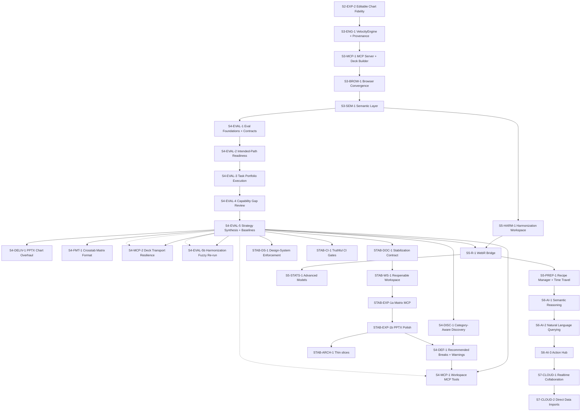

# Velocity Implementation Tracker (Execution DAG)

This tracker is the operational delivery board. It is dependency-first and optimized for multi-agent orchestration.

Use with:
- Documentation index: `docs/README.md`
- Strategic roadmap: `docs/roadmap_00_strategic_guide.md`
- Scope gates: `docs/blue_02_feature_matrix.md`
- Phase 4 synthesis: `docs/archive/2026-03/phase4-eval/eval_s4_eval_5_phase_synthesis.md`
- Agent rules: `AGENTS.md`

## 1. Status Model

- `Not started`: work item has not begun
- `In progress`: active implementation
- `Blocked`: waiting on dependency or decision
- `In review`: implementation complete, awaiting review gates
- `Done`: merged with required evidence
- `Merged`: absorbed into another tracker row (do not start separately)
- `Frozen`: explicitly deferred until stabilization exit criteria in §4.2.1

## 2. Gate Legend

- `T`: Typecheck
- `L`: Lint
- `U`: Targeted unit tests
- `I`: Integration tests
- `G`: Golden tests (for statistical/chart parity)
- `A`: Architecture/invariant checks (`src/core` seam, Worker compute, dual-state integrity)

Default owner flow for all items: `Architect -> Implementer -> Reviewer`
Handoff required for every owner transition using `docs/agent_handoff_template.md`.

## 3. Dependency Graph (Open Work)



S2-STAT-1 through S2-STAT-4 are resolved. S2-EXP-1 and S2-EXP-2 are done. Phase 3 critical path delivery is complete. **Phase 4 agent-capability validation is now complete.** All five workstreams (`S4-EVAL-1` through `S4-EVAL-5`) are Done. The phase synthesis validates the engine thesis (mean 4.7), identifies semantic discovery (mean 3.0) and MCP workflow breadth (mean 3.0) as the primary capability expansion gaps, and freezes four benchmark baselines (EVAL-01, 02, 04, 06). The May 2026 deep review reframes the next phase as **stabilization, not expansion**: documentation trust, reopenable workspace durability, export quality, design-system enforcement, monolith decomposition, and CI truthfulness are now higher priority than WebR, deeper AI, or cloud work. Independent artifact review still flags PPTX chart polish, MCP crosstab matrix output, and EVAL-05 harmonization drift coverage as open follow-through. Runtime/workspace/harmonization expansion remains Phase 5, AI work Phase 6, and cloud work Phase 7.

## 4. Execution Board

### 4.1 Completed Phase 4 Evidence

| ID | Stream | Outcome | Depends on | Status | Contract change | Gates | Evidence |
| :--- | :--- | :--- | :--- | :--- | :--- | :--- | :--- |
| S4-EVAL-1 | Eval Program | Canonical Phase 4 plan, task portfolio, benchmark contract, scoring model, and capability-gap review structure for agent-led validation of the full app surface | S3-SEM-1 | Done | No | A | `docs/archive/2026-03/phase4-eval/plan_phase4_agent_capability_validation.md`, `docs/archive/2026-03/phase4-eval/eval_00_agent_interface_validation.md`, `docs/eval_framework.md`, `docs/archive/2026-03/phase4-eval/eval_00_task_portfolio.md`, `evals/templates/eval_00_benchmark_result_template.md`, `evals/templates/eval_00_phase_synthesis_template.md` |
| S4-EVAL-2 | Workflow Validation | Intended-path readiness: MCP setup reliability, session round-trip clarity, engine/tool contract consistency, workflow docs alignment, artifact capture | S4-EVAL-1 | Done | Yes | T,L,U,I,A | `.claude/settings.json`, `scripts/velocity-mcp-setup.mjs`, `src/engine/VelocityEngine.ts`, `src/engine/__tests__/session-roundtrip.test.ts`, `mcp-server/tools.ts`, `docs/guide_agent_quickstart.md`, `docs/playbooks/agent_analysis_workflow.md`, `evals/README.md`, `docs/eval_00_run_summary_schema.ts`, `evals/eval-03/brief.md`, `evals/eval-04/brief.md`, `evals/eval-05/brief.md`, `evals/eval-06/brief.md` |
| S4-EVAL-3 | Eval Execution | Executed task portfolio across discovery, deck authoring, handoff, convergence, harmonization, and stress cases with standardized outputs | S4-EVAL-2 | Done | Yes | U,I,A | `docs/archive/2026-03/phase4-eval/design_s4_eval_3_task_portfolio_execution.md`, `evals/eval-*/runs/run-2026-03-13/`, `src/App.tsx`, `src/services/sessionSemanticState.ts`, `src/services/sessionSemanticState.test.ts`, `mcp-server/tools.ts`, `mcp-server/__tests__/tools.test.ts`, `tests/e2e/agentWorkflow.test.ts`, `docs/guide_agent_quickstart.md`, `docs/playbooks/agent_analysis_workflow.md`, `scripts/eval/run-eval-06.mjs` |
| S4-EVAL-4 | Capability Review | Per-eval strategic assessments that classify gaps as rough-edge, capability expansion, interface re-engineering, or scope/thesis revision, including semantic option studies | S4-EVAL-3 | Done | No | A | `docs/archive/2026-03/phase4-eval/design_s4_eval_4_capability_gap_review.md`, `docs/archive/2026-03/phase4-eval/eval_s4_eval_4_cross_cutting_gap_review.md` |
| S4-EVAL-5 | Strategy | Phase synthesis: validated claims, unvalidated claims, frozen benchmark baselines, and roadmap reset for post-validation work | S4-EVAL-4 | Done | No | A | `docs/archive/2026-03/phase4-eval/eval_s4_eval_5_phase_synthesis.md` |

### 4.2 Current Stabilization Sprint (May 2026)

Grilled against `docs/archive/2026-05/audits/audit_05_deep_code_review_2026-05-19.md` (May 2026). **Stabilization sprint closed May 19, 2026** — all `STAB-*` rows below are Done. **Active critical path:** `S4-EVAL-5b`; parallel `STAB-ARCH-1` thin slices (§8). Phase 5+ remains frozen until post–Phase 4 follow-through.

#### 4.2.1 Stabilization contract (execution rules)

| Rule | Decision |
| :--- | :--- |
| Sequencing | Hybrid: WS hard gate → export phased (`EXP-A` then `EXP-B`); doc/DS/CI parallel after contract PR |
| WS persistence | Per-dataset OPFS DuckDB open first (`buildOpfsDbPath` / `setPersistenceContext`); fall back to `rehydrateDatasetFromOpfs` on miss/corruption |
| WS implementation | Add `openWorkspaceDataset(stored)` (hydrate store `dataset`, restore session, switch persistence, rehydrate); wire `App.tsx` / `useWorkspace` `openDataset`; OPFS delete on dataset remove |
| WS acceptance | New Playwright spec: two uploads → workspace → open non-active dataset → dashboard usable without re-upload |
| Export | `STAB-EXP-1a` = `S4-FMT-1` (matrix formatter in `src/core/`, MCP `format: 'matrix'`); `STAB-EXP-1b` = `S4-DELIV-1` (theme branding, chart polish, merge/delete `pptxChartBuilder`) |
| CI | E2E-first product truth; update `arch_08_testing.md`; defer shrinking Vitest coverage exclusions; `check-design-tokens` in CI (`scripts/check-design-tokens.mjs`, empty allowlist) |
| Design system | Staged allowlist ratchet (`scripts/check-design-tokens.mjs`); see §7 |
| Design audit plan | Superseded by tracker §7 (`STAB-DS-1`); no `docs/DESIGN_AUDIT_PLAN.md` |
| Expansion freeze | **Lifted (May 19, 2026)** after `STAB-WS-1` + `STAB-EXP-1` (1a+1b) shipped. **Allowed now:** finish `S4-DEF-1` (engine/MCP/tests only — no `dataSlice` / `App.tsx` / OPFS edits); start `S4-MCP-1`, `S4-MCP-2`, `S4-EVAL-5b`; `STAB-ARCH-1` scoped slices (§8). **Still frozen:** Phase 5+ (`S5-R-1` WebR, `S5-STATS-1`, `S5-PREP-*`), Phase 6–7, ad-hoc monolith refactors outside `STAB-ARCH-1`, net-new MCP tools beyond the S4-MCP rows |
| Post-stabilization priority | (1) `S4-EVAL-5b` harmonization re-run; (2) `STAB-ARCH-1` slices in parallel when staffed |

| ID | Stream | Outcome | Depends on | Status | Contract change | Gates | Evidence |
| :--- | :--- | :--- | :--- | :--- | :--- | :--- | :--- |
| STAB-DOC-1 | Docs/process | Stabilization contract in tracker, roadmap §2.1, and `arch_08`; reconcile feature matrix drift; archive audit is evidence-only | S4-EVAL-5 | Done | No | A | `docs/archive/2026-05/audits/audit_05_deep_code_review_2026-05-19.md`, §4.2.1 |
| STAB-WS-1 | Workspace | Stored datasets reopen/switch/delete across sessions (DB-first, source replay fallback) | STAB-DOC-1 | Done | Yes | T,U,I,A | `src/store/slices/dataSlice.ts` (`openWorkspaceDataset`), `src/App.tsx`, `src/features/workspace/hooks/useWorkspace.ts`, `src/services/opfsFileManager.ts`, `tests/e2e/workspace-switch.spec.ts` |
| STAB-EXP-1 | Export | Stakeholder-ready deliverables: matrix MCP + PPTX polish (parent; closes when 1a+1b done) | STAB-WS-1 | Done | Yes | T,U,A | `STAB-EXP-1a` + `STAB-EXP-1b` done |
| STAB-EXP-1a | Export / MCP | `S4-FMT-1`: `format: 'matrix'` on `velocity_crosstab`; formatter in `src/core/`; unit + MCP tests | STAB-WS-1 | Done | Yes | T,U,A | `src/core/analysis/formatCrosstabMatrix.ts`, `mcp-server/tools.ts`, `mcp-server/__tests__/tools.test.ts`, `docs/guide_agent_quickstart.md` |
| STAB-EXP-1b | Export | `S4-DELIV-1`: wire `resolveExportBranding(theme)`; PPTX chart quality; unify or remove `pptxChartBuilder` | STAB-EXP-1a | Done | Yes | T,U,A | `src/core/export/pptxChartStyle.ts`, `src/core/export/pptxChartStyle.test.ts`, `src/core/export/pptxExporter.ts`, `src/features/dashboard/DashboardShell.tsx`, `src/core/export/__tests__/pptxExporter.semantics.test.ts` |
| STAB-DS-1 | Design system | Semantic tokens, cleanup, staged allowlist guard (`check-design-tokens`) | S4-EVAL-5 | Done | No | T,U,A | `src/index.css`, `src/index.css.test.ts`, `scripts/check-design-tokens.mjs`, `package.json` (`check:design-tokens`), `.github/workflows/test.yml`, tracker §7 |
| STAB-CI-1 | Quality gates | Document truthful CI; workspace-switch E2E required; hook design guard when script exists; defer coverage un-exclude | S4-EVAL-5 | Done | No | T,U,I,A | `.github/workflows/test.yml`, `docs/arch_08_testing.md`, `npm run typecheck:mcp`, `npm run check:design-tokens` in `test` job |

### 4.3 Post-Validation Follow-Through (Phase 4)

**Expansion freeze lifted (May 19, 2026):** `STAB-WS-1` and `STAB-EXP-1` are Done. `S4-FMT-1` / `S4-DELIV-1` were delivered via `STAB-EXP-1a` / `STAB-EXP-1b`. Next authorized work is §4.2.1 post-stabilization priority — not Phase 5+ expansion.

| ID | Stream | Outcome | Depends on | Status | Contract change | Gates | Evidence |
| :--- | :--- | :--- | :--- | :--- | :--- | :--- | :--- |
| S4-DISC-1 | Discovery | Category-aware discovery: annotation-type filters, `listVariablesByCategory` engine method + MCP tool, guided "suggest breaks for topic X" flow | S4-EVAL-5 | Done | Yes | T,L,U,I,A | `src/engine/VelocityEngine.ts`, `mcp-server/tools.ts`, `mcp-server/__tests__/tools.test.ts` |
| S4-DELIV-1 | Export | PPTX chart rendering overhaul (absorbed by `STAB-EXP-1b`) | STAB-EXP-1b | Merged | Yes | T,L,U,A | `STAB-EXP-1b` |
| S4-FMT-1 | MCP | Crosstab matrix format (absorbed by `STAB-EXP-1a`) | STAB-EXP-1a | Merged | Yes | T,L,U,I,A | `STAB-EXP-1a` |
| S4-MCP-1 | MCP | Workspace-aware MCP: `velocity_load_metadata` + `velocity_load_full` two-step flow; multi-dataset workspace tools | STAB-EXP-1, S4-DEF-1 preferred first | Not started | Yes | T,L,U,I,A | - |
| S4-DEF-1 | Defaults | Recommended break variables after topic selection; false-positive weight warnings; high-cardinality guardrails | S4-DISC-1 | In progress | Yes | T,L,U,I,A | `src/engine/VelocityEngine.ts`, `mcp-server/tools.ts`, `mcp-server/__tests__/tools.test.ts` — **scope:** engine/MCP only until Done; no WS/persistence files |
| S4-MCP-2 | MCP | Deck build transport resilience: stream or chunk `buildDeck` responses to avoid stdio OOM | STAB-EXP-1 | Done | Yes | T,L,U,A | `mcp-server/deckTransport.ts`, `mcp-server/__tests__/deckTransport.test.ts`, `mcp-server/tools.ts`, `mcp-server/__tests__/tools.test.ts`, `docs/guide_agent_quickstart.md` |
| S4-EVAL-5b | Eval | Harmonization re-run: EVAL-05 follow-on with naming drift, partial label overlap, or scale inversion construct | STAB-EXP-1 | Not started | No | A | - |
| STAB-ARCH-1 | Architecture | Thin-slice decomposition of `App.tsx` / `dataSlice` orchestration (§8); no behavior change | STAB-EXP-1 | Not started | No | T,U,I,A | - |

### 4.4 Next After Validation (Phase 5)

| ID | Stream | Outcome | Depends on | Status | Contract change | Gates | Evidence |
| :--- | :--- | :--- | :--- | :--- | :--- | :--- | :--- |
| S5-HARM-1 | Harmonization | Lasso + Sankey + mapping workflow baseline | S3-SEM-1 | Done | Yes | T,U,I,A | 3bd2bf1 |
| S5-R-1 | Runtime | WebR Worker + Arrow-to-R marshalling | S5-HARM-1, S4-EVAL-5 | Not started | Yes | T,L,U,I,A | - |
| S5-STATS-1 | Stats | Advanced models (`lme4`) + raking path integration | S5-R-1 | Not started | Yes | T,L,U,I,G,A | - |
| S5-PREP-1 | Data Prep | Recipe manager + time travel | S5-R-1 (if R-backed steps), else S5-HARM-1; informed by S4-EVAL-5 | Not started | Yes | T,L,U,I,A | - |
| S5-PREP-2 | Data Prep | Block formula builder + programming-by-example | S5-PREP-1 | Not started | Yes | T,L,U,I,A | - |

### 4.5 Later (Phase 6-7)

| ID | Stream | Outcome | Depends on | Status | Contract change | Gates | Evidence |
| :--- | :--- | :--- | :--- | :--- | :--- | :--- | :--- |
| S6-AI-1 | AI | Semantic reasoning + auto-code for text | S5-PREP-1 | Not started | Yes | T,L,U,I,A | - |
| S6-AI-2 | AI | Text-to-SQL/Text-to-state interpreter | S6-AI-1 | Not started | Yes | T,L,U,I,A | - |
| S6-AI-3 | AI | Action hub (Linear/Jira export workflows) | S6-AI-2 | Not started | Yes | T,L,U,I,A | - |
| S7-CLOUD-1 | Cloud | Realtime collaboration backend + UI integration | S6-AI-3 | Not started | Yes | T,L,U,I,A | - |
| S7-CLOUD-2 | Cloud | Direct survey platform imports via backend proxy | S7-CLOUD-1 | Not started | Yes | T,L,U,I,A | - |

### 4.6 Recent Delivered (Snapshot)

**Current window:** May 19, 2026 stabilization sprint (`main`, commits `f67b3da`…`ced9b1d`). Older delivered work (Feb–Mar 2026) remains in git history and §5 foundations; do not treat this table as the only source of past evidence.

| ID | Stream | Outcome | Depends on | Status | Contract change | Gates | Evidence |
| :--- | :--- | :--- | :--- | :--- | :--- | :--- | :--- |
| STAB-DOC-1 | Docs/process | Stabilization contract, doc archive/reorg, eval framework consolidation, repo layout + npm workspaces | S4-EVAL-5 | Done | No | A | `f67b3da`, `d0ff00b`…`9ab295f`, `ab99ccf` |
| STAB-WS-1 | Workspace | `openWorkspaceDataset`, OPFS DB-first + source replay, workspace-switch E2E | STAB-DOC-1 | Done | Yes | T,U,I,A | `848cbab`, `727c944`, `tests/e2e/workspace-switch.spec.ts` (E2E pass local + CI job) |
| STAB-EXP-1a | Export / MCP | `formatCrosstabMatrix` in core; MCP `format: 'matrix'`; weighted counts fix | STAB-WS-1 | Done | Yes | T,U,A | `1ef4f6b`, `eb3459c` |
| STAB-EXP-1b | Export | `pptxChartStyle`, branding resolution; removed `pptxChartBuilder` | STAB-EXP-1a | Done | Yes | T,U,A | `2fc1a0f`, `5f686e4`, `ced9b1d` |
| STAB-DS-1 | Design system | Token migration + `check-design-tokens` CI (empty allowlist) | S4-EVAL-5 | Done | No | T,U,A | `2fc1a0f`, `scripts/check-design-tokens.mjs` |
| STAB-CI-1 | Quality gates | Production build + design-token + MCP typecheck in CI; `arch_08` E2E truth | S4-EVAL-5 | Done | No | T,U,I,A | `57f5642`, `2fc1a0f`, `.github/workflows/test.yml` |

## 5. Completed Foundations (Summary)

Completed work remains documented in git history and prior tracker revisions. Current completed anchors that open work depends on:
- Phase 1 core ingestion, canvas, design system, testing baseline, and worker unification
- Phase 2 hub-and-spoke architecture and visual ETL foundation
- Phase 2 statistical foundation (Phase 1 significance)
- Phase 2 charting refactor and weighting application
- **Phase 3 critical path complete:** `S3-ENG-1 -> S3-MCP-1 -> S3-BROW-1 -> S3-SEM-1` all Done. Engine extraction, MCP deck building, browser convergence, and semantic layering are fully shipped.
- **Phase 3 engine foundation complete (S3-ENG-1):** `VelocityEngine`, `ResultEnvelope` provenance wrapping, CLI migration, headless slide default resolution, and PPTX subtitle/notes/section-divider semantics landed in `02d54c2` with Phase 1 review-gap fixes closed in `cf3dc13`.
- **MCP server + DeckBuilder complete (S3-MCP-1):** `DeckBuilder` class (`src/engine/DeckBuilder.ts`) — batch deck composition with fail-soft per-slide error handling, per-slide filter/weight isolation, automatic title/subtitle/chart-type resolution. `VelocityEngine` extended with `buildDeck`, `exportDeck`, `recommendChart`, `proposeMappings`, `buildHarmonizedTable`, and `dataDir` path sandboxing. MCP server package (`mcp-server/`) with stdio transport, 20 tool definitions covering full lifecycle (load → describe → analyze → build deck → export → harmonize → session). 31 new tests (DeckBuilder: 12, MCP tools: 19). All 63 test files passing.
- **Export engine closure (S2-EXP-1):** Browser-side PPTX/XLSX export via PptxGenJS, slide-deck-level modal, multi-slide scope selection. All critical and medium bugs resolved; 22 tests passing.
- Analysis deck interaction foundation (state capture, timeline actions, timeline rail redesign)
- Workspace expansion: longitudinal support plus batch operations/export-import workflows
- **Statistical engine closure (S2-STAT-1–4):** Pairwise comparisons, FDR/Bonferroni correction pipeline, dependent-sample overlap handling for multi-response, TSL NO-GO decision. Phase 5 statistical dependency is cleared once the new validation phase completes.
- **Phase 4 is now dedicated to agent capability validation:** the new top-priority sequence is `S4-EVAL-1 -> S4-EVAL-2 -> S4-EVAL-3 -> S4-EVAL-4 -> S4-EVAL-5`, covering benchmark design, intended-path readiness, task-portfolio execution, capability-gap review, and roadmap synthesis.
- **Phase numbering shifted back again for downstream streams:** runtime/workspace/harmonization items now track as `S5-*`, AI items as `S6-*`, and cloud items as `S7-*` so full agent-capability validation owns Phase 4.
- **R parity validation (S2-VAL-1):** 12 Vitest tests comparing Velocity's crosstab engine against R (`haven` + `survey`) on `sleep.sav` and `bsa93.sav`. Fixtures pre-committed; CI has no R dependency. Two engine bugs found and fixed: `regularizedGammaP` continued fraction (correct chi-square p-values) and `STDDEV→STDDEV_POP` (population formula consistency across weighted/unweighted paths). Three WVS Wave 7 tests remain `.todo` pending a ReadStat-WASM parsing fix.
- **Semantic layer complete (S3-SEM-1):** Heuristic auto-annotator (`src/core/semantic/annotator.ts`) classifies variables by 9 rules (weight, identifier, temporal, demographic/gender, Likert/NPS attitude, awareness, behavior, open-end, classification) with per-rule confidence scoring and no ML dependency. `ConceptStore` (`src/core/semantic/concepts.ts`) provides CRUD, alias management, variable linking, merge, and JSON round-trip. Concept discovery (`conceptDiscovery.ts`) clusters by (topic, intent) + Jaccard value-label similarity. Token-based semantic search (`search.ts`) scores: concept match (0.4) > topic (0.3) > label (0.2) > name (0.1) with multi-dataset support. Domain-aware suggestions (`suggestions.ts`) emit ranked `AnalysisSuggestion[]` and `HarmonizationSuggestion[]`. `VelocityEngine` extended with 10 semantic methods. 7 new MCP tools. Session format v2 (backward-compatible). Chart recommender extended with semantic overrides. 68 tests, TypeScript clean, zero browser deps in `src/core/semantic/`.
- **Harmonization workspace (S5-HARM-1):** Full cross-wave variable harmonization. Core pure-TS engine: Jaro-Winkler similarity, Jaccard value-label overlap, type compatibility, scale inversion detection, auto-match greedy assignment, SQL generators (value frequencies, UNION-based harmonized table, respondent overlap). Zustand harmonization slice with persist. Worker message handling. D3 Sankey diagram, react-window MappingTable, ValueRemapPanel, LassoSelector (pointer capture + polygon containment), WaveDetectionBanner, HarmonizationWorkspace full-screen overlay. Import-time wave detection heuristics. CrossWavePanel wired to real Harmonize entry point. 410 tests passing, TypeScript clean, architecture invariant (zero browser deps in `src/core/harmonization/`) confirmed.

## 6. Update Rules

When updating this file:
1. Never add a work item without an `ID` and `Depends on` field.
2. If `Contract change` is `Yes`, link evidence in PR description using `.github/pull_request_template.md`.
3. Move items only by status transitions (`Not started` -> `In progress` -> `In review` -> `Done`).
4. Keep dependency graph and tables in sync in the same commit.

## 7. STAB-DS-1 — Design-system cleanup

**Status:** Done (May 2026). Tasks 1–5 complete; allowlist empty.

**Scope:** Semantic token integrity, Tailwind color discipline, CSS fallback cleanup, and visual consistency across themes.

### Policy

Tailwind CSS is approved with one hard rule: color-bearing classes must reference semantic CSS variables.

```tsx
// Good
<div className="bg-[var(--bg-panel)] text-[var(--text-primary)]">

// Bad
<div className="bg-white text-indigo-600">
```

CSS Modules remain for complex component states, grids, animations, and unreadable utility strings. Inline styles are acceptable for D3, SVG, virtualization, or dynamic geometry.

### Tasks

1. **Semantic token completeness** — Done (`--text-tertiary`, `--bg-hover`, status pairs in `src/index.css`).
2. **Legacy token removal** — Done (Research Desk tokens removed from active source).
3. **CSS fallback and hex cleanup** — Done (component CSS; `src/index.css.test.ts` regression).
4. **Raw Tailwind palette cleanup** — Done (`--gray-*` eliminated; semantic `var(--…)` utilities in TSX).
5. **Regression guard** — Done (`scripts/check-design-tokens.mjs`, CI wired, empty allowlist).

### Acceptance

- `AGENTS.md`, `docs/design_01_system.md`, and `docs/dev_01_contributing.md` agree on Tailwind policy.
- Active source has no deprecated Research Desk tokens, raw palette utilities, or CSS fallback hexes.
- App builds across all supported themes.

## 8. STAB-ARCH-1 — Orchestration thin slices

**Status:** Not started (May 2026). Parent row in §4.3. Follow `docs/playbooks/refactor_safely.md` — zero behavior change per slice.

**Problem:** `src/App.tsx` (~960 lines) and `src/store/slices/dataSlice.ts` (~1,480 lines) concentrate workspace open/switch, OPFS rehydration, engine proxy lifecycle, and upload orchestration. Stabilization added correct behavior but increased coupling risk.

**Goal:** Move orchestration behind small modules/hooks so Phase 4 MCP and future Phase 5 work do not require editing monolith files.

### Slices (sequential; one PR each)

| Slice | Extract from | Into | Acceptance |
| :--- | :--- | :--- | :--- |
| 8.1 | `App.tsx` workspace-open handler + `openWorkspaceDataset` call chain | `src/features/workspace/hooks/useWorkspaceOpen.ts` (or extend `useWorkspace.ts`) | `useWorkspace.test.ts` + `workspace-switch.spec.ts` green; `App.tsx` loses workspace-open block |
| 8.2 | `dataSlice` OPFS rehydrate + `openWorkspaceDataset` persistence switch | `src/store/workspaceDatasetLifecycle.ts` (pure helpers + typed calls into slice) | `dataSlice.workspace.test.ts`, `persistence.test.ts` green; slice file shrinks by ≥150 lines |
| 8.3 | `dataSlice` engine init/respawn + corruption handlers | `src/store/enginePersistenceBridge.ts` | Existing `persistence.test.ts` + `opfsFileManager.test.ts` green; no new public store API |
| 8.4 | Upload → OPFS key assignment in `App.tsx` / `useFileUpload` | Colocate with workspace hooks; single `assignOpfsKeyAndLoad` helper | `useFileUpload` tests if present; E2E upload path unchanged |

### Gates per slice

- `npm run typecheck:all`
- `npm run test:run`
- `npx playwright test tests/e2e/workspace-switch.spec.ts` when touching WS/open paths
- No changes to `VelocityEngine` public API or MCP tool schemas

### Out of scope (remain frozen)

- Splitting `analysisWorker.ts` or `VelocityEngine.ts`
- Coverage exclusion removal (separate future `STAB-CI-2` if needed)
- WebR / Phase 5 runtime work
