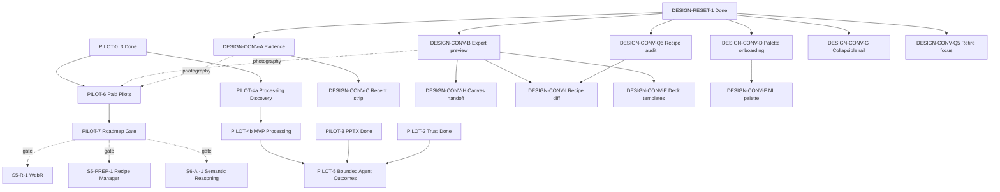

# Velocity Implementation Tracker (Active Work)

Operational delivery board for **upcoming and in-flight work**. Dependency-first; optimized for multi-agent orchestration.

Use with:
- Documentation index: `docs/README.md`
- Completed foundations (shipped narrative + evidence): `docs/completed_foundations_summary.md`
- Strategic roadmap: `docs/roadmap_00_strategic_guide.md`
- Scope gates: `docs/blue_02_feature_matrix.md`
- Agent rules: `AGENTS.md`

**Critical path:** close Audit 10's engine-boot and CI-truth incident before relying on pilot-readiness or persistence-promotion claims. After that, prove the narrow SAV-to-deck wedge before expanding the platform.

## 1. Status Model

- `Not started`: work item has not begun
- `In progress`: active implementation
- `Blocked`: waiting on dependency or decision
- `In review`: implementation complete, awaiting review gates
- `Done`: merged with required evidence (move narrative to `completed_foundations_summary.md`)
- `Merged`: absorbed into another tracker row (do not start separately)
- `Frozen`: explicitly deferred until the relevant gate opens

## 2. Gate Legend

- `T`: Typecheck
- `L`: Lint
- `U`: Targeted unit tests
- `I`: Integration tests / E2E
- `G`: Golden, parity, or benchmark evidence
- `A`: Architecture/invariant checks (`src/core` seam, Worker compute, dual-state integrity, ResultEnvelope/session rules)
- `V`: Market validation evidence (paid pilot, observed workflow, willingness-to-pay signal)

Default owner flow: `Architect -> Implementer -> Reviewer`. Handoff: `docs/agent_handoff_template.md`.

## 3. Now / Next

| Priority | Pull | Why |
| :--- | :--- | :--- |
| 1 | `STAB-BOOT-1`…`5`, `STAB-CI-25`…`26` | Audit 10 stabilization and promoted-commit proof |
| 2 | `DESIGN-CONV-B` | Confirmed P0: export preview lane before PPTX |
| 3 | `DESIGN-CONV-A` | Post-reset photography + unscripted session evidence (unblocks PILOT-6 screenshots) |
| 4 | `PILOT-4a` | External project/file reviews → ranked processing blockers |
| 5 | `PILOT-6` | Paid pilot recruiting (promise must match current surface; photography after CONV-A) |
| 6 | `DESIGN-CONV-Q6` | Recipe legibility audit before agent UI (`DESIGN-CONV-I`) |

Do **not** start `PILOT-4b`, Phase 5+, or `DESIGN-CONV-J` without the stated gates.

## 4. Active Dependency Graph

```mermaid
graph TD
  P0["PILOT-0..3 Done"] --> P4A["PILOT-4a Processing Discovery"]
  P0 --> P6["PILOT-6 Paid Pilots"]
  P4A --> P4B["PILOT-4b MVP Processing"]
  P4B --> P5["PILOT-5 Bounded Agent Outcomes"]
  P3["PILOT-3 PPTX Done"] --> P5
  P2["PILOT-2 Trust Done"] --> P5
  P6 --> P7["PILOT-7 Roadmap Gate"]

  DR1["DESIGN-RESET-1 Done"] --> DCA["DESIGN-CONV-A Evidence"]
  DR1 --> DCB["DESIGN-CONV-B Export preview"]
  DCA --> DCC["DESIGN-CONV-C Recent strip"]
  DR1 --> DCD["DESIGN-CONV-D Palette onboarding"]
  DCB --> DCH["DESIGN-CONV-H Canvas handoff"]
  DCB --> DCI["DESIGN-CONV-I Recipe diff"]
  DR1 --> DCQ6["DESIGN-CONV-Q6 Recipe audit"]
  DCQ6 --> DCI
  DCB --> DCE["DESIGN-CONV-E Deck templates"]
  DCD --> DCF["DESIGN-CONV-F NL palette"]
  DR1 --> DCG["DESIGN-CONV-G Collapsible rail"]
  DR1 --> DCQ5["DESIGN-CONV-Q5 Retire focus"]
  DCB -. photography .-> P6
  DCA -. photography .-> P6

  P7 -. gate .-> S5R1["S5-R-1 WebR"]
  P7 -. gate .-> S5PREP1["S5-PREP-1 Recipe Manager"]
  P7 -. gate .-> S6AI1["S6-AI-1 Semantic Reasoning"]
```

## 5. Execution Board

### 5.1 SAV-to-Deck Pilot (remaining)

**Thesis:** Fastest, simplest, most private path from an analysis-ready SAV file to a defensible, editable client deck.  
**Owners:** `pilot_00_brief.md`, `pilot_04a_processing_gap_discovery.md`, `pilot_06_paid_pilot_program.md`, `pilot_evidence_collection_checklist.md`.  
**Shipped:** `PILOT-0`…`3` and `PILOT-DEMO-1`…`4` — see `completed_foundations_summary.md` §Market-Reset Pilot Foundations.

| ID | Stream | Outcome | Depends on | Status | Contract change | Gates | Evidence / validation |
| :--- | :--- | :--- | :--- | :--- | :--- | :--- | :--- |
| PILOT-4a | Processing Discovery | Observe pilot files; classify prep gaps that block the Friday-4pm job; ranked blockers + explicit "do not build yet" list | PILOT-0 (Done) | In progress | No | V,A | Discovery kit: `pilot_04a_processing_gap_discovery.md`, `pilot_evidence_collection_checklist.md`. Still needs 10–15 external project/file review notes |
| PILOT-4b | Minimum Viable Processing | Smallest processing layer required by 4a (derived vars/nets, banner plans, common recipes; raking only if repeatedly blocking) | PILOT-4a | Blocked | Yes | T,L,U,I,G,A,V | Narrow PRs with add-tests-first; transform/session replay; dual-state safeguards; pilot unblock evidence |
| PILOT-5 | Bounded Agent Outcomes | Agent as auditable outcomes (first-pass deck, tracker update, client-request assist) with manual control adjacent | PILOT-2/3 Done; PILOT-4b if needed | Not started | Yes | T,L,U,I,A,V | Gate 5 foundation exists (`draftDeckPlan`, approval-required actions); promote only with human acceptance + observed time/trust evidence |
| PILOT-6 | Paid Pilot Program | Recruit and run 5–8 qualified paid boutique/consultant pilots | PILOT-0; photography via DESIGN-CONV-A | In progress | No | V | Program kit: `pilot_06_paid_pilot_program.md`. Remaining: signed commitments + observed workflow records; re-screenshot after design reset |
| PILOT-7 | Roadmap Gate | Continue / narrow / pause / expand from paid-pilot evidence; update roadmap, feature matrix, this tracker | PILOT-6 | Not started | No | A,V | Decision memo: metrics, retained wedge, rejected assumptions, next 1–3 workstreams |

#### Pilot notes

- `PILOT-4b` stays blocked until real file evidence ranks blockers.
- `PILOT-6` may recruit now, but the promise must match the shipped surface; screenshots wait on `DESIGN-CONV-A`.
- `PILOT-7` gates Phase 5+ expansion.

### 5.2 Design Reset Convergence (`DESIGN-CONV`)

**Source:** `docs/assets/design-reset-evidence/before_after_analysis.html` (Q1–Q7 / paths A–J). Decision date: July 4, 2026.  
**Goal:** Close convergence gaps on the five-minute journey (file-drop → three slides → PPTX) without re-litigating Pathway B.  
**Shipped precursor:** `DESIGN-RESET-1` — see foundations summary.

#### Convergence decisions (Q1–Q7)

| Q | Question | Decision | Tracker action |
| :--- | :--- | :--- | :--- |
| Q1 | Is summon-only variable discovery fast enough? | Open — explore thin resident strip + one-time palette onboarding | `DESIGN-CONV-C`, `D`; evidence from `A` |
| Q2 | Does the story rail earn 240px on 1–2 slide decks? | Proceed via collapsible rail | `DESIGN-CONV-G` |
| Q3 | Where does "review before export" live? | Deck preview step before PPTX | `DESIGN-CONV-B` — Wave 1 priority |
| Q4 | Teach palette grammar without coaching? | One-time inline ghost in palette | `DESIGN-CONV-D` |
| Q5 | Is focus mode still a mode? | Retire focus mode | `DESIGN-CONV-Q5` |
| Q6 | Recipe structure legible for human + MCP? | Audit before build | `DESIGN-CONV-Q6` → `I` |
| Q7 | Dark mode vs journey polish? | Dark mode after journey polish | `DESIGN-CONV-J` Frozen |

#### Execution board

| ID | Path | Stream | Outcome | Depends on | Status | Contract change | Gates | Evidence / validation |
| :--- | :--- | :--- | :--- | :--- | :--- | :--- | :--- | :--- |
| DESIGN-CONV-A | A | Validate | Post-reset PILOT-6 photography; 3–5 unscripted first sessions scored | DESIGN-RESET-1 | In progress | No | V,I | Re-screenshot pack; session scorecard; update `before_after_analysis.html` metrics |
| DESIGN-CONV-B | B | Journey | Export preview lane: filmstrip, recipe summary, significance audit before PPTX | DESIGN-RESET-1 | In progress | Yes | T,L,U,I,V | E2E export flow with preview gate; EVAL-03 agent-handoff scenario; evidence screenshot |
| DESIGN-CONV-C | C | Discovery | Thin collapsible "recent & pinned" variable strip (~32px) | DESIGN-CONV-A | Not started | Yes | T,L,U,I,V | Accent budget audit; drag-first usability pass |
| DESIGN-CONV-D | D | Keyboard | First ⌘K: inline 3-step ghost (search → ↵ rows → ⌥↵ columns); dismiss forever | DESIGN-RESET-1 | Not started | Yes | T,L,U,I | No coaching reappear; session-scoped dismiss |
| DESIGN-CONV-E | E | Story | "Start from template" → 3-slide tracker skeleton | DESIGN-CONV-B, PILOT-DEMO-3 | Not started | Yes | T,L,U,I,V | Brand tracker template fixture; e2e template-start |
| DESIGN-CONV-F | F | NL | Insert palette NL row/column binding only (not full AI analysis) | DESIGN-CONV-D | Not started | Yes | T,L,U,I,A,V | Displayr-positioning guardrail; inspectability tests |
| DESIGN-CONV-G | G | Polish | Story rail collapses to icon strip on single-slide sessions | DESIGN-RESET-1 | Not started | Yes | T,L,U,I | Motion budget; 1-slide vs 5-slide screenshots |
| DESIGN-CONV-H | H | Continuity | After upload, land on slide 1 with palette pre-focused | DESIGN-RESET-1 | Not started | Yes | T,L,U,I,V | Timed handoff metric in five-minute pass |
| DESIGN-CONV-I | I | Agent | Quiet "what changed" summary on agent session import | DESIGN-CONV-Q6 | Not started | Yes | T,L,U,I,A | MCP handoff eval; muted per calm-tech rules |
| DESIGN-CONV-J | J | Hold | Dark mode as Soft Machine token inversion | DESIGN-CONV-B/H, PILOT-7 or pilot request | Frozen | Yes | T,L,U,I | Pilot blocker evidence only |
| DESIGN-CONV-Q5 | — | Retire | Remove focus mode (`F`, toolbar, focus chrome); default canvas is presentation | DESIGN-RESET-1 | Not started | Yes | T,L,U,I | E2E focus specs retired/rewritten; `design_02_ux_modes.md` updated |
| DESIGN-CONV-Q6 | — | Audit | Recipe legibility review for human + MCP; gap list before `I` | DESIGN-RESET-1 | In progress | No | A,V | Written audit vs recipe inspector + story rail; EVAL-03 criteria (`design_reset_recipe_legibility_audit.md`) |

#### Wave plan

| Wave | Items | Rationale |
| :--- | :--- | :--- |
| **1** | `A`, `B` | Evidence loop + confirmed P0 export preview |
| **2** | `C`, `D`, `G`, `Q6` | Summon concern, onboarding, rail space, legibility audit |
| **3** | `H`, `I`, `Q5` | Continuity, agent handoff, focus retirement (before PILOT-6 re-screenshot) |
| **4** | `E`, `F` | Higher-scope delight after core journey polish |
| **Hold** | `J` | Dark mode after journey polish or explicit pilot blocker |

#### DESIGN-CONV notes

- Do not ship PPTX-only export improvements without the `B` preview lane.
- `C` and `D` are paired Q1 experiments; keep both until `A` evidence decides.
- `Q5` should land before PILOT-6 photography so screenshots reflect final chrome.
- `Q6` must finish before `I`.

### 5.3 Presentation leftovers (`STAB-UI-F` / catalog)

**Shipped:** `STAB-UI-F1`–`F4`, pilot presentation gate (PR #18), and `STAB-UI-T1`–`T7` — see foundations summary and `plan_02` / `plan_03`.

| ID | Stream | Outcome | Depends on | Status | Contract change | Gates | Evidence / validation |
| :--- | :--- | :--- | :--- | :--- | :--- | :--- | :--- |
| STAB-UI-F5 | Accessibility themes | High-contrast + colorblind significance themes (UXF-016) | STAB-UI-F1 | Frozen | Yes | T,L,U,I | Defer until a pilot requests |
| STAB-UI-F6 | Nested row chart semantics | Chart representation for nested row recipes (table expand vs chart scope TBD) | STAB-UI-F1; nested-row table fix | Not started | Yes | T,L,U,I,A | Design brief before build; see `arch_05`, `user_journey_screenshots.md` §2.2. Do not block pilot |
| STAB-UI-VAR-1 | Variable catalog ordering | Shared Smart / File order / Alphabetical browse for ⌘K empty query + Variable Manager | DESIGN-RESET-1 | Not started | Yes | T,L,U,I,A | One pure ordering fn; persisted `variableCatalogOrderMode`; no demo-specific hacks. Pull when intro-flow browse pain recurs on real files |

### 5.4 CI Truth (remaining)

**Owner:** `audit_10_engine_boot_ci_truth_rca_2026-07-14.md`. Do not move these rows to Done until the audit's exact promoted-commit evidence is linked.

| ID | Stream | Outcome | Depends on | Status | Contract change | Gates | Evidence / validation |
| :--- | :--- | :--- | :--- | :--- | :--- | :--- | :--- |
| STAB-CI-19 | Mutation threshold | Stryker break 40 → 48 when measured ≥ 48 | STAB-CI-8 | Blocked | No | A | Baseline ~46%; raise deferred to avoid false CI failures |
| STAB-CI-23 | Features/overlays ratchet | Raise per-path `src/features/**` and `src/components/overlays/**` fn floors toward 82% | STAB-CI-11 | In progress | No | A,U | Baseline ~70% / 67% vs floors 70% / 67%. Slices: overlays, workspace, dashboard, variableManager, harmonization. See `arch_08` §7.1 |
| STAB-CI-24+ | Further ratchets | `services`, `store`, harmonization UI floors after STAB-CI-23 | STAB-CI-23 | Frozen | No | A | Activate after features/overlays gap closes |
| STAB-BOOT-1 | Fresh workspace before engine | Shell and real visible start actions work with engine idle | None | In progress | Yes | T,L,U,I,A | Clean-context visible-control and real file-chooser E2E |
| STAB-BOOT-2 | Cross-thread boot evidence | Bounded correlated trace plus always-written failure artifacts | STAB-BOOT-1 | In progress | Yes | T,L,U,I,A | Trace contract E2E; failed experiment names exact phase; Journey artifact |
| STAB-BOOT-3 | Linux CI cause | Prove the environmental trigger with repeated one-variable experiments | STAB-BOOT-2 | In progress | No | I,G,A | 20-run diagnostic cells and 50-run final candidate; exact CI trace/run |
| STAB-BOOT-4 | Bounded recoverable boot | Per-phase deadlines, cancellation, retry, visible safe-memory recovery | STAB-BOOT-3 | In progress | Yes | T,L,U,I,A | Lifecycle tests plus real-browser forced-failure/recovery E2E |
| STAB-BOOT-5 | Boot-first verification and soak | Boot prerequisite classifies dependents; dev/production critical paths stay green | STAB-BOOT-4 | In progress | Yes | T,L,U,I,G,A | Journey + product E2E green on 10 consecutive main runs and pilot profile |
| STAB-CI-25 | Enforced merge controls | Eight canonical checks, up-to-date branch, routine bypass disabled, red-main owner | None | In progress | Yes | A,I | Deliberately failing required-check PR is unmergeable; protection API evidence |
| STAB-CI-26 | Evidence-bound status | Correct Plan 06/Audit 09/tracker/testing docs with commit and runs | STAB-CI-25, STAB-BOOT-5 | In progress | No | A | Final Audit 10 evidence table links commit, PR, soak, chaos, and pilot profile |

### 5.5 Future gates (frozen until `PILOT-7`)

Do not activate without retention, willingness-to-pay, or repeated pilot blockers that justify them.

| ID | Stream | Outcome | Depends on | Status | Contract change | Gates | Gate to activate |
| :--- | :--- | :--- | :--- | :--- | :--- | :--- | :--- |
| S5-R-1 | Runtime | Productized WebR Worker + Arrow-to-R marshalling | S5-HARM-1, PILOT-7 | Frozen | Yes | T,L,U,I,A | Advanced methods/raking repeatedly block paid pilots |
| S5-STATS-1 | Stats | Advanced models (`lme4`) + raking path | S5-R-1 | Frozen | Yes | T,L,U,I,G,A | After WebR productized and pilot evidence demands it |
| S5-PREP-1 | Data Prep | Recipe manager + time travel | PILOT-7 or PILOT-4b | Frozen | Yes | T,L,U,I,A | Saved transformation recipes become a retention requirement |
| S5-PREP-2 | Data Prep | Block formula builder + programming-by-example | S5-PREP-1 | Frozen | Yes | T,L,U,I,A | After recipe manager proves useful |
| S6-AI-1 | AI | Semantic reasoning + auto-code for text | PILOT-7, S5-PREP-1 | Frozen | Yes | T,L,U,I,A,V | After bounded agent outcomes prove value |
| S6-AI-2 | AI | Text-to-SQL/Text-to-state interpreter | S6-AI-1 | Frozen | Yes | T,L,U,I,A,V | After semantic reasoning validated |
| S6-AI-3 | AI | Action hub workflows | S6-AI-2 | Frozen | Yes | T,L,U,I,A,V | After repeatable agent workflows exist |
| S7-CLOUD-1 | Cloud | Realtime collaboration backend + UI | S6-AI-3 | Frozen | Yes | T,L,U,I,A,V | In-house/team ICP expansion only |
| S7-CLOUD-2 | Cloud | Survey platform imports via backend proxy | S7-CLOUD-1 | Frozen | Yes | T,L,U,I,A,V | After governance/import pain observed in target segment |

## 6. Completed Work Reference

Do not expand completed narratives here. Durable summary + evidence map: `docs/completed_foundations_summary.md`.

Recently closed streams (IDs only):

- Foundations: Phase 1–4, stabilization, UXR/`STAB-UI-D`, harmonization workspace
- Pilot: `PILOT-0`…`3`, `PILOT-DEMO-1`…`4`
- UI: `STAB-UI-F1`…`F4`, `STAB-UI-T1`…`T7`, `DESIGN-RESET-1`
- CI: `STAB-CI-2`…`22`

## 7. Update Rules

1. Keep **active / blocked / frozen / not-started** work in §5; move completed narratives to `docs/completed_foundations_summary.md` and leave only an ID in §6.
2. Never add a work item without an `ID`, `Depends on`, `Status`, and validation evidence.
3. If `Contract change` is `Yes`, link evidence in PR descriptions using `.github/pull_request_template.md`.
4. Move items only by status transitions (`Not started` → `In progress` → `In review` → `Done`; or `Blocked`/`Frozen` when gated).
5. Keep the Mermaid graph and tables in sync in the same commit.
6. Do not activate Phase 5+ expansion without `PILOT-7` evidence or an explicit roadmap decision.
