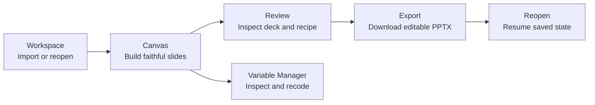
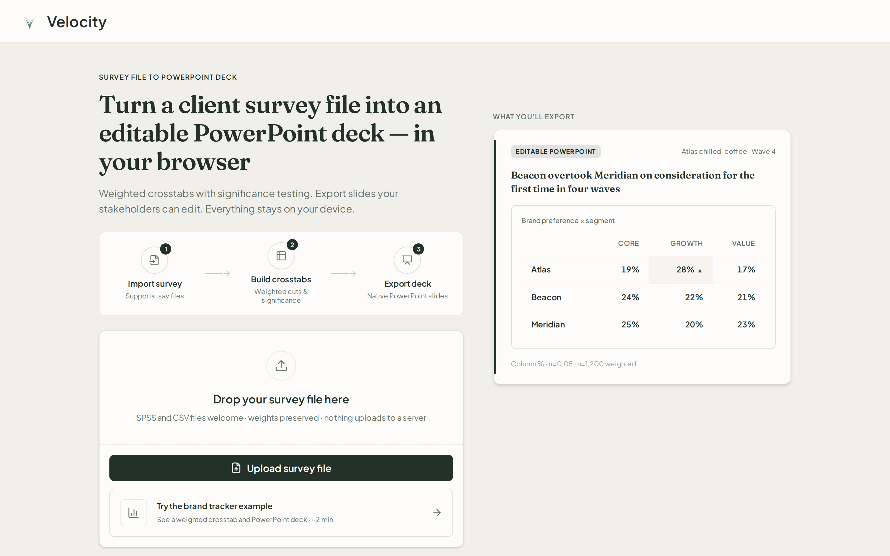
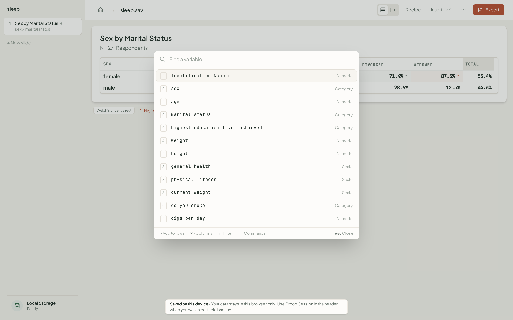
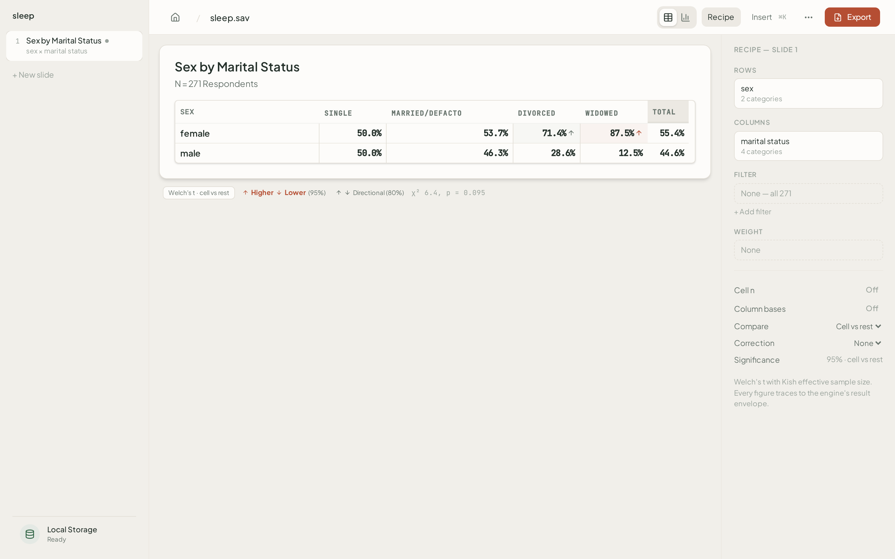
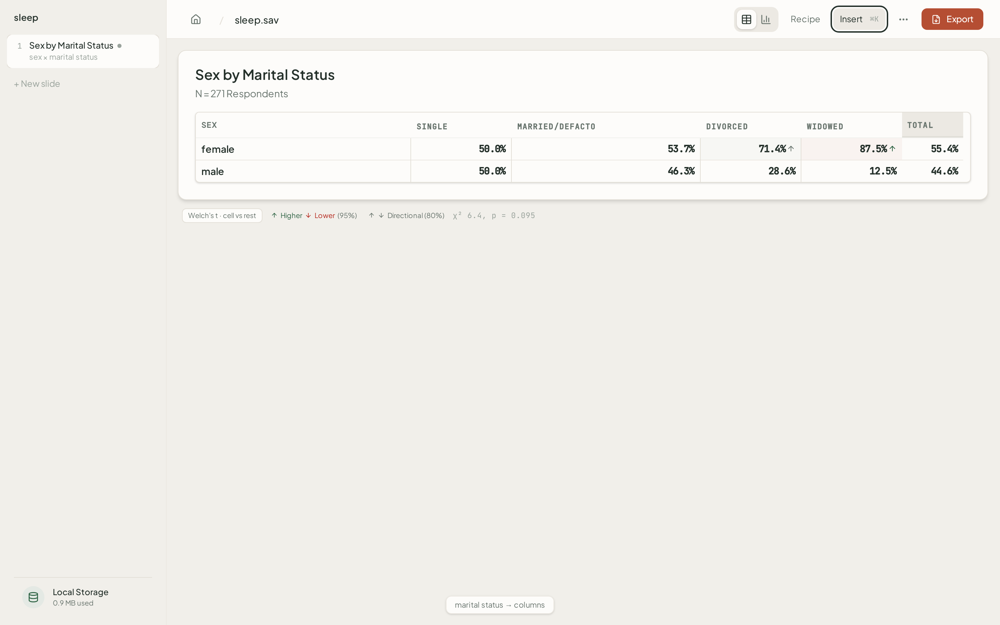
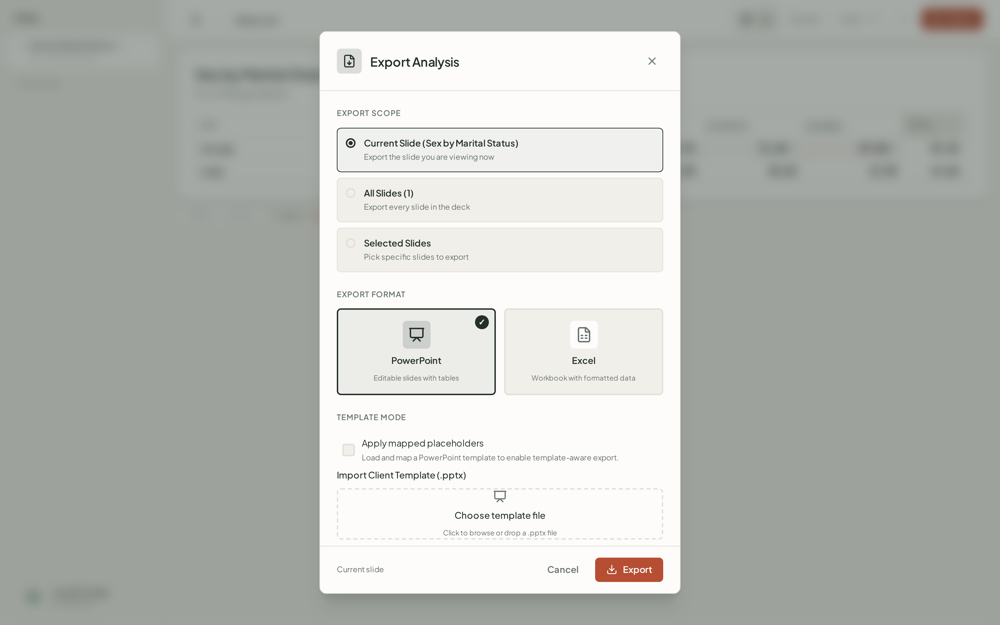
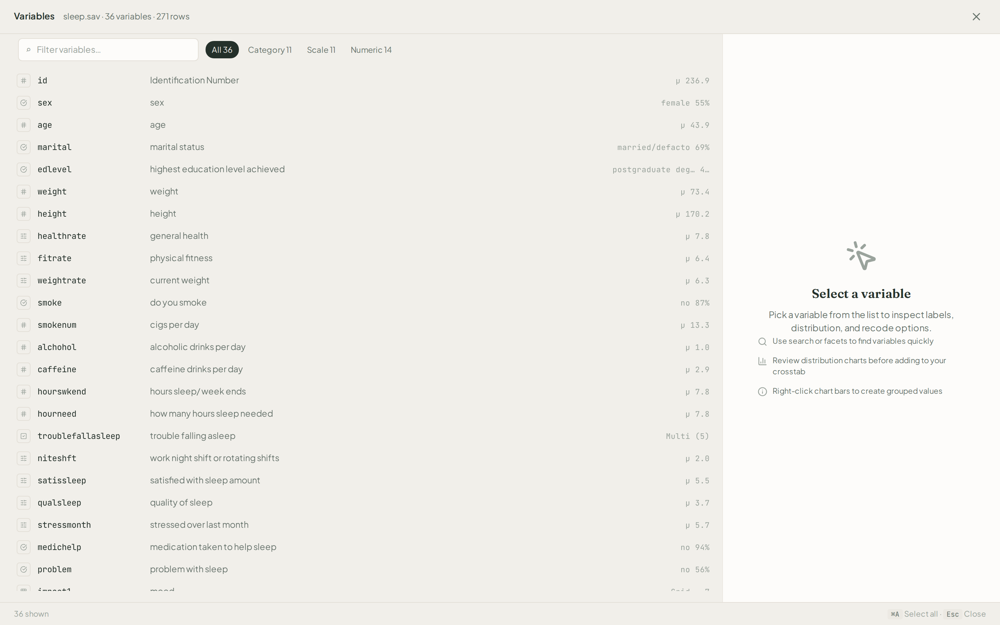
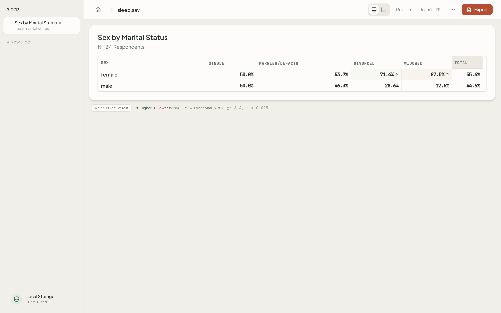

# Current User Journey and Screenshot Evidence

**Status:** July 14, 2026 — reset foundation implemented; convergence and final validation open
**Product thesis:** Analysis-ready SAV -> defensible, editable client deck ([`pilot_00_brief.md`](pilot_00_brief.md))
**UX contract:** [`design_02_ux_modes.md`](design_02_ux_modes.md)
**Current baseline pack:** [`assets/design-reset-evidence/screenshots/`](assets/design-reset-evidence/screenshots/)

The screenshots below document the reset-era product. They were captured July 3–4 and are useful implementation evidence, but they are not final pilot photography. The approved convergence work and July 14 gap audit have not yet been fully integrated and recaptured.

## Journey map

| Step | Current reset-era surface | Completion state |
| :--- | :--- | :--- |
| Import or reopen | Workspace landing and OPFS-backed dataset library | Implemented; recovery evidence remains separate stabilization work |
| Build slides | Story rail, insert palette, slide artifact, recipe inspector | Implemented foundation; palette grammar and saved-state fidelity are open |
| Review deck | Story rail plus export modal | Incomplete; approved export preview lane is not on current `main` |
| Export | Editable PPTX/session export | Engine loop implemented; frontend is still direct-download |
| Resume | Workspace reopen and saved session | Implemented foundation; per-slide weight/settings restoration is incomplete |

## 1. Workspace to first slide

Workspace owns import, dataset selection, and local durability. After upload, the target handoff is slide 1 with the insertion path ready. `DESIGN-CONV-H` has a candidate implementation but is not integrated into the current product line.

The canvas now uses the reset information architecture: deck outline resident on the left, variables summoned through the palette, and analysis controls in the recipe inspector. The rail is still fixed at 240px in current code; the approved collapsible-rail candidate (`DESIGN-CONV-G`) remains to be reconciled.

## 2. Build and understand a slide

The palette is the main insertion surface. **Canonical grammar (`DESIGN-CONV-K1`):** ↵ adds to columns, ⌥↵ adds to rows, ⇧↵ adds to filter. Product code, help, five-minute automation, and docs share this vocabulary; automation asserts the resulting `tableConfig` / slide recipe, not click timing alone.

The summoned inspector exposes rows, columns, filter, weight, and display controls. The resident rail exposes only rows × columns. The completed [`recipe legibility audit`](design_reset_recipe_legibility_audit.md) found that persistent filter, weight, view, section, notes, and imported-session changes are not legible enough for human/MCP handoff.

The slide artifact is the exportable content; statistics remain outside it as a margin note. This structural model is implemented. Final verification must still close the slide-title font mismatch, contrast failures, supported-width behavior, and normal pointer interaction with overflow controls.

## 3. Review and export

The current modal reports readiness and issues, then downloads directly. The approved journey requires an export review lane with export-bound slide thumbnails, recipe/significance summaries, and an explicit review-before-download step. That work is `DESIGN-CONV-B` and currently exists only as an off-line candidate.

Focus mode is not part of the target journey. It remains in current code, but the approved Q5 decision is to remove it and make the normal canvas the presentation surface.

## 4. Organize and resume

Variable Manager is a two-pane overlay for dense inspection and recoding. It no longer uses the pre-reset Miller-column design.

Session resume restores the visible deck foundation, but slide switching currently restores rows, columns, and filters without restoring `weightVar`; analysis settings are workspace-global rather than faithful per-slide state. `DESIGN-CONV-K2` owns the saved-analysis correction and persistent recipe summary.

## Evidence required for final closure

`DESIGN-CONV-A` closes this journey only when all of the following are true:

1. Approved convergence candidates are reconciled against current `main` and pass their implementation gates.
2. The screenshot workflow runs with a documented browser setup and normal user interactions; no force-clicks conceal hit-testing defects.
3. Automation asserts the intended row, column, filter, weight, and view state for every slide and completes review-before-download.
4. A fresh pack captures the final chrome at the agreed viewport sizes.
5. Three to five representative users complete the journey without coaching; time, discovery, errors, recovery, and confidence are recorded.

Until then, these images show an implemented baseline, not a verified or validated final redesign.

## Related owners

| Document | Owns |
| :--- | :--- |
| [`tracker_00_implementation_status.md`](tracker_00_implementation_status.md) §4.3.2 | Active dependencies, statuses, and pilot gate |
| [`plan_05_design_reset_implementation.md`](plan_05_design_reset_implementation.md) | Reset foundation and Phase 4 evidence contract |
| [`design_01_system.md`](design_01_system.md) | Visual tokens, typography, contrast, layout contract |
| [`design_02_ux_modes.md`](design_02_ux_modes.md) | Workspace, Canvas, palette, inspector, VM, and export responsibilities |
| [`design_reset_recipe_legibility_audit.md`](design_reset_recipe_legibility_audit.md) | Q6 findings and evidence |
