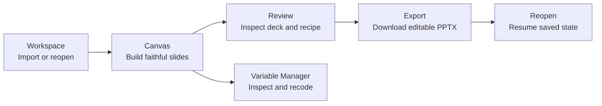

# Current User Journey and Screenshot Evidence

**Status:** September 23, 2026 — current researcher journey captured and exercised; the July screenshots below remain historical
**Product thesis:** Analysis-ready SAV -> defensible, editable client deck ([`pilot_00_brief.md`](pilot_00_brief.md))
**UX contract:** [`design_02_ux_modes.md`](design_02_ux_modes.md)
**Current journey pack:** [`assets/researcher-journey/screenshots/`](assets/researcher-journey/screenshots/) (capture command: `CAPTURE_JOURNEY=1 npx playwright test tests/e2e/researcher-journey.spec.ts --project=product --no-deps`)

The July screenshots in the numbered sections below document the reset-era product. The current capture in the next section supersedes them for the researcher journey. The retained convergence work was merged in `913af5e`.

## September 23 Track A journey capture

The browser path in [`researcher-journey.spec.ts`](../tests/e2e/researcher-journey.spec.ts) reproduces the current screenshots. It uses `brandtracker_w4.sav` at 1440×900 and 1280×800, then `sleep.sav` at 1024×768 as a narrower-window exception. The app recommends at least 1280px for all controls. The screenshots are browser renders, not export-quality examples.

| User action | Observed result and evidence |
| :--- | :--- |
| Open a fresh browser profile | [First-use Workspace, 1440](assets/researcher-journey/screenshots/01-first-use-1440.png) shows example and upload routes. |
| Load the brand tracker example and inspect its weighted table | [Table, 1440](assets/researcher-journey/screenshots/02-brand-table-1440.png) and [table, 1280](assets/researcher-journey/screenshots/05a-brand-table-1280.png). The recipe inspector [shows the applied weight](assets/researcher-journey/screenshots/06-brand-recipe-1440.png). |
| Search for a missing variable, then correct the query | [No-results state](assets/researcher-journey/screenshots/03-search-empty-1440.png) is recoverable by editing the search. [Selected-question preview](assets/researcher-journey/screenshots/04-brand-selection-1440.png) reveals the full label, source name, and default destination before insertion. |
| Switch table to chart and back | [Brand chart](assets/researcher-journey/screenshots/05-brand-chart-1440.png) retains the active recipe. |
| Return to Workspace and reopen the saved dataset | [Workspace library](assets/researcher-journey/screenshots/07-workspace-reopen-1440.png) leads to the [same table](assets/researcher-journey/screenshots/08-brand-reopened-1440.png). The browser check compares all rendered table text before and after reopen. |
| Initiate export | [Scope/format review](assets/researcher-journey/screenshots/09-export-review-1440.png) leads to the [PowerPoint preview](assets/researcher-journey/screenshots/10-export-preview-1440.png). The existing pilot workflow also checks PPTX download. |
| Repeat on a structurally different dataset | `sleep.sav` gives a [two-row table](assets/researcher-journey/screenshots/12-sleep-table-1024.png), [chart](assets/researcher-journey/screenshots/13-sleep-chart-1024.png), [empty new slide](assets/researcher-journey/screenshots/14-empty-slide-1024.png), and [two-slide export warning](assets/researcher-journey/screenshots/15-two-slide-export-1024.png). At 1024px the desktop-width notice remains visible but no longer covers the toolbar or intercepts pointer input. |

### Problems found and changes made

| User action and consequence before the change | Change and remaining limit |
| :--- | :--- |
| Searching for a long or similar brand question showed clipped source names and labels; the researcher could not distinguish results without guessing. [Before](assets/researcher-journey/screenshots/00-before-brand-selection-1440.png) | The active result now shows its complete source label and name, plus where Enter will put it. [After](assets/researcher-journey/screenshots/04-brand-selection-1440.png). Source wording is preserved. Synthetic long and duplicate-looking names are covered by the palette component test. |
| Reading a compact brand table at 1440 stretched four value columns across nearly the entire canvas and left the result visually shallow. [Before](assets/researcher-journey/screenshots/00-before-brand-table-1440.png) | The slide and statistics line now share a 1120px maximum reading width; [after](assets/researcher-journey/screenshots/02-brand-table-1440.png) the values sit closer to their row labels. At 1280px the available width still governs. |
| Switching to chart at 1024px was blocked by the desktop-width notice over the toolbar. | The notice moved below the working area and ignores pointer events. The browser test now switches table/chart and opens the two-slide export review at 1024px. |
| Reopening saved work could have changed the weighted result without an obvious signal. | The browser path compares the rendered table before/after reopen and checks the applied weight. This verifies the representative saved recipe; it is not a statistical audit of every dataset. |

The brand tracker question `Q5. and Which One of These Brands Do You Most Prefer?` and the generated slide title remain source-derived and editorially awkward. The interface exposes the full wording; a clearer title requires metadata preparation or a researcher edit, not an inferred rewrite. No raw codes, labels, weights, or significance settings were changed for this track.

## September 23 direct check

The brand tracker example opened into a weighted preference-by-segment crosstab. Returning to Workspace and reopening the saved dataset restored the same slide and values. The PowerPoint export review showed the chosen slide, recipe, weighting and significance method, then downloaded successfully. Excel export also downloaded. All 25 Playwright browser journeys passed. These checks verify the implemented loop; they do not replace the product owner's research judgment.

The downloaded PowerPoint opened in Microsoft PowerPoint with two editable slides: a mostly empty cover using the long survey-question title and the table slide. The default cover title still needs editorial improvement. The export format now states that the standard PowerPoint includes a cover. The Excel workbook contained the expected segment values; its numeric total column is labelled `Total (count)` beside the percentage-formatted segment columns. The current neutral-theme implementation displays weighted numeric totals to one decimal place. Fresh current screenshots still need capture before replacing the July pack.

## Journey map

| Step | Current reset-era surface | Completion state |
| :--- | :--- | :--- |
| Import or reopen | Workspace landing and OPFS-backed dataset library | Implemented; recovery evidence remains separate stabilization work |
| Build slides | Story rail, insert palette, slide artifact, recipe inspector | Palette grammar and saved-analysis fidelity are implemented; current screenshots remain open |
| Review deck | Story rail plus export modal | Export review lane is implemented and directly exercised on 23 September |
| Export | Editable PPTX/session export | PPTX and XLSX download; default cover title needs review |
| Resume | Workspace reopen and saved session | Reopened brand tracker analysis matched its saved weighted table on 23 September |

## 1. Workspace to first slide

Workspace owns import, dataset selection, and local durability. After upload, the handoff opens slide 1 and may summon the insert palette for a fresh empty analysis. The July image predates the integrated `DESIGN-CONV-H` change.

The canvas uses the reset information architecture: deck outline resident on the left, variables summoned through the palette, and analysis controls in the recipe inspector. The integrated rail collapses for a one-slide deck and expands for larger decks or pending import warnings. The July image predates that behavior.

## 2. Build and understand a slide

The palette is the main insertion surface. **Canonical grammar (`DESIGN-CONV-K1`):** ↵ adds to columns, ⌥↵ adds to rows, ⇧↵ adds to filter. Product code, help, five-minute automation, and docs share this vocabulary; automation asserts the resulting `tableConfig` / slide recipe, not click timing alone.

The summoned inspector exposes rows, columns, filter, weight, and display controls. The resident rail exposes only rows × columns. The completed [`recipe legibility audit`](design_reset_recipe_legibility_audit.md) found that persistent filter, weight, view, section, notes, and imported-session changes are not legible enough for human/MCP handoff.

The slide artifact is the exportable content; statistics remain outside it as a margin note. This structural model is implemented. Final verification must still close the slide-title font mismatch, contrast failures, supported-width behavior, and normal pointer interaction with overflow controls.

## 3. Review and export

The export modal now includes an explicit review step with export-bound slides, recipe and significance summaries before PowerPoint download. The July screenshot above predates it and should be replaced in the next capture.

Focus mode was removed on `main`; the normal canvas is the presentation surface.

## 4. Organize and resume

Variable Manager is a two-pane overlay for dense inspection and recoding. It no longer uses the pre-reset Miller-column design.

Session resume in the July screenshot pack predates the saved-analysis correction. `DESIGN-CONV-K2` subsequently restored per-slide weight and analysis settings on `main`; the September direct check reopened the weighted example. Capture new screenshots before using this pack to describe the current experience.

## Verification limits

The following checks help inspect the integrated journey. They are not a product approval stage:

The current browser path uses normal pointer and keyboard interactions, with no force-clicks. It checks the representative weighted table across reopen, view switching, search recovery, and export review. The 1024px exception remains below the app's recommended desktop width. The product owner's direct use and research judgment can still reveal problems these checks do not measure; the pack proves the implemented interactions and their rendered state, not product validation.

## Related owners

| Document | Owns |
| :--- | :--- |
| [`tracker_00_implementation_status.md`](tracker_00_implementation_status.md) | Current work and priorities |
| [`plan_05_design_reset_implementation.md`](plan_05_design_reset_implementation.md) | Reset foundation and Phase 4 evidence contract |
| [`design_01_system.md`](design_01_system.md) | Visual tokens, typography, contrast, layout contract |
| [`design_02_ux_modes.md`](design_02_ux_modes.md) | Workspace, Canvas, palette, inspector, VM, and export responsibilities |
| [`design_reset_recipe_legibility_audit.md`](design_reset_recipe_legibility_audit.md) | Q6 findings and evidence |
