# User Journey Screenshots

**Status:** July 3, 2026 — current `main`  
**Product thesis:** Analysis-ready SAV → defensible, editable client deck ([`pilot_00_brief.md`](pilot_00_brief.md))  
**UX mode contract:** [`design_02_ux_modes.md`](design_02_ux_modes.md)  
**Screenshot pack:** [`assets/user-journey-screenshots/`](assets/user-journey-screenshots/)

Velocity organizes work into three coordinated modes — **Workspace**, **Analysis Canvas**, and **Variable Manager** — that map to three pilot-critical user journeys. This document captures each journey with screenshots, the design decisions behind them, recent improvements, and open questions.

---

## Journey map

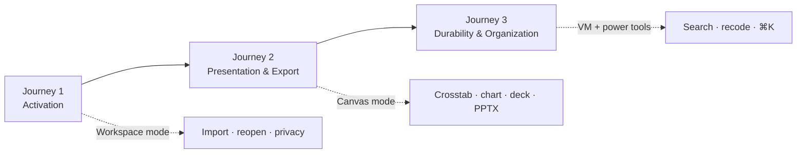

| Journey | Mode(s) | Pilot target | Screenshots |
| :--- | :--- | :--- | :--- |
| **1. Activation** | Workspace → Canvas | Useful crosstab in **< 5 min** | 00, 01, 04, 05, 06 |
| **2. Presentation & export** | Canvas | Editable slide in **< 15 min** | 06, 07, 10, 08, 15 |
| **3. Durability & organization** | Workspace + VM | Predictable reopen on same machine | 12, 13, 14, 09, 11 |

---

## Journey 1 — Activation

**Goal:** A first-time researcher loads a SAV file and reaches a correct, labeled crosstab without training.

### 1.1 Engine initialization


| | |
| :--- | :--- |
| **What happens** | Web Worker and OPFS storage initialize before the workspace shell appears. |
| **Design decision** | Boot stays inside the app shell — a thin progress bar, not a separate marketing splash. Heavy compute never blocks the main thread (`arch_07` §11). |
| **Recent improvement** | PPR-001 (PR #18): replaced full-screen serif splash with in-shell init bar; UXF-015 contrast fix on secondary copy. |
| **Open question** | Should init expose a recoverable error state when OPFS is unavailable, rather than a hard block? Browser matrix in [`pilot_01_packaging.md`](pilot_01_packaging.md) documents limits but the empty-state UX is thin. |

### 1.2 Workspace landing (empty)

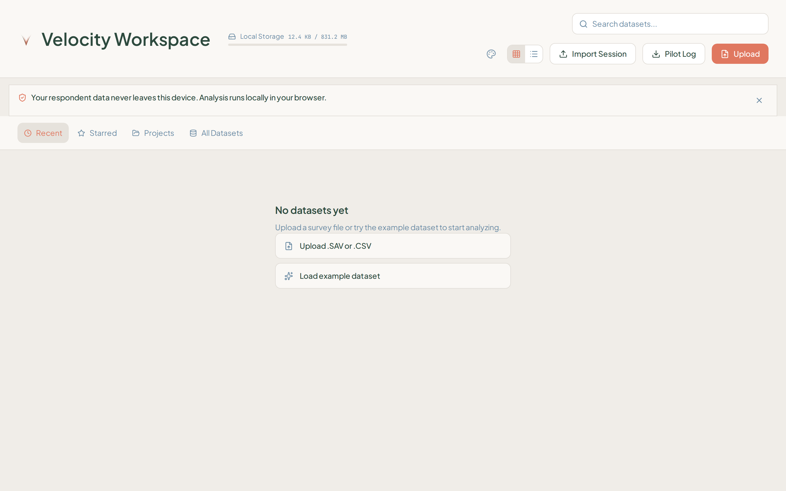

| | |
| :--- | :--- |
| **What happens** | User sees the dataset library with upload and example-dataset entry points. |
| **Design decision** | Workspace owns dataset selection, not analysis. Privacy is stated once via `WorkspaceStatusStrip` — data never leaves the device. Tabs (Recent / Starred / Projects / All Datasets) separate navigation from the hero empty state. |
| **Recent improvement** | UXF-014: collapsed stacked banners into a single dismissible strip; PPR-002/003: reduced card-in-card welcome chrome. July 3: quiet storage note replaces anxious “checking local storage” copy. |
| **Open question** | **Projects** tab is visible but lightly used in pilot scope — does project grouping need first-run explanation, or should it hide until a second dataset exists? |

### 1.3 Pre-analysis canvas

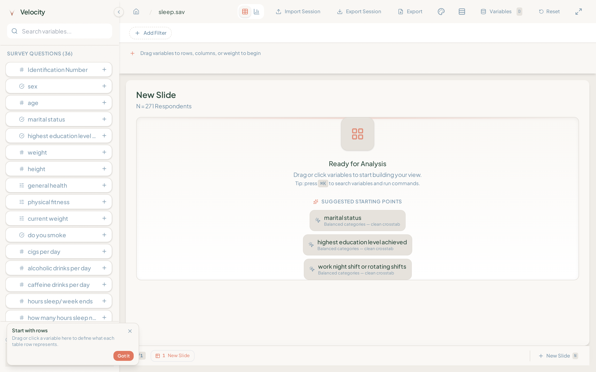

| | |
| :--- | :--- |
| **What happens** | After upload, metadata loads and the variable browser appears with searchable survey questions. |
| **Design decision** | Canvas is low-density: sidebar for discovery, central frame for output. Variable cards use dual-state labels (codes + display text per `arch_02`). Suggestion chips offer one-click first variables without opening Variable Manager. |
| **Recent improvement** | PPR-004: labels no longer clip in suggestion pills; PPR-005: corner coaching chips replace modal popovers on the hero frame. |
| **Open question** | Metadata-only preview (before “Load Full Data”) is fast but adds a decision point — is the interstitial worth the T1 savings for pilot files that are always analysis-ready? |

### 1.4 Building first crosstab

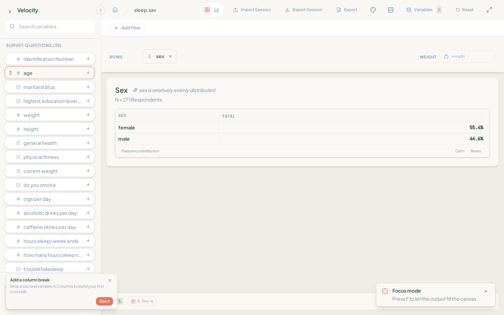

| | |
| :--- | :--- |
| **What happens** | User clicks `sex` → frequency table renders; coaching chip prompts adding a column break. |
| **Design decision** | Drag-and-drop shelves (Rows / Columns / Filters / Weight) mirror survey-research mental models. First-run coaching is **session-scoped** and anchored to shelf corners — never modal-over-output. |
| **Recent improvement** | UXF-011: first-crosstab tour via corner chips + “Got it” dismiss; `firstCrosstabTour.test.ts` locks behavior. Focus-mode tip toast (`useFocusModeTip`) is one-time. |
| **Open question** | Weighting discovery remains implicit until a weight variable is dragged — is a “dataset has weights” banner needed for files like `sleep.sav` where `weight` is pre-applied? |

### 1.5 Crosstab result (hero output)

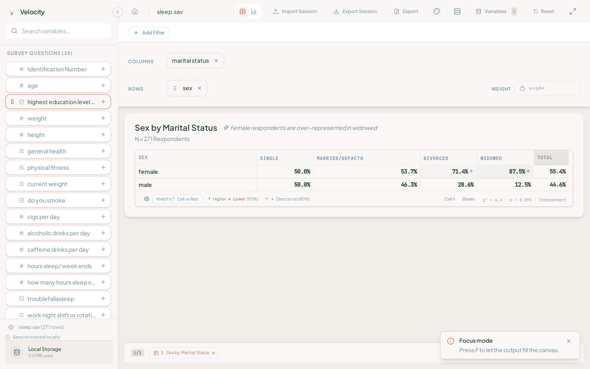

| | |
| :--- | :--- |
| **What happens** | `sex × marital status` crosstab with significance markers, χ²/p footer, and insight chip. |
| **Design decision** | The slide is the **hero artifact** — content-sized frame (`AnalysisOutputFrame.shrinkWrap`), `CrosstabCell` alignment (Strategy A), significance as directional arrows not color-only. Deck-clean defaults hide cell `n=` and column bases; toggles live in the status bar. |
| **Recent improvement** | UXF-001–005, UXF-017 (July 3): Liquid Glass scoping fix on sticky headers; layout-flow when `n=` hidden; mulberry32 deterministic example data. |
| **Open question** | Insight chip copy (“female respondents are over-represented in widowed”) is engine-generated — what confidence threshold should gate visible insights in pilot demos? |

---

## Journey 2 — Presentation & export

**Goal:** The researcher polishes output for a client screenshot or exports an editable PowerPoint slide.

### 2.1 Crosstab slide (presentation-ready)


| | |
| :--- | :--- |
| **Design decision** | Presentation mode optimizes **clarity over density** — statistics footer stays visible; coaching never covers it. Timeline dock uses compact labels hidden until hover (UXF-007). |
| **Recent improvement** | STAB-UI-F1 complete; pilot presentation gate closed ([`audit_07`](audit_07_pilot_presentation_readiness_2026-07-01.md) §5, PR #18). |
| **Open question** | Horizontal scroll affordance appears only when columns clip — do paid pilots need an always-visible scroll hint for wide banners? |

### 2.2 Chart view

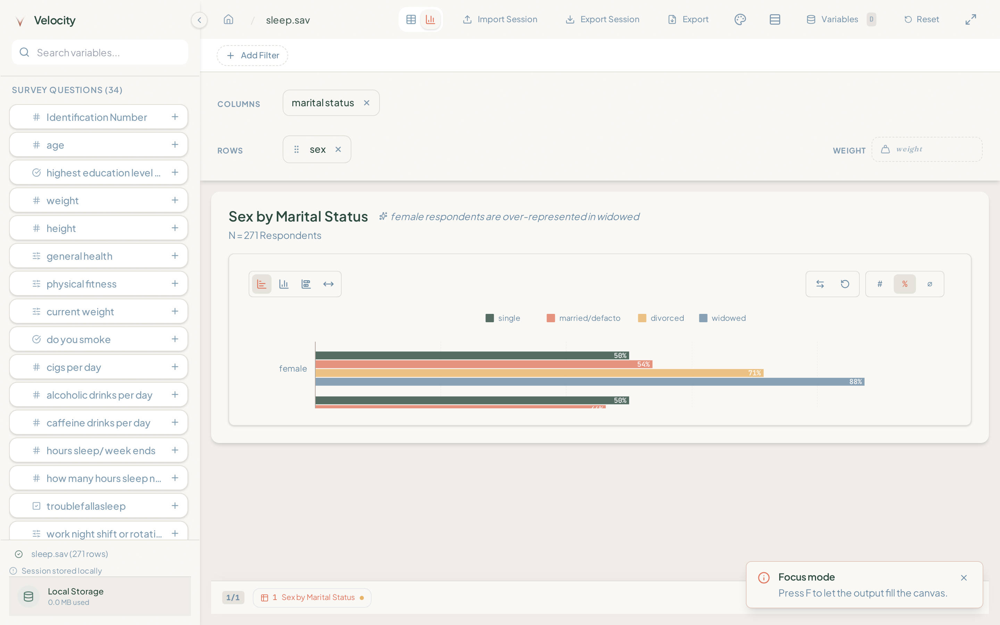

| | |
| :--- | :--- |
| **What happens** | Table ↔ chart toggle renders a grouped bar chart with complete legend labels. |
| **Design decision** | Charts share the same `AnalysisOutputFrame` as tables; axis semantics use percentages on a 0–100 scale. View switch uses a fade wrapper to avoid empty-canvas flash (UXF-003). |
| **Recent improvement** | PPR-008: `SvgChartSeriesLegend` + percent labels; content-sized chart height. |
| **Open question** | Chart type is inferred from variable types — should users pick chart family explicitly before export, or is auto-selection sufficient for the pilot wedge? |

### 2.3 Focus mode

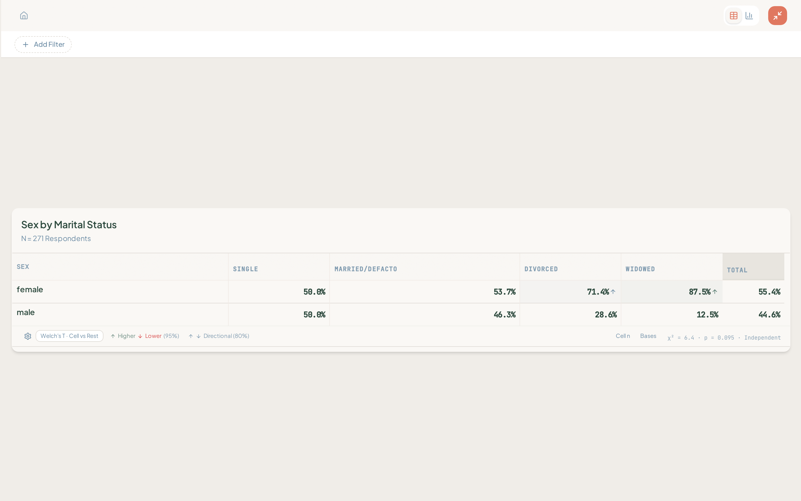

| | |
| :--- | :--- |
| **What happens** | Press **F** (or Focus button) to hide sidebar and reduce chrome so the slide fills the viewport. |
| **Design decision** | Focus is a **presentation posture**, not a separate route — deck state is unchanged. Toolbar retains Export and session actions; import/reset hide (PPR-011). |
| **Recent improvement** | UXF-006: focus discoverability via micro-tip chips and one-time toast. |
| **Open question** | Focus still leaves the top toolbar — is a “true fullscreen” export preview needed for PILOT-6 screenshot workflows, or does focus suffice? |

### 2.4 Export modal

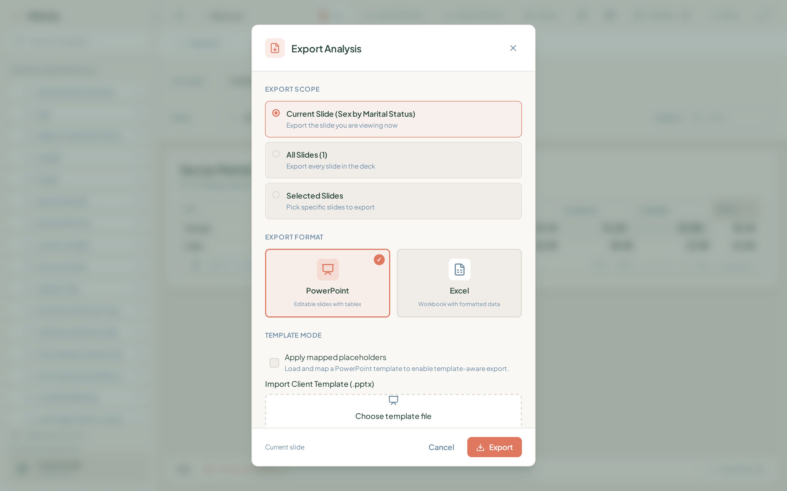

| | |
| :--- | :--- |
| **What happens** | User chooses scope (current / all / selected slides), format (PPTX / XLSX), and optional client template mapping. |
| **Design decision** | Export initiates from Canvas; core export logic stays in `src/core/export/` with `ResultEnvelope` provenance. Template mode supports client `.pptx` import + placeholder mapping (PILOT-3). Custom-styled file picker replaces native “Choose File” (PPR-009). |
| **Recent improvement** | PILOT-3 done: `templateMapping.ts` binary PPTX binding, `ExportModal` persistence across reopen, integration tests in `pptxExporter.semantics.test.ts`. |
| **Open question** | **Saved slide recipes** and wave-in-place deck refresh are out of pilot scope — when PILOT-4a ranks banner plans as blockers, does template mapping alone satisfy agency workflows? |

### 2.5 Statistical settings

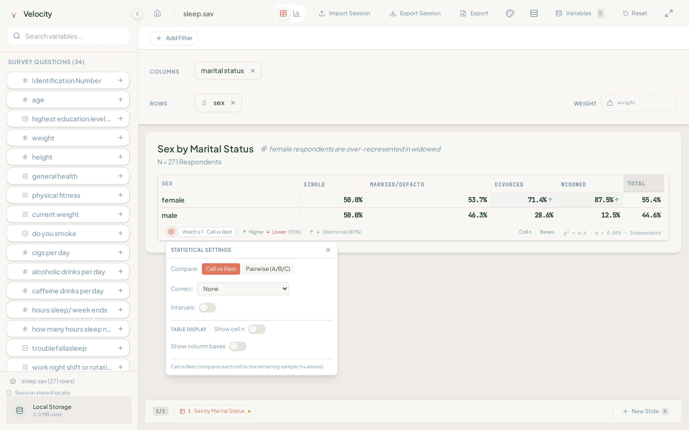

| | |
| :--- | :--- |
| **What happens** | Overlay exposes significance level, test selection, and weighting behavior. |
| **Design decision** | Settings are expert-facing and overlay-based — defaults match survey-native methodology in `arch_04`. Weighting applies existing weights only (no raking in pilot). |
| **Recent improvement** | UXF-012: contextual micro-tips surface weighting/significance paths; command palette adds filter/export commands (UXF-013). |
| **Open question** | Significance test picker (Welch's T vs χ²) is powerful but undiscoverable — do pilots need preset “agency defaults” per project template? |

---

## Journey 3 — Durability & organization

**Goal:** A returning researcher reopens a stored dataset, resumes deck state, and organizes variables without losing work.

### 3.1 Workspace after session

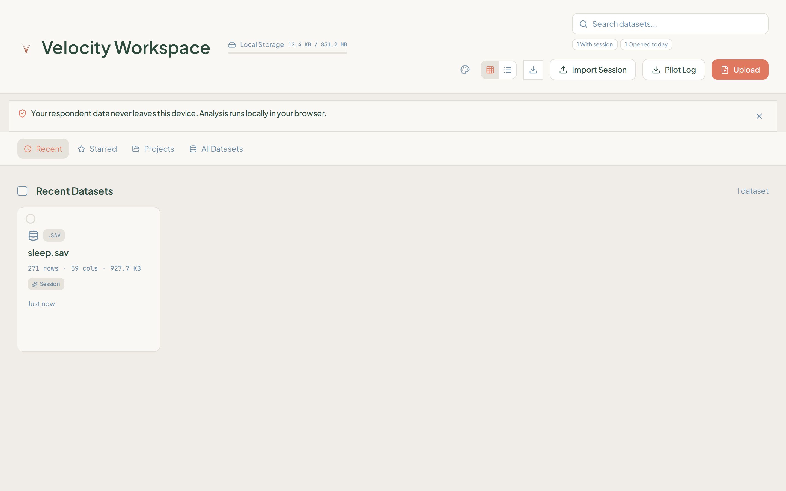

| | |
| :--- | :--- |
| **What happens** | User returns from Canvas; the dataset card shows row count, last-opened time, and session continuity cues. |
| **Design decision** | OPFS-backed workspace is the **durability primitive** — no server upload. Workspace prepares data; it does not run crosstabs. |
| **Recent improvement** | PPR-013/014: simplified card metadata row; grammar fix (“1 dataset”). Welcome-back card hydrates labels from store catalog, not raw UUIDs (UXF-010). |
| **Open question** | Workspace **rebuild** and **delete** flows are contractually required (`design_02` §6) — are failure/recovery paths tested enough for PILOT-6 incident targets (≤1 P1 per participant)? |

### 3.2 Dataset search & reopen

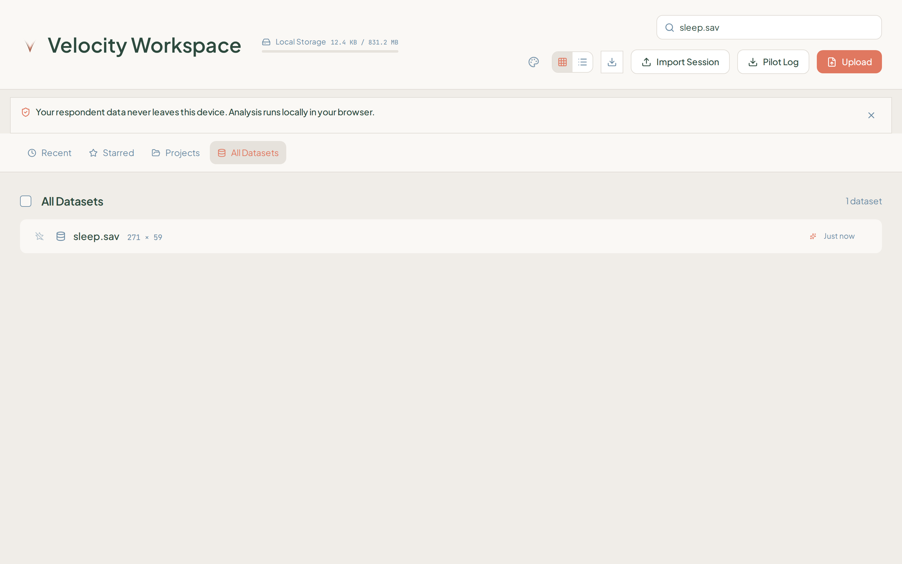

| | |
| :--- | :--- |
| **What happens** | User searches “sleep.sav” in All Datasets and double-clicks to reopen. |
| **Design decision** | Keyboard-first search in workspace; reopen reloads OPFS artifact and hydrates session. Portable `.velocity` session export remains the handoff primitive for cross-machine transfer (no respondent rows). |
| **Recent improvement** | PPR-015: tighter list selection layout. |
| **Open question** | Single-result search still leaves vertical void — acceptable for sparse libraries, but how does this scale to 50+ datasets per agency? |

### 3.3 Resumed analysis session

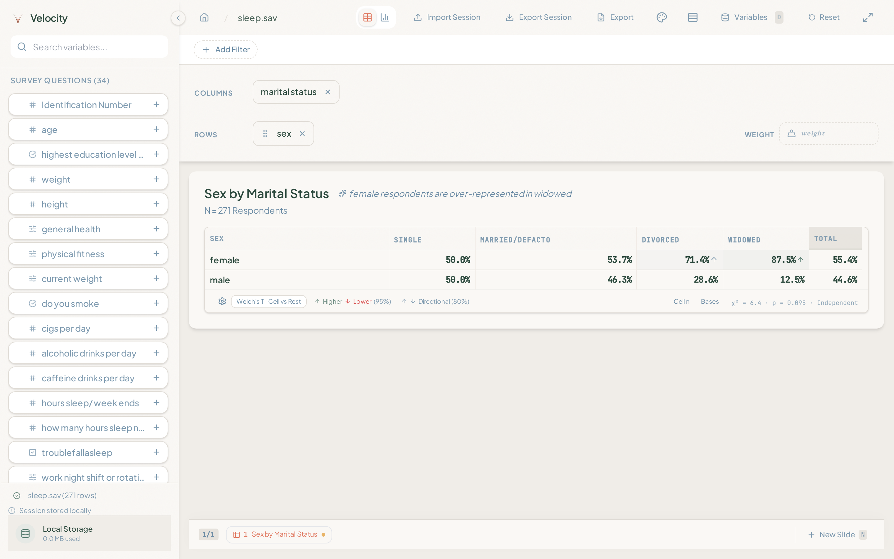

| | |
| :--- | :--- |
| **What happens** | Canvas restores with `sex × marital status` slide, timeline, and shelves intact. |
| **Design decision** | Session state is store/engine source-of-truth — not duplicated in ad hoc UI state. Coaching chips respect session-scoped dismiss (PPR-016); they do not reappear on resume. |
| **Recent improvement** | PPR-005 persistence fix; resume trust row in workspace status strip. |
| **Open question** | `.velocity` import/export is documented for agents — is the human-facing “Export Session” affordance discoverable enough for freelancer handoffs between machines? |

### 3.4 Variable Manager

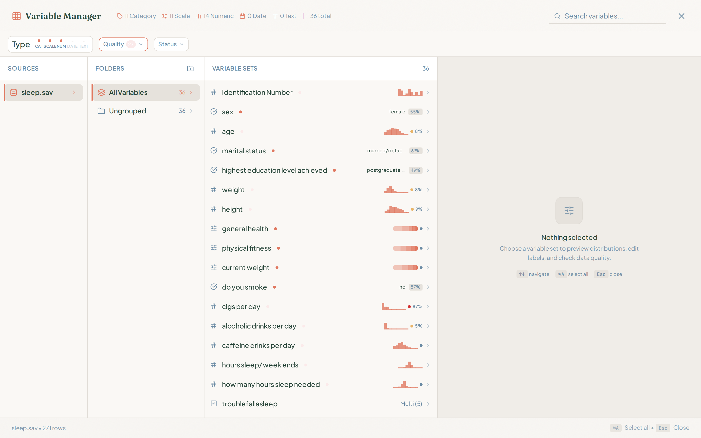

| | |
| :--- | :--- |
| **What happens** | Overlay opens Miller-column browser with type/quality filters, mini distribution sparklines, and inspector pane. |
| **Design decision** | VM is a **spoke overlay** on Canvas — high-density organization without leaving analysis context. Quality badges and recode entry points live here, not on the hero slide. |
| **Recent improvement** | UXF-009: guided empty inspector; PPR-010: wider list column. STAB-UI-T7: recode modal persists via `ModalHost` wiring. |
| **Open question** | Quality badge count (27) uses alarm-red — is the visual weight appropriate for pilot first impressions, or should quality be muted until the user opts in? **Harmonization** entry points exist but multi-wave work is frozen until PILOT-7. |

### 3.5 Command palette

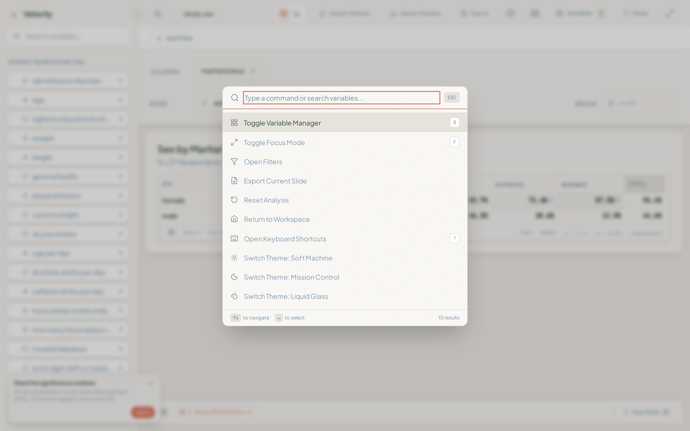

| | |
| :--- | :--- |
| **What happens** | **⌘K** opens search for variables, shelf actions, export, and focus commands. |
| **Design decision** | Palette is the power-user accelerator across modes — action + variable search in one surface (`STAB-UI-F4`). Neutral focus ring, not accent/error colored (PPR-012). |
| **Recent improvement** | `CommandPalette.test.tsx`, `commandPaletteSearch.test.ts`; unified keyboard registry (`STAB-UI-T6`). |
| **Open question** | Should workspace-level commands (reopen dataset, import session) also live in ⌘K, or does that blur the mode boundary? |

---

## Cross-journey design principles

| Principle | Where it shows up | Source |
| :--- | :--- | :--- |
| **Local-first privacy** | Workspace strip, no upload path | `pilot_00_brief.md`, `arch_06` |
| **Content-sized hero artifact** | Crosstab/chart frame shrink-wrap | STAB-UI-F1, `audit_07` |
| **Mode separation** | Workspace selects; Canvas analyzes; VM organizes | `design_02_ux_modes.md` |
| **Dual-state integrity** | Variable labels in sidebar, table, export | `arch_02`, AGENTS §2 |
| **Worker-bound compute** | All crosstabs via engine/worker | `arch_07` §11 |
| **Session-scoped coaching** | Corner chips, no resume amnesia | STAB-UI-F3, PPR-005/016 |

---

## Open questions summary (tracker-linked)

| # | Question | Journey | Tracker / gate |
| :--- | :--- | :--- | :--- |
| OQ-1 | OPFS-unavailable graceful degradation | 1 | PILOT-1 browser matrix |
| OQ-2 | Projects tab first-run affordance | 1, 3 | STAB-UI-F3 |
| OQ-3 | Pre-applied weight discovery banner | 1, 2 | PILOT-4a observation |
| OQ-4 | Insight chip confidence threshold | 2 | PILOT-5 (frozen) |
| OQ-5 | True fullscreen vs focus for screenshots | 2 | PILOT-6 feedback |
| OQ-6 | Template mapping vs saved banner recipes | 2 | PILOT-4a / PILOT-4b |
| OQ-7 | Workspace rebuild/delete recovery UX | 3 | `design_02` §6 |
| OQ-8 | Large dataset library density | 3 | Post-pilot |
| OQ-9 | Human session handoff discoverability | 3 | PILOT-6 |
| OQ-10 | Quality badge visual weight | 3 | STAB-UI-F2 |
| OQ-11 | High-contrast / colorblind significance themes | 2 | STAB-UI-F5 (frozen) |
| OQ-12 | ⌘K scope across workspace commands | 3 | STAB-UI-F4 |

---

## Related evidence

| Doc | Contents |
| :--- | :--- |
| [`audit_07_pilot_presentation_readiness_2026-07-01.md`](audit_07_pilot_presentation_readiness_2026-07-01.md) | Before/after presentation audit, PPR fix list |
| [`plan_02_ui_presentation_workstream.md`](plan_02_ui_presentation_workstream.md) | UXF register, slice specs |
| [`tracker_00_implementation_status.md`](tracker_00_implementation_status.md) | STAB-UI-F/T, PILOT-4a/6 status |
| [`assets/ui-pilot-readiness-audit/`](assets/ui-pilot-readiness-audit/) | July 1–2 gate closure screenshot packs |

---

## Regenerate screenshots

```bash
npm run dev -- --host 127.0.0.1 --port 4173

SKIP_DEV_SERVER=1 SCREENSHOT_OUT=docs/assets/user-journey-screenshots \
  node scripts/ui-workflow-screenshot-audit.mjs
```

See [`assets/user-journey-screenshots/README.md`](assets/user-journey-screenshots/README.md) for the file index.
