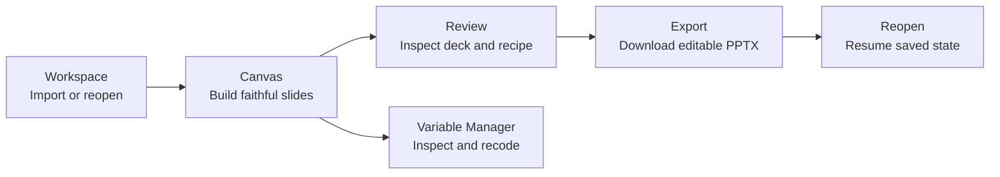

# Current User Journey and Screenshot Evidence

**Status:** September 23, 2026 — reset foundation and export review implemented; this page's July screenshots are historical, and current capture remains open
**Product thesis:** Analysis-ready SAV -> defensible, editable client deck ([`pilot_00_brief.md`](pilot_00_brief.md))
**UX contract:** [`design_02_ux_modes.md`](design_02_ux_modes.md)
**Current baseline pack:** [`assets/design-reset-evidence/screenshots/`](assets/design-reset-evidence/screenshots/)

The screenshots below document the reset-era product. They were captured July 3–4 and are useful implementation evidence, but they are not current journey photography. The retained convergence work was merged in `913af5e`; its current state has not yet been recaptured.

## September 23 direct check

The brand tracker example opened into a weighted preference-by-segment crosstab. Returning to Workspace and reopening the saved dataset restored the same slide and values. The PowerPoint export review showed the chosen slide, recipe, weighting and significance method, then downloaded successfully. Excel export also downloaded. All 25 Playwright browser journeys passed. These checks verify the implemented loop; they do not replace the product owner's research judgment.

The downloaded PowerPoint opened in Microsoft PowerPoint with two editable slides: a mostly empty cover using the long survey-question title and the table slide. The default cover title still needs editorial improvement. The export format now states that the standard PowerPoint includes a cover. The Excel workbook contained the expected segment values; its numeric total column is now labelled `Total (count)` beside the percentage-formatted segment columns. Fresh current screenshots still need capture before replacing the July pack.

## Journey map

| Step | Current reset-era surface | Completion state |
| :--- | :--- | :--- |
| Import or reopen | Workspace landing and OPFS-backed dataset library | Implemented; recovery evidence remains separate stabilization work |
| Build slides | Story rail, insert palette, slide artifact, recipe inspector | Palette grammar and saved-analysis fidelity are implemented; current screenshots remain open |
| Review deck | Story rail plus export modal | Export review lane is implemented and directly exercised on 23 September |
| Export | Editable PPTX/session export | PPTX and XLSX download; default cover title needs review |
| Resume | Workspace reopen and saved session | Reopened brand tracker analysis matched its saved weighted table on 23 September |

## 1. Workspace to first slide

Workspace owns import, dataset selection, and local durability. After upload, the handoff opens slide 1 and may summon the insert palette for a fresh empty analysis. The July image predates the integrated `DESIGN-CONV-H` change.

The canvas uses the reset information architecture: deck outline resident on the left, variables summoned through the palette, and analysis controls in the recipe inspector. The integrated rail collapses for a one-slide deck and expands for larger decks or pending import warnings. The July image predates that behavior.

## 2. Build and understand a slide

The palette is the main insertion surface. **Canonical grammar (`DESIGN-CONV-K1`):** ↵ adds to columns, ⌥↵ adds to rows, ⇧↵ adds to filter. Product code, help, five-minute automation, and docs share this vocabulary; automation asserts the resulting `tableConfig` / slide recipe, not click timing alone.

The summoned inspector exposes rows, columns, filter, weight, and display controls. The resident rail exposes only rows × columns. The completed [`recipe legibility audit`](design_reset_recipe_legibility_audit.md) found that persistent filter, weight, view, section, notes, and imported-session changes are not legible enough for human/MCP handoff.

The slide artifact is the exportable content; statistics remain outside it as a margin note. This structural model is implemented. Final verification must still close the slide-title font mismatch, contrast failures, supported-width behavior, and normal pointer interaction with overflow controls.

## 3. Review and export

The export modal now includes an explicit review step with export-bound slides, recipe and significance summaries before PowerPoint download. The July screenshot above predates it and should be replaced in the next capture.

Focus mode was removed on `main`; the normal canvas is the presentation surface.

## 4. Organize and resume

Variable Manager is a two-pane overlay for dense inspection and recoding. It no longer uses the pre-reset Miller-column design.

Session resume in the July screenshot pack predates the saved-analysis correction. `DESIGN-CONV-K2` subsequently restored per-slide weight and analysis settings on `main`; the September direct check reopened the weighted example. Capture new screenshots before using this pack to describe the current experience.

## Current verification work

The following checks help inspect the integrated journey. They are not a product approval stage:

1. Retained convergence changes are integrated on `main`; inspect their current behavior directly.
2. The screenshot workflow runs with a documented browser setup and normal user interactions; no force-clicks conceal hit-testing defects.
3. Automation asserts the intended row, column, filter, weight, and view state for every slide and completes review-before-download.
4. A fresh pack captures the final chrome at the agreed viewport sizes.
5. The product owner uses the journey directly and records problems with discovery, errors, recovery, or confidence.

The existing images show an implemented July baseline, not the current final experience.

## Related owners

| Document | Owns |
| :--- | :--- |
| [`tracker_00_implementation_status.md`](tracker_00_implementation_status.md) | Current work and priorities |
| [`plan_05_design_reset_implementation.md`](plan_05_design_reset_implementation.md) | Reset foundation and Phase 4 evidence contract |
| [`design_01_system.md`](design_01_system.md) | Visual tokens, typography, contrast, layout contract |
| [`design_02_ux_modes.md`](design_02_ux_modes.md) | Workspace, Canvas, palette, inspector, VM, and export responsibilities |
| [`design_reset_recipe_legibility_audit.md`](design_reset_recipe_legibility_audit.md) | Q6 findings and evidence |
